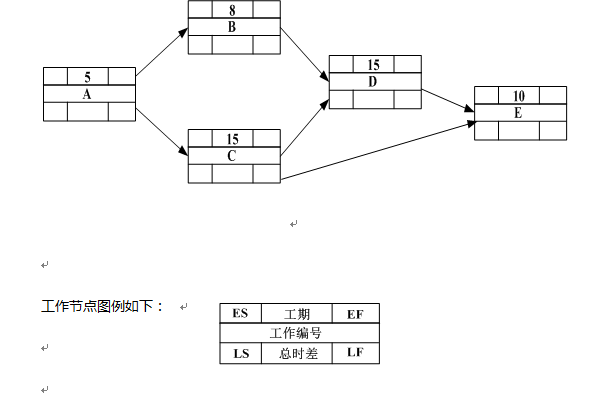
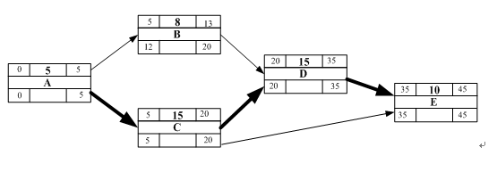
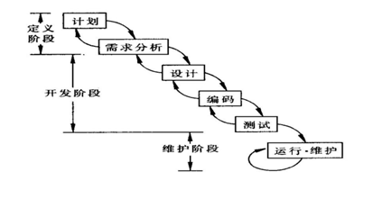

# 2009.5

## 试题1

**阅读下列说明，针对项目的进度管理，回答问题1至问题3。将解答填入答题纸的对应栏内。**
B市是北方的一个超大型城市，最近市政府有关部门提出需要加强对全市交通的管理与控制。
2008年9月19日B市政府决定实施智能交通管理系统项目，对路面人流和车流实现实时的、量化的监控和管理。项目要求于2009年2月1日完成。
该项目由C公司承建，小李作为C公司项目经理，在2008年10月20日接到项目任务后，立即以曾经管理过的道路监控项目为参考，估算出项目历时大致为100天，并把该项目分成五大模块分别分配给各项目小组，同时要求项目小组在2009年1月20日前完成任务，1月21日至28日各模块联调，1月29日至31日机动。小李随后在原道路监控项目解决方案的基础上组织制定了智能交通管理系统项目的技术方案。
可是到了2009年1月20日，小李发现有两个模块的进度落后于计划，而且即使这五个模块全部按时完成，在预定的1月21日至28日期间因春节假期也无法组织人员安排模块联调，项目进度拖后已成定局。
本题考核的是项目进度管理问题，聚焦在如何科学地制定项目的进度计划以及如何科学地监控项目的实际进度，考查考生在进度管理方面的实际经验。

**【问题1】（8分）**
请简要分析项目进度拖后的可能原因。
>仅依靠一个道路监控项目来估算项目历时，根据不充分；
制定进度计划时，不仅考虑到活动的历时还要考虑到节假日；
没有对项目的技术方案、管理计划进行详细的评审；
监控力度过粗（或监控周期过长）；
对项目进度风险控制考虑不周。

**【问题2】（4分）**
请简要叙述进度计划包括的种类和用途。
>里程碑计划，由项目的各个里程碑组成。里程碑式项目生命周期中的一个时刻，在这一时刻，通常有重大交付物完成。此计划用于甲乙丙等相关各方高层对项目的监控；
阶段计划，或叫概括性进度表，该计划标明了各阶段的起止日期和交付物，用于相关部门的协调（或协同）；
详细甘特图计划，或详细横道图计划，或称时标进度网络图，该计划标明了每个活动的起止日期，用于项目组成员的日常工作安排和项目经理的跟踪。

**【问题3】（3分）**
请简要叙述“滚动波浪式计划”方法的特点和确定滚动周期的依据。针对本试题说明中所述项目，说明采用多长的滚动周期比较恰当。
>1、“滚动波浪式计划”方法的特点是近期的工作计划得较细，远期的工作计划得较粗。
2、根据项目的规模、复杂度以及项目生命周期的长短来确定滚动波浪式计划中的滚动周期。
3、滚动周期1~2周之间的时间周期都正确。

---
---
---

## 试题2

**阅读下列说明，回答问题1至问题3，将解答填入答题纸的对应栏内。**
下图为某项目主要工作的单代号网络图。工期以工作日为单位。

本题考核的是如何制定项目的进度计划。
本题规定从第0天开始计算项目的最早开始时间（ES）、最早结束时间（EF）、最晚开始时间（LS）、最晚结束时间（LF），其目的是让EF、ES、FF（自由时差）的计算能够简化，省去了从第一天开始计算ES、EF、LS、LF时需加1、减1的麻烦。
但是应提醒注意的是，从第0天开始计算情况下，任务最早结束时间（EF）、最晚结束时间（LF）均不应计算在任务的历时之内。例如，任务A的任务最早开始时间（ES）是0、最早结束时间（EF）是5，但第5天并不在任务A的历时之内，此时的计算公式如下
ES1=0
ESj=MAX{所有前导任务的EF}
EFj=ESj+DUj
上式中，DUj为任务j的历时（题干已提供）。
自由浮动时间或自由时差是指一项活动在不耽误直接后续活动最早开始日期的情况下，可以拖延的时间长度。
FFj（自由时差）=后续工作的最早ES-本工作的EF
总浮动时间或总时差是指在不耽误项目计划完成日期的条件下，一项活动从最早开始时间算起，可以拖延的时间长度。
TFj（总浮动时间）=LSj-ESj或LFj-EFj
当依正推法得出每个任务的最早开始时间（ES）、最早结束时间（EF）后，从最后一个任务逆着向第一个任务逆推，可按下列公式计算出所有任务的最晚结束时间（LF）、最晚开始时间（LS）
LFj=MIN{所有后继任务的LS}
LSj=LFj-DUj

**【问题1】（5分）**
请在图中填写各活动的最早开始时间（ES）、最早结束时间（EF）、最晚开始时间（LS）、最晚结束时间（LF），从第0天开始计算。
>网络图中粗箭头标明了项目的关键路径，按活动的最早开始时间、最早结束时间、最晚开始时间和最晚结束时间的定义，把它们计算出来后，直接标在了网络图上。

**【问题2】（6分）**
请找出该网络图的关键路径，分别计算工作B、工作C的总时差和自由时差，说明此网络工程的关键部分能否在40个工作日内完成，并说明具体原因。
>关键路径为A-C-D-E；
总工期=5+15+15+1=45个工作日，因此网络工程不能在40个工作日内完成；
工作B总时差=7
自由时差=7
工作C总时差=0
自由时差=0

**【问题3】（4分）**
请说明通常情况下，若想缩短工期可采取哪些措施。
>赶工，缩短关键路径上的工作历时；
或采用并行施工方法以压缩工期（或快速跟进）；
追加资源；
改进方法和技术；
缩减活动范围；
使用高素质的资源或经验更丰富人员。

---
---
---

## 试题3

**阅读下列说明，针对项目的质量管理，回答问题1至问题3。将解答填入答题纸的对应栏内。**
某系统集成公司在2007年6月通过招投标得到了某市滨海新区电子政务一期工程项目，该项目由小李负责，一期工程的任务包括政府网站以及政务网网络系统的建设，工期为6个月。
因滨海新区政务网的网络系统架构复杂，为了赶工期项目组省掉了一些环节和工作，虽然最后通过验收，但却给后续的售后服务带来很大的麻烦为了解决项目网络出现的问题，售后服务部的技术人员要到现场逐个环节查遍网络，绘出网络的实际连接图才能找到问题的所在。售后服务部感到对系统进行支持有帮助的资料就只有政府网站的网页HTML文档及其内嵌代码。
本题考的是有关项目质量管理理论和实践，主要涉及的是质量保证和质量控制方面的内容。在本案例的项目实施过程中没有遵循项目管理的标准和流程、没有严格把有关项目质量、项目人力资源不足，以至于为了赶工期而省掉了一些环节和工作，没有为项目的日后维护留下充足的资料。虽然满足了项目进度要求，但忽略了因项目质量而导致后期维护成本的增加，对公司效益和形象造成了双重不利影响。
在实际项目过程中，很多时候我们处于时间紧、任务重、工作量大的局面。在项目质量管理过程中，只要我们能够合理调配人员，制定合理的计划来控制项目质量和进度，同时使用一些基本项目管理工具与技术来管理项目资产，就能够保证项目高质量地完成，同时还可给项目后期维护提供保证。然而在项目实施过程中，却出现了类似于本案例中所描述的一些问题，影响了项目质量。项目质量不能满足客户要求，即使进度再快，也会给客户和后期维护带来诸多负面影响。分析本案例步骤如下。

**【问题1】（5分）**
请简要分析造成该项目售后存在问题的主要原因。
>没有遵循项目管理的标准和流程；
没有按照要求生成项目中间交付物，文档不齐、太简单（或文档管理不善）；
项目中间的控制环节缺失，没有进行必要的测试或评审；
设计环节不完善，缺少施工图和连线图，或竣工图与施工图不符且没有提交存档；
对项目售后的需求考虑不周。

**【问题2】（6分）**
针对该项目，请简要说明在项目建设时可能采取的质量控制方法或工具。
>检查；
测试；
评审；
因果图，或鱼刺图、石川图、NASHIKAWA图；
流程图；
帕累托图，或PARETO图。

**【问题3】（4分）**
请指出，为了保障小李顺利实施项目质量管理，公司管理层应提供哪些方面的支持
>制定公司质量管理方针；
选择质量标准或制定质量要求；
制定质量控制流程；
提出质量保证所采取的方法和技术（或工具）；
提供相应的资源。

---
---
---

## 试题4

**阅读下面叙述，回答问题1至问题3，将解答填入答题纸的对应栏内。**
H公司是一家专门从事ERP系统研发和实施的IT企业，目前该公司正在进行的一个项目是为某大型生产单位（甲方）研发ERP系统。
H公司同甲方关系比较密切，但也正因为如此，合同签的较为简单，项目执行较为随意。同时甲方组织架构较为复杂，项目需求来源多样而且经常发生变化，项目范围和进度经常要进行临时调整。
经过项目组的艰苦努力，系统总算能够进入试运行阶段，但是由于各种因素，甲方并不太愿意进行正式验收，至今项目也未能结项。
本题以一个典型的ERP项目不能顺利结项为核心问题，考查考生处理项目收尾的实际经验。本题综合了项目合同管理、过程控制和沟通管理。在项目管理的实施工作中导致项目未能结项的原因很多，例如合同简单，“项目目标、质量、工期和验收标准的规定不明确”、项目需求不确定、项目范围和进度变更频繁、从项目立顶到项目收尾都没有一个清晰的流程和标准来管理项目的开发过程、缺乏严格的项目管理与控制等等都有可能最终导致项目不能正式验收。具体分析如下。

**【问题1】（6分）**
请从项目管理角度，简要分析该项目“未能结项”的可能原因。
>对项目的风险认识不足；
合同中可能未对工期、质量和项目目标等关键问题进行约束；
未能进行有效地需求调研或需求分析不全面；
未能进行有效地项目（整体）变更控制；
项目执行过程中未能进行及时有效地沟通（或建立有效地沟通机制）。

**【问题2】（5分）**
针对该项目现状，请简要说明为了促使该项目进行验收，可采取哪些措施。
>请求公司的管理层出面去与甲方协调；
重新确认需求并获得各方认可；
和甲方明确合同以及双方确定的补充协议等，包括修改后的范围、进度和质量方面的文件等，作为验收标准；
准备好相应的项目结项文档，向甲方提交。

**【问题3】（4分）**
为了避免以后出现类似情况，请简要叙述公司应采取哪些有效的管理手段。
>要在合同评审阶段参与评审，在合同汇总明确相应的项目目标和进度；
需求调查和需求变更要有清楚的文档和会议纪要；
及时与甲方进行沟通，必要时请求公司管理层的支援；
阶段验收前，文档要齐全，阶段目标要保证实现，后期目标调整要有承诺；
引入监理机制；
做好有效地变更控制。

---
---
---

## 试题5

**阅读下列说明，回答问题1至问题3。将解答填入答题纸的对应栏内。**
小赵是一位优秀的软件设计师，负责过多项系统集成项目的应用开发，现在公司因人手紧张，让他作为项目经理独自管理一个类似的项目，他使用瀑布模型来管理该项目的全生命周期，如下所示

项目进行到实施阶段，小赵发现在系统定义阶段所制订的项目计划估计不准，实施阶段有许多原先没有估计到的任务现在都冒了出来。项目工期因而一再延期，成本也一直超出。
试题5试题分析
本题考的是项目经理对项目生命周期的划分方法，以及各种生命周期模型的优缺点。

**【问题1】（6分）**
根据项目存在的问题，请简要分析小赵在项目整体管理方面可能存在的问题。
>系统定义不够充分（需求分析和项目计划的结果不足以指导后续工作）；
过于关注各阶段内的具体技术工作，忽视了项目整体监控和协调；
过于关注技术工作，而忽视了管理活动；
项目技术工作的生命周期未按时间顺序与管理工作的生命周期统一协调起来。

**【问题2】（6分）**
1.请简要叙述瀑布模型的优缺点。
2.请简要叙述其他模型如何弥补瀑布模型的不足。
>1.瀑布模型的优点阶段划分次序清晰，各阶段人员的职责规范、明确，便于前后活动的衔接，有利于活动重用和管理。
瀑布模型的缺点是一种理想的线性开发模式，缺乏灵活性（或风险分析），无法解决需求不明确或不准确地问题。
2.原型化模型（演化模型），用于解决需求不明确的情况。
螺旋模型，强调风险分析，特别适合庞大而复杂的、高风险的系统。

**【问题3】（3分）**
针对本案例，请简要说明项目进入实施阶段时，项目经理小赵应该完成的项目文档工作。
>需求分析与需求分析说明说；验收测试计划（或需求确认计划）；
系统设计说明书；系统设计工作报告；系统测试计划或设计验证计划；
详细的项目计划；单元测试用例及测试计划；编码后经过测试的代码；
测试工作报告；项目监控文档如周例会纪要等。
全国计算机技术与软件专业技术资格（水平）考试
