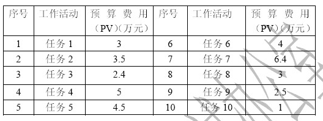

# 2010.5  

## 试题1  

**阅读下面说明，回答问题1至问题3，将解答填入答题纸的对应栏内。**  
某网络建设项目在商务谈判阶段，建设方和承建方鉴于以前有过合作经历，并且在合同谈判阶段双方都认为理解了对方的意图，因此签订的合同只简单规定了项目建设内容、项目金额、付款方式和交工时间。  
在实施过程中，建设方提出一些新需求，对原有需求也做了一定的更改。承建方项目组经评估认为新需求可能会导致工期延迟和项目成本大幅增加，因此拒绝了建设方的要求，并让此项目的销售人员通知建设方。当销售人员告知建设方不能变更时，建设方对此非常不满意，认为承建方没有认真履行合同。  
在初步验收时，建设方提出了很多问题，甚至将曾被拒绝的需求变更重新提出，双方交涉陷入僵局。建设方一直没有在验收清单上签字，最终导致项目进度延误，而建设方以未按时交工为由，要求承建方进行赔偿。  
试题分析  
本题考查项目合同管理、变更管理、范围管理、沟通管理等相关理论与时间，并偏重于在时间中的应用。从题目的说明中，可以初步分析出以下一些信息  
（1）合同签订比较随意，说明该项目的合同管理存在一定的问题。只规定了项目建设内容、项目金额、付款方式和交工时间这些合同里面必不可少的组成部分，因此可能会遗漏一些对于项目执行和验收活动至关重要的保障性条款。  
（2）在项目实施过程中，对于变更的处理存在一定问题。当客户提出变更请求时，项目组按照变更控制流程的要求进行了影响评估，这种做法是没有问题的，但评估之后的结果及处理方式不恰当，不能在没有跟客户进行沟通的情况下就直接拒绝客户的要求，同时，项目组应当直接与客户进行沟通，不应该由销售人员来转达。  
（3）当销售人员转达了项目组的意思后，客户已经表示了不满的情绪，但对于该项目组来说并没有采取进一步的措施，也标明项目的沟通管理存在严重的问题。  
（4）初步验收的时候客户提出问题，并且迟迟不肯签字，也是由于之前的沟通不到位，客户关系不够融洽造成的后果。  
从以上的分析我们可以看出，试题1强调的是各范畴的管理理论在项目实践中的应用，考生在考试时并不能只是关注理论体系，而是要有一定的项目经验，了解项目中的一些正确的实施方法。  

**【问题1】（7分）将以下空白处填写的恰当内容，写入答题纸的对应栏内。**  
（1） 在该项目实施过程中 、 与 工作没有做好。  
① 沟通管理 ② 配置管理 ③ 质量管理   
④ 范围管理 ⑤ 绩效管理 ⑥ 风险管理  
（2）从合同管理角度分析可能导致不能验收的原因是合同中缺少 、  
 、 的相关内容。  
（3） 对于建设方提出的新需求，项目组应 ，以便双方更好地履行合同。  
>（1）① 沟通管理 ④ 范围管理 ⑥ 风险管理（回答编号或术语都可以，顺序不限）  
（2）项目范围（或需求）、验收标准（或验收步骤、或验收方法）、违约责任及判定（顺序不限）  
（3）与建设方正式协商（或沟通）后，就项目的后续执行达成一致（只要答出沟通和协商即可得分）  

**【问题2】（4分）将以下空白处应填写的恰当内容，写入答题纸的对应栏内。**  
从合同变更管理的角度来看，项目经理应当遵循的原则和方法如下  
（1）合同变更的处理原则是 。  
（2）变更合同价款应按下列方法进行  
首先确定 ，然后确定变更合同价款。  
若合同中已有适用于项目变更的价格，则按合同已有的价格变更合同价款。  
若合同中只有类似于项目的变更价格，则可以参照类似价格变更合同价款。  
若合同中没有适用或类似项目变更的价格，则由 提出适当的变更价格，经  
 确认后执行。  
>（1）公平合理  
（2）① 合同变更量清单（或合同变更范围、合同变更内容）  
④ 承包人（或承建单位）、监理工程师（或业主，或建设单位）  

**【问题3】（4分）**  
为了使项目通过验收，请简要叙述作为承建方的项目经理，应该如何处理。  
>对双方的需求（项目范围）做一次全面的沟通和说明，达成一致，并记录下来，请建设方签字确认。  
就完成的工作与建设方沟通确认，并请建设方签字。  
就待完成的工作列出清单，以便完成时请建设方确认。  
就合同中的验收标准、步骤和方法与建设方协商一致。  
必要时可签署一份售后服务承诺书，将此项目周期内无法完成的任务做一个备忘，承诺在后续的服务期内完成，先保证项目能按时验收。  
对于建设方提出的新需求，可与建设方协商进行合同变更，或签订补充合同。  

---
---
---

## 试题2（15分）  

**阅读下面说明，回答问题1至问题3，将解答填入答题纸的对应栏内。**  
某系统集成公司选定李某作为系统集成项目A的项目经理。李某针对A项目制定了WBS，将整个项目分为10个任务，这10个任务的单项预算如下表。  
  
到了第四个月月底的时候，按计划应该完成的任务是1、2、3、4、6、7、8，但项目经理李某检查发现，实际完成的任务是1、2、3、4、6、7，其他的工作都没有开始，此时统计出来花费的实际费用总和为25万元。  
试题分析  
本题主要考查成本控制中挣值分析的方法和应用。  
挣值分析是成本控制的方法之一，核心是将已完成的工作的预算成本（挣值）按其计划的预算值进行累加获得的累加值，与计划工作的预算成本（计划值）和已经完成工作的实际成本（实际值）进行比较，根据比较的结果得到项目的绩效情况。  

**【问题1】（6分）**  
请计算此时项目的PV、AC、EV（需写出计算过程）。  
>PV=3+3.5+2.4+5+4+6.4+3=27.3  
AC=25  
EV=3+3.5+2.4+5+4+6.4=24.3  

**【问题2】（4分）**  
请计算此时项目的绩效指数CPI和SPI（需写出公式）。  
>CPI=EV/AC=24.3/25=97.2%  
SPI=EV/PV=24.3/27.3=89.01%  

**【问题3】（5分）**  
请分析该项目的成本、进度情况，并指出可以在哪些方面采取措施以保障项目的顺利进行。  
>进度落后，成本超支。  
措施用高效人员替换低效率人员，加班（或赶工），或在防范风险的前提下并行施工（快速跟进）。  

---
---
---

## 试题3  

**阅读下面说明，回答问题1至问题3，将解答填入答题纸的对应栏内。**  
王某是某管理平台开发项目的项目经理。王某在项目启动阶段确定了项目组的成员，并任命程序员李工兼任质量保证人员。李工认为项目工期较长，因此将项目的质量检查时间定为每月1次。项目在实施过程中不断遇到一些问题，具体如下  
事件1项目进入编码阶段，在编码工作进行了1个月的时候，李工按时进行了一次质量检查，发现某位开发人员负责的一个模块代码未按公司要求的编码规范编写，但是此时这个模块已基本开发完毕，如果重新修改势必影响下一阶段的测试工作。  
事件2李工对这个开发人员开具了不符合项目报告，但开发人员认为并不是自己的问题，而且修改代码会影响项目进度，双方一直未达成一致，因此代码也没有修改。  
事件3在对此模块的代码走查过程中，由于可读性较差，不但耗费了很多的时间，还发现了大量的错误。开发人员不得不对此模块重新修改，并按公司要求的编码规范进行修正，结果导致开发阶段的进度延误。  
试题分析  
本题主要考查如何实施项目的质量管理工作。质量管理工作对一个项目来说是至关重要的，但在很多项目中质量管理并不是系统地、有计划地来执行的，经常处于一种救火的状态，还有人认为质量管理就是为了找错的。事实上，质量管理活动应该是有计划、有目标、有流程规范的一系列活动。  
通过仔细阅读题目说明，可分析如下  
（1）李工原来是程序员，并且在项目中兼任质量管理人员，一方面没有质量保证经验，另方面质量管理人员一般来说应该独立于项目组，否则无法保证质量检查工作的客观性。  
（2）李工将检查时间定为每月一次也是不妥的，因为在一个月之内可能会发生很多活动，而有些活动是应该在执行过程中被检查的，等到完成后检查就来不及了。正确的活动做法是按照项目计划制定出质量管理计划，然后按照质量管理计划具体实施。  
（3）李工发现问题时，未能与当事人达成一致，他应该按问题上报流程处理，而不是放任不管。  
（4）编码人员没有按照公司的编码规范来编码，这一点是不对的，但究其原因可能是公司或项目没有对项目提供有效的培训造成的。  

**【问题1】（5分）**  
请指出这个项目在质量管理方面可能存在哪些问题？  
>项目经理用人错误，李工没有质量保证经验。  
没有制定合理的质量管理计划，检查频率的设定有问题。  
应加强项目过程中的质量控制或检查，不能等到产品完成后才检查。  
李工发现问题的处理方式不对。QA发现问题应与当事人协商，如果无法达成一致要向项目经理或更高的领导汇报，而不能自作主张。  
在质量管理中，没有与合适的技术手段相结合。  
对程序员在质量意识和质量管理方面的培训不足。  

**【问题2】（6分）**  
质量控制的工具和技术包括哪六项？（从以下候选项中选择，将相应的编号写入答题纸的对应栏内）  
A．同行评审 B．挣值分析 C．测试 D．控制图 E．因果图  
F．流程图  G．成本效益分析 H．甘特图  
I．帕累托图（排列图） J．决策树分析   
K．波士顿矩阵图  
>A，C，D，E，F，I  

**【问题3】（4分）**  
作为此项目的质量保证人员，在整个项目中应该完成哪些工作？  
>计划阶段制定质量管理计划和相应的质量标准。  
按计划实施质量检查，检查是否按标准过程实施项目工作。注意项目过程中的质量检查，在每次进行检查之前准备检查清单（checklist），并将质量管理相关情况予以记录。  
依据检查的情况和记录，分析问题，发现问题，与当事人协商进行解决。问题解决后要进行验证；如果无法与当事人达成一致，应报告项目经理或更高层领导，直至问题解决。  
定期给项目干系人发质量报告。  
为项目组成员提供质量管理要求方面的培训或指导。  

---
---
---

## 试题4（15分）  

**阅读下面说明，回答问题1至问题3，将解答填入答题纸的对应栏内。**  
老陆是某系统集成公司资深项目经理，在项目建设初期带领项目团队确定了项目范围。后因工作安排太忙，无瑕顾及本项目，于是他要求  
（1）本项目各小组组长分别制定组成项目管理计划的子计划；  
（2）本项目各小组组长各自监督其团队成员在整个项目建设过程中子计划的执行情况；  
（3）项目组成员坚决执行子计划，且原则上不允许修改。  
在执行了三个月以后，项目经常出现各子项目间无法顺利衔接，需要大量工时进行返工等问题，目前项目进度已经远远滞后于预定计划。  
试题分析  
本题主要考查考生如何制定项目计划以及项目管理计划包含的内容。  
项目管理计划是一个整体计划，它明确了如何执行、监督、监控以及如何收尾项目。除了进度计划和项目预算外，项目管理计划可以是概要的或详细的，并且可以包括一个或多个分计划。  
项目计划的编制是一个逐步细化的过程，一般编制项目计划的大致过程如下  
（1）明确项目目标和阶段目标。  
（2）成立初步的项目团队。  
（3）工作准备与信息收集，尽可能全面地收集项目信息。  
（4）依据标准、模板编写初步的概要项目计划。  
（5）编写范围、质量、进度、预算等分计划。  
（6）把上述分计划纳入项目计划，然后对项目计划进行综合平衡、优化。  
（7）项目经理负责组织编写项目计划，项目计划应包括计划主体和以附件形式存在的其他相关分计划。  
（8）评审与批评项目计划。  
（9）获得批准后的项目计划就成为了项目的基准计划。  
通过对题目说明的详细阅读和分析，可以找到如下的问题  
（1）老陆在项目计划阶段没有参与项目计划的制定，也没有把各子计划综合起来形成整体的项目管理计划。  
（2）项目小组各自只管自己的子计划，没有相互之间的沟通，并且项目计划没有经过评审。这样各小组之间的计划无法协调一致，势必会影响整体项目工作。  
（3）老陆规定计划不允许变更，这样，当指导项目实施的时候无法及时的纠正错误。  
（4）老陆要求各小组长监督其成员在整个项目过程中子计划的执行情况，这一点也是不妥的。作为整个项目的项目经理，他应该承担起项目监控的职责，而不是完全放权给下面的人。  

**【问题1】（4分）**  
请简要分析造成项目目前状况的原因。  
>项目缺少整体计划。本案例中的做法只完成了项目管理计划中的子计划，并没有形成真正的项目整体管理计划，即确定、综合与协调计划所需要的活动，并形成文件。  
项目缺少整体的报告和监控机制，各项目小组各自为政。  
项目缺少整体变更控制流程和机制。管理计划本身是通过变更控制过程进行不断更新和修订的，不允许修改是不切合实际的。  

**【问题2】（6分）**  
请简要叙述项目整体管理计划中应包含哪些内容。  
>所使用的项目管理过程。  
每个特定项目管理过程的实施程度。  
完成这些项目的工具和技术的描述。  
选择的项目生命周期和相关的项目阶段。  
如何用选定的过程来管理具体的项目，包括过程之间的依赖与交互关系和基本的输入输出等。  
如何执行流程来完成项目目标。  
如何监督和控制变更。  
如何实施配置管理。  
如何维护项目绩效基线的完整性。  
与项目干系人进行沟通的要求和技术。  
为项目选择的生命周期模型。对于多阶段项目，要包括所定义阶段是如何划分的。  
为了解决某些遗留问题和未定的决策，对于其内容、严重程度和紧迫程度进行的关键管理评审。  

**【问题3】（5分）**  
为了完成该项目，请从整体管理的角度，说明老陆和公司可采取哪些补救措施。  
>建立整体管理机制。老陆应分配更多的精力来进行项目管理，或由其他合适的人员来承担整体管理的工作。  
理清各子项目组目前的工作状态，例如其工作进度、成本、资源配置等。  
重新定义项目的整体管理计划，并与各子项目计划建立明确的关联。  
按照计划要求，重新进行资源平衡。  
建立或加强项目的沟通、报告和监控机制。  
加强项目的整体变更控制。  

---
---
---

## 试题5  

**阅读下面说明，回答问题1至问题3，将解答填入答题纸的对应栏内。**  
有多年开发经验的赵工被任命为某应用软件开发项目的项目经理，客户要求10个月完成项目。项目组包括开发、测试人员共10人，赵工兼任配置管理员的工作。  
按照客户的初步需求，赵工估算了工作量，发现工期很紧。因此，赵工在了解客户的部分需求之后，就开始对这部分需求进行设计和开发工作。  
在编码阶段，赵工发现需求文件还在不断修改，形成了多个版本，设计文件不知道该与哪一版本的需求文件对应，而代码更不知道对应哪一版本的需求和设计文件。同时，客户仍在不断提出新的需求，有些很细微的修改，开发人员随手就改掉了。  
到了集成调试的时候，发现错误非常多。由于需求、设计和代码的版本对应不上，甚至搞不清楚是需求、设计还是编码的错误。眼看进度无法保证，项目团队成员失去了信心。  
试题分析  
本题主要考查配置管理在项目过程中的应用。  
配置管理师为了系统的控制配置变更，在项目的整个生命周期中维持配置的完整性和可跟踪性，而表示系统在不同时间点上的配置的学科。本项目是一个软件开发的项目，软件的配置管理包括的主要活动有配置识别、变更控制、状态报告和配置审计，在实施配置管理活动前要制定配置管理计划。  
从题目的说明出发，对本题进行分析，可得到如下的结论  
（1）赵工具有多年的开发经验，但说明中并没有给出他具有一定的项目管理经验，因此这一点可能是造成项目失控的原因。  
（2）赵工兼任配置管理工作，有过项目经验的人一般会知道，有10个开发人员参与的近一年的软件开发项目是有一定规模的，其中的配置管理工作非常琐碎，作为一个项目经理本身工作就很繁忙，因此赵工身兼二职是不现实的，这也是造成项目失控的原因之一。  
（3）需求文件与设计文件对应不上，这一方面是由于没有做好版本管理工作，另一方面也是由于项目中没有建立相应的基线造成的。  
（4）客户提出的新需求，开发人员随手就改掉了，说明没有进行有效地变更控制。  

**【问题1】（5分）**  
请从项目管理和配置管理的角度分析造成项目失控的原因。  
>赵工没有项目管理经验，不适合担任项目经理的职位。  
项目经理兼任配置管理员，精力不够，无法完成配置管理工作。  
赵工的项目范围管理有问题。  
版本管理没有做好。  
项目中没有建立基线，导致需求、设计、编码无法对应。  
没有做好变更管理。  

**【问题2】（5分）**  
以下左侧表格中是配置管理的基本概念，右侧表格是有关这些概念的论述，请在答题纸上用直线将左侧表格与右侧表格里的对应项连接起来。  

配置项 | 用于控制工作产品，包括存储媒体、规程和访问的工具  
 :- | :-  
**基线** | **是配置管理的前提，它的组成可能包括交付客户的产品、内部工作产品、采购的产品或使用的工具等**  
**配置管理系统** | **可看做是一个相对稳定的逻辑实体，其组成部分不能被任何人随意修改**  
**配置状态报告** | **记录配置项有关的所有信息，存放受控的配置项**  
**配置库** | **能够及时、准确地给出配置项的当前状况，加强配置管理工作**  
>  

**【问题3】（5分）**  
请说明正常的配置管理工作包括哪些活动？  
>制定配置管理计划，配置项识别，报告配置状态，进行配置审核，版本管理和发行管理，实施配置变更控制。  
注意中项教材第二版，配置管理的过程包括制定配置管理计划、配置标识、配置控制、配置状态报告、配置审计、发布管理和交付。  
