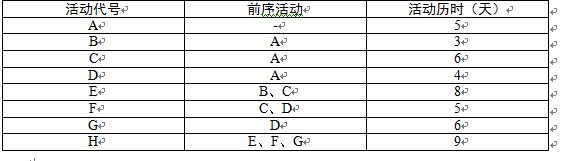

# 2011.11

## 试题1

**阅读以下说明，请回答问题1至问题3，将解答填在答题纸对应栏内。**
某大型企业集团拟在生产园区建立一套无线网络，覆盖半径大约15公里，要求能够支持高速数据传输、无缝漫游以及多种类型数据业务等。集团总经理责成信息中心主任李某自负此事，李某找到曾经承担集团内部网络系统工程的系统集成商A公司，提出了集团的需求，A公司管理层开会研究后命令项目经理张某积极跟进，与李某密切联系，张某经过上网搜索，发现外企B公司最近推出的一种基于WiMAX技术的无线网络系统比较符合需求，国外也有类似的成功案例。张某亲自到B公司的国内代理商C公司进行了实地考察，并在C公司进行了产品演示实验，感到效果良好后，张某和李某沟通，A公司正式与C公司签订了采购台同，并很快进行了系统的安装部署。
可是当无线网络系统正式投入运行后不久，就出现了一系列问题，比如无线网络覆盖存在盲区，不支持某些类型的数据业务，用户较多时数据传输率急剧下降，偶尔发生莫名其妙的断网现象等，更麻烦的是，当地无线电管理部门认为他们没有取得无线电频带使用执照，要求该集团立即停止运行该无线网络，并且要对他们进行处罚。此时C公司传来消息，称B公司因内部原因即将退出中国大陆市场，继续提供该系统的技术支持服务比较困难。
试题分析

**【问题1】（6分）**
在案例中，张某未进行充分的项目可行性研究以致项目出现危机，请指出具体体现在哪些方面（将正确选项对应的字母填入答题纸对应栏内，多选扣分）
A．投资必要性 D．组织可行性 F．经济可行性
B．技术可行性 E．社会可行性 G．风险因素分析及对策
C．财务可行性
>B，E，G

**【问题2】（3分）**
请简要列举进行项目可行性研究的主要步骤。
>初步可行性研究
详细可行性研究
项目论证
项目评估
项目可行性研究报告的编写、提交和获得批准

**【问题3】（6分）**
如果你被A公司任命为该项目的项目经理，请用300以内文字简要叙述你应如何应对目前的困境。
>了解无线频带使用的有关政策，与政府有关部门沟通，商谈办理无线频带使用手续。
与C、B公司沟通，寻求技术解决方案。针对题干中出现的技术问题（速率、多数据类型、断网、覆盖盲区等），商议满足用户技术需求的方法和措施。
与C公司就系统后续的技术支持和服务沟通协商。
如果与C、B公司协商不能达成一致，根据合同让C公司承担相应责任；提出采用其他无线网络代替方案的建议或终止该项目。

---
---
---

## 试题2

**阅读以下说明，请回答问题1至问题3，将解答填入答题纸的对应栏内。**
某系统集成项目的建设方要求必须按合同规定的期限交付系统，承建方项目经理李某决定严格执行项目管理，以保证项目按期完成。他决定使用关键路径方法来编制项目进度网络图。在对工作分解结构进行认真分析后，李某得到一张包含了活动先后关系和每项活动初步历时估计的工作列表，如下所示。

试题分析

**【问题1】（5分）**
请计算活动B、C、F的自由浮动时间。
请计算活动D、G的最迟开始时间。
>B的自由浮动时间分别为3（天）
C的自由浮动时间分别为（天）
F的自由浮动时间分别为3（天）
D的最迟开始时间分别为9（天）
G的最迟开始时间分别为13（天）

**【问题2】（4分）**
如果活动B拖延了4天，则该项目的工期会拖延几天？请说明理由。
>（4分）
结果拖延了1天
理由
原关键路径为ACEH
原工期=5+6+8+9=28天
新关键路径为ABEH
新工期=5+7+8+9=29天

**【问题3】（6分）**
按照题干所述，李某实际完成了项目进度管理的什么过程？如果要进行有效的项目进度管理，还要完成哪些过程？
>（6分）
已完成活动定义；活动排序；活动历时估算。
待完成活动资源估算；制定进度计划表；进度控制。

---
---
---

## 试题3

**阅读以下说明，请回答问题1至问题3，将解答填入答题纸的对应栏内。**
M公司是一个仅有几名技术人员的小型信息系统集成公司，运营三年来承担过不同规模的二十多个系统集成项目，积累了一定的项目经验。由于公司尚处于成长期，有些工作尚未规范，某些项目存在质量问题。
公司管理层决定采取措施，加强质量管理工作。这些措施包括提高公司的技术和管理人员素质，专门招聘几名有经验的项目管理人员；成立了专门的质量管理部门，委派新招聘的陈工担任质量管理部门的经理，全面负责公司的质量管理。
试题分析

**【问题1】（6分）**
项目经理的项目质量保证活动的基本内容向陈工请教，请问陈工应如何回答？
>（6分）
制订质量标准
制订质量控制流程
提出质量保证所采用的方法和技术
建立质量保证体系

**【问题2】（3分）**
陈工对质量管理的方法、技术和工具进行了整理，主要包括传统的检查、测试、（ ）和6。另外，业界在开展全面质量管理的过程中，通常将（ ）、流程图、直方图、检查表、散点图、（ ）和控制图称为“老七种工具”，而将互相关系图、亲和图、（ ）、矩阵图、（ ）过程决策程序图和（ ）称为“新七种工具”。
请你将上面的叙述补充完整（将空白处应填写的恰当内容写在答题纸的对应栏内）。
>（3分）
统计抽样
因果图
排列图
树状图
优先矩阵图
活动网络图

**【问题3】（6分）**
公司任命张工为某项目的项目经理，针对项目质量控制过程的基本步骤，陈工可对张工提出怎样的指导性建议？
>（6分）
选择控制对象
确定控制对象
制订实施计划，确定保证措施
按计划执行
对项目实施情况进行跟踪监督、检查，并将监测的结果与计划或标准相比较
发现并分析偏差
根据偏差采取相应对策

---
---
---

## 试题4

**阅读以下说明，请回答问题1至问题3，将解答填入答题纸的对应栏内。**
B系统集成公司拟承建某大型国有企业A单位的一个信息系统项目。该项目由A单位信息中心负责，信息中心主任赵某任甲方经理，B公司委派项目经理杨某负责跟进该项目。经初步调研，杨某发现该项目进度紧、任务重、用户需求模糊，可能存在较大风险。但B公司领导认为应该先签下该项目，其他问题在项目实施中再想办法解决。A、B双方很快签订了一份总价合同。在合同中，根据赵某提供的初步需求说明，简单列出了系统应完成的各项功能和性能指标。杨某根据合同制定了项目的范围说明书。
可是随着需求调研的深入，杨某发现A单位一些业务部门获得的用户需求大大超出了赵某所提出的需求范围。杨某就此和赵某进行了沟通。杨某认为需求变化太大，如果继续按合同中所规定的进度和验收标准实施将非常困难，要求A单位追加预算并延长项目工期。而赵某认为这些需求已经包含在所签合同的条款中，并且这是一个固定预算项目，不可能再增加预算。双方对照合同条款逐条分析。结果杨某发现这些条款要么太粗，不够明确，要么就是双方在需求理解上存在巨大差异。
杨某将上述情况汇报给了B公司主管领导，主管领导认为A单位为公司客户，非常重要，要求杨某利用合同条款的模糊性，简化部分模块的功能实现，以保持成本和进度不变。
试题分析

**【问题1】（6分）**
在本案例中，B公司在合同管理方面存在哪些问题？
>（6分）
没有做好签订合同之前的调查工作，合同签订过于草率。
合同没有制定好，缺乏明确清晰的工作说明或更细化的合同条款。
没有采取措施，确保合同签约双方对合同条款的一致理解。
合同中缺乏相应的纠纷处理条款。
对于签订总价合同的风险认识不足。

**【问题2】（5分）**
结合本案例，判断下列选项的正误（填写在答题纸的对应栏内，正确的选项填写“√”，错误的选项填写“×”）
合同确定了信息系统实施和管理的主要目标，是签约双方在工程中各种经济活动的依据。（ ）
合同开始生效以后，对于某些未约定的或者约定不明确的内容，合同双方可以通过合同附件进行补充。（ ）
如果承建方交付的工作结果经过建设方的验收但实际不符合质量要求，则应该由承建方承当采取补救措施所产生的全部费用。（ ）
承包人通常愿意签订总价合同以便能够通过节约成本来提高利润。（ ）
合同变更的基本处理原则是“公平合理”。（ ）
>（5分）
（1）√
（2）√
（3）×
（4）×
（5）√

**【问题3】（4分）**
题干说明中的最后一段中，B公司主管领导对项目实施的要求是否妥当？你认为杨某应该如何处理才能把合同管理的后续工作做好。
>（4分）
不妥当。（1分）
杨某应采取的处理措施有
召集项目干系人对A单位的需求变化及引起的相应的合同变更事宜进行评估；
与B公司管理层沟通，要求实施合同变更；
建议A、B公司的高层领导沟通协商，就合同的变更及项目的继续执行达成原则一致。

---
---
---

## 试题5

**阅读以下说明，请回答问题1至问题2，将解答填入答题纸的对应栏内。**
项目经理张某率领项目组为某银行开发了一套“银证通”管理系统，这是一套典型的异构环境下的分布式电子交易系统，该系统在实际工作环境狭隘运行状况良好，客户方也非常满意，在系统正式运行的第三个月末，由于银行业务的调整，客户方提出需要修改该系统的功能。为此该系统需要在原有的数据库中增加一项新的业务代码，并在另一项原本仅由数字构成的业务代码前增加由3个英文字母组成的前缀码。张某认为这算不上什么特别大的功能调整，就非常有把握地对负责该项目的客服人员说“小意思，估计一个人一天时间就能完成修改。为了稳妥起见，你可以向客户承诺三天内解决问题，五天内新版本系统正式上线。”
项目经理要求经验丰富的程序员甲在一天内独自完成所有相关代码的改动和系统测试。第二天一早，他吃惊地发现，程序员一夜未眠，还在埋头查找和修改代码。不得已，他又将程序员乙、丙加入到了代码修改者的行列中。但是一周时间飞逝而过，修改的工作仍然未完成，客户方对此非常不满。
试题分析

**【问题1】（6分）（将相应选项填入答题纸对应栏内。）**
在本案例中，这次系统工程变更属于一种 （1） 维护工作，导致这次变更发生的原因是
（2） 。从技术角度来看，造成项目修改工作如此困难最可能的原因是系统 （3） 方面的问题从管理角度来看，造成项目修改工作迟迟不能结束主要是因为在 （4） 过程中存在问题。
备选项
（1） A．适应性 B．预防性
C．完善性 D．更正性
（2） A．项目执行与项目基准不一致导致的被动调整
B．项目范围定义存在疏忽
C．实现项目的价值提升
D．外部环境发生了变化
（3） A．需求分析 B．设计
C．编码 D．测试
（4） A．进度管理 B．沟通管理
C．变更管理 D．风险管理
>（6分）
（1）A
（2）D
（3）B
（4）C

**【问题2】（9分）**
针对题干中客户提出的要求和有关后续工作，如果你是该项目的项目经理，请简述你将如何实施变更。
>（9分）
提出和接受变更申请；
对变更的初审；
变更方案论证；
项目变更控制委员会审查；
发出变更通知并开始实施；
变更实施的监控；
变更效果的评估；
判断发生变更后的项目是否已纳入正常轨道；
  妥善保存变更产生的相关文档，确保其完整、及时、准确、清晰，适当的时候可以引入配置管理工具。
