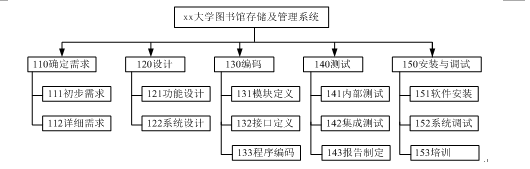
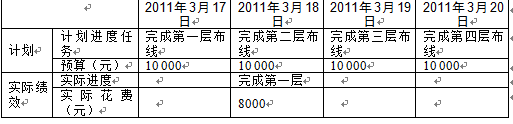

# 2011.5  

## 试题1  

**阅读以下材料，请回答问题1至问题3，将解答或相应的编号填入答题纸的对应栏内。**  
ZGY公司承担了某大学图书馆存储及管理系统的开发任务，项目周期4个月。  
小陈是ZGY公司的员工，半年前入职。在校期间，小陈跟随导师做过两年的软件开发，具有很好的软件开发基础。领导对小陈很信任，本次任命小陈担任该项目的项目经理。项目立项前，小陈参与了用户前期沟通会议，并承担了需求分析工作。  
会议后，相关部门按照要求整理会议所形成的决议和共识，并寄予客户等待确认。为了节约时间，小陈根据自己在沟通会议上记录的结果，当晚组织相关人员撰写了软件需求规格说明。次日便要求设计人员开始进行系统设计，并指出项目组成员必须严格按照进度计划执行，以不辜负领导的期望与嘱托。  
项目进行到2月底时，校方主管此业务的新领导到任，并提出了新的信息化管理要求。小陈进行变更代价分析，认为成本超支严重，于是小陈准备不进行范围变更，并将结果通知客户，引起客户不满。  
项目进入测试阶段后，ZGY公司开展内部管理审查活动，此项目作为在建项目接受了抽查，项目审查员给该项目提出了多个问题，范围管理方面的问题尤为突出。  
参考答案  

**【问题1】（5分）**  
结合本案例，分析小陈在此项目中项目范围管理方面可能存在的不足。  
>（5分）  
1．没有制定项目管理计划（或范围管理计划）；  
2．没有进行项目范围定义（或软件需求规格说明书只是项目范围定义输出的一个组成部分，或没有形成项目范围说明书）；  
3．在与干系人形成统一意见之间，就开始设计工作（或范围没有确认）；  
4．项目范围是否变更，应遵循正式变更流程，不由项目经理单独决定；  
5．项目范围管理过程中与干系人的沟通存在问题（或范围变更没有和客户取得统一意见）；  
6．软件需求规格说明没有经过评审就付诸实行。  
每条1分，满分5分。  

**【问题2】（6分）**  
小陈组织人员撰写的项目WBS如下  
  
请说明上述WBS结构是将 作为第一层进行分解的。除了上述方法，还可以采用哪些方式进行分解？  
把项目重要的可交付物作为分解的第一层、把子项目安排在第一层。（1分）  
从上图来看，完整的WBS中除了实现最终产品或服务所必须进行的技术工作外，还需要包括 。  
创建WBS时要遵循哪些原则？供选择答案（将正确选项的字母填入答题纸对应栏内）  
A．在各层次上保持项目的完整性，避免遗漏必要的组成部分。  
B．一个工作单元可从属于某些上层单元。  
C．相同层次的工作单元可以采用非相同性质。  
D．工作单元应能分开不同责任者和不同工作内容。  
E．便于项目管理计划、控制的管理需要。  
F．最低层工作应该具有可比性，是可管理的，可定量检查的。  
G．分解到一定粒度的工作包。  
H．WBS不包括分包出去的工作。  
>（6分）  
答案项目生命周期；（1分）  
把项目重要的可交付物作为分解的第一层、把子项目安排在第一层。（1分）  
从上图来看，完整的WBS中除了实现最终产品或服务所必须进行的技术工作，还需要包括 。  
答案项目的管理工作。（2分）  
创建WBS时要遵循哪些原则？供选择答案（将正确选项的字母填入答题纸对应栏内）  
A．在各层次上保持项目的完整性，避免遗漏必要的组成部分。  
B．一个工作单元可从属于某些上层单元。  
C．相同层次的工作单元可以采用非相同性质。  
D．工作单元应能分开不同责任者和不同工作内容。  
E．便于项目管理计划、控制的管理需要。  
F．最低层工作应该具有可比性，是可管理的，可定量检查的。  
G．分解到一定粒度的工作包。  
H．WBS不包括分包出去的工作。  
参考答案A D  
E F（2分，.5分每个选项）  

**【问题3】（4分）**  
请指出案例中引起范围变更的原因。  
一般情况下，造成项目范围变更还有哪些主要原因？  
>（4分）  
请指出案例中引起范围变更的原因。  
答案客户对项目、项目产品或服务的要求发生变化。（1分）  
一般情况下，造成项目范围变更还有哪些主要原因。  
答案  
项目外部环境发生变化，例如政府政策发生变化；  
项目范围计划编制有错误或遗漏；  
市场上出现了或设计人员提出了新技术、新手段或新方案；  
项目实施组织本身发生变化。  
（每条1分，满分3分）  

---
---
---

## 试题2（15分）  

**阅读以下材料，请回答问题1至问题3，将解答或相应的编号填入答题纸的对应栏内。**  
某布线工程基本情况为一层到四层，必须在低层完成后才能进行高层布线。每层工作量完全相同。项目经理根据现有人员和工作任务，预计每层需要一天完成。项目经理编制了该项目的布线进度计划，并在3月18号工作时间结束后对工作完成情况进行了绩效评估，如下表所示  
  
试题分析  
试题2是一道有关挣值分析计算的试题，题目给出了相关的条件，要求考试能够识别出PV、AC和EV。同时，根据这些参数来计算CV和SV，然后来判断项目的状态。解答此题的关键在充分理解PV、AC和EV的概念，同时，需要识记相关的公式，例如，CPI=EV/AC和SPI=EV/PV。难点在于完工预测部分，计算ETC和EAC。要求识别典型偏差和非典型偏差，对于典型偏差，要求知道公式EAC = AC+（BAC-EV）/CPI，在典型偏差情况下，ETC=（BAC-EV）/CPI。  
参考答案  

**【问题1】（5分）**  
试计算2011-3-18号相对应的PV EV AC CPI和SPI？  
>（5分）计算211-3-18号相对应的PV、EV、AC、CPI和SPI。  
PV=10 000+10 000=20 000元EV=10  
000元AC=8 000元  
CPI=EV/AC=10 000/8 000=1.25  
SPI=EV/PV=10 000/20 000=0.5  

**【问题2】（4分）**  
（1）根据当前绩效，在下图中划出AC和EV曲线。（2分）  
（2）根据目前的绩效分析，如果想在以后的工作中改进目前绩效，请你列出具体措施（2分）  
>（4分）  
根据当前绩效在下图中画出AC和EV的曲线。  

**【问题3】（6分）**  
（1）如果在2011年3月18日绩效评估后，找到了影响绩效的原因，并纠正了项目偏差，请计算ETC和EAC，并预测此种情况下的完工日期。（3分）  
（2）如果在2011年3月18日绩效评估后，未进行原因分析和采取相关措施，仍按目前状态开展工作，请计算ETC和EAC，并预测此种情况下的完工日期。  
>（6分）  
如果在211-3-18日的绩效评估后找到了影响绩效的原因，并纠正了项目偏差，请计算ETC和EAC并预测此种情况下的完工日期。  
答ETC=EAC-EV=40 000-10 000=30 000元  
EAC=AC+ETC=8 000+30 000=38  
000元  
预测完工日期为3月21号（2分）  
如果在2011-3-18日的绩效评估后未能找到影响绩效的原因，请计算ETC和EAC并预测此种情况下的完工日期。  
ETC=（EAC-EV）/CPI=（40 000-10 000）/1.25=30 000/1.25=24 000元  
EAC=AC+ETC=8 000+24 000=32  
000元  
预测完工日期为3月24号（4分）  

---
---
---

## 试题3  

**阅读以下材料，请回答问题1至问题3，将解答或相应的编号填入答题纸的对应栏内。**  
某系统集成商A两年前通过了ISO9000认证，并能够按照要求持续改进，不断提高质量管理水平。  
近期，该公司承担了某自然灾害预警系统项目，由于项目时间紧张，上线任务迫切，经过管理层讨论，决定临时简化流程，在开发阶段集中对质量进行把关。  
由于以前做过类似的项目，为了节约时间，项目经理带领团队套用原有成功项目的需求和设计思路，对历史项目的相关文档进行修改后，立即进入编码阶段。编码完成后，为争取系统提前交付，匆忙进行测试，并上线试运行。  
系统试运行中，各种错误不断涌现。到目前为止，延期半年还没有交付，严重影响了用户满意度。  
参考答案  

**【问题1】（5分）**  
结合本案例，分析该项目在质量管理方面可能存在的不足，并简述项目质量管理的流程。  
>（5分）  
不足  
1．公司未按照质量保证的标准体系进行质量管理（有法不依）。  
2．质量保证部门或人员没有对项目全过程的实施进行指导与监控（全程参与）。  
3．需求设计相关文件没有经过评审（概要设计、详细设计文件没有经过评审）。  
4．前期测试工作不充分（有可能忽视了单元测试、代码走查、系统测试、集成测试等环节）。（每条1分，满分2分）  
质量管理流程  
1．确立质量标准体系。  
2．对项目实施进行质量监控。  
3．将实际与标准对照。  
4．纠偏纠错。  
（每条1分，满分3分）  

**【问题2】（8分）**  
（1）面对该项目现状，你作为该项目的项目经理，请提出下一步的应对措施。（5分）  
（2）填空（3分）  
软件的质量保证与控制涉及一系列术语，其中，确定软件开发周期中的一个给定阶段的产品是否达到在上一阶段确立的需求的过程是 ；在软件开发过程结束时对软件进行评价以确定它是否和软件需求相一致的过程是 ；通过执行程序来有意识地发现程序中的设计错误和编码错误的过程是 。  
>（8分）  
（1）必要的时候建议修改该项目的质量基线（和客户沟通，重新讨论项目需求，力求主要、关键部分能让客户满意，达到上线条件）；  
向公司高层要求调拨资源（如成本、时间、人力）；  
加强测试和质量监控；  
加强交付后的客服与维护；  
加强沟通（包括所有的沟通、公关的可能性）。  
（每条1分，满分5分）  
2）填空（3分）  
软件的质量保证与控制涉及一系列术语，其中，确定软件开发周期中的一个给定阶段的产品是否达到在上一阶段确立的需求的过程是 ；在软件开发过程结束时对软件进行评价以确定它是否和软件需求相一致的过程是 ；通过执行程序来有意识地发现程序中的设计错误和编码错误的过程是 。  
答案验证；确认；测试  

**【问题3】（2分）**  
请说明项目质量控制包括哪些活动？  
>（2分）  
1.保证由内部或外部机构进行检测管理的一致性；  
2.发现与质量标准（客户需求、质量需求）的差异；  
3.消除产品与服务过程中性能不能被满足的原因（分析原因并解决）；  
4.审查质量标准以决定可以达到的目标、成本，即效率问题；  
5.确定是否可以修订项目的质量标准或项目的具体目标。（每条1分，满分2分）  

---
---
---

## 试题4  

**阅读以下材料，请回答问题1至问题3，将解答或相应的编号填入答题纸的对应栏内。**  
在系统集成项目收尾的时候，项目经理小张和他的团队完成了以下工作。  
工作一系统测试。项目组准备了详尽的测试用例，会同业主共同进行系统测试，测试过程中为了节约时间，小张指派项目开发人员小李从测试用例中挑选了部分合理、有效的数据进行测试，保证系统正常运行。  
工作二试运行。项目组将业主的数据和设置加载到系统中进行正常操作，完成了试运行工作。  
工作三文档移交。小张准备了项目最终报告、项目介绍、说明手册、维护手册、软硬件说明书、质量保证书等文档资料移交给业主。  
工作四项目验收。经过业主验收后，小张派小李撰写了项目验收报告，并提请双方工作主管认可。  
工作五准备总结会。小张整理了项目过程文档以及项目组各技术人员的经验教训，从中列出了项目执行过程中的若干优点。  
工作六召开总结会。小张召集全体参与项目的人员参加了总结会，并就相关内容进行了讨论，形成了总结报告。  

**【问题1】（5分）**  
请简要阐述案例中的六项工作中哪些工作存在问题，并说明原因。  
>无  

**【问题2】（6分）**  
工作六中，项目组召开了总结会，那么总结会讨论的内容应该包括 、 、  
 、 。  
（填对一空给1分，总分6分）  
>无  

**【问题3】（4分）**  
项目总结会召开之前，核心技术人员小王产生了抵触心理，他认为更多的时间应该放在技术研发上，而不是浪费在召开会议。请简要阐述项目经理小张应该如何说服小王参加项目总结会。  
（每条1分，满分4分）  
>无  

---
---
---

## 试题5  

**阅读以下材料，请回答问题1至问题4，将解答或相应的编号填入答题纸的对应栏内。**  
某系统集成企业，最近签订了一个法院综合信息系统运维项目合同，并签订了服务级别协议，对服务内容和具体要求进行了约定。要求运维企业从解决问题过程到控制问题过程及发布过程，要与法院服务管理流程要很好地衔接。而法院信息中心对系统的运维管理非常重视，于2010年10月通过ISO20000的认证。小张被任命为该运维项目的项目经理，负责该项目的具体管理。小张如何运用学到的项目管理和IT服务管理方面的知识做好流程梳理和队伍建设，对管理好该项目至关重要。  
试题分析  

**【问题1】（5分）**  
结合本案例，判断下列选项的正误（填写在答题纸的对应栏内，正确的选项填写“√”，错误的选项填写“×”）  
（1）GB/T24405.1—2009与ISO20000.1—2005内容是一致的。  （ ）  
（2）该运维合同与服务级别协议和服务目录没有关系。  （ ）  
（3）服务级别协议中的服务响应时间是决定服务收费的主要依据。  （ ）  
（4）运维服务中配置管理是甲方的责任。  （ ）  
（5）服务台就是电话。  （ ）  
（每条1分，满分5分）  
>（5分）  
（1）√；（2）（×）；（3）（√）；（4）（×）；（5）（×）  

**【问题2】（3分）**  
按照IT服务管理规范，请指出控制过程和发布过程包含哪些内容？  
>（3分）  
（1）控制过程组包括配置管理、变更管理。  
（2）发布过程组包括发布管理。  

**【问题3】（3分）**  
小张在流程梳理的前期调研时，发现某员工不能发送邮件。该问题处置过程往往要经过问题提出→服务台记录问题→工程师调查问题→解决问题→如果该现象经常出现要调查原因→批准和更新设施或软件。按照IT服务管理规范，请选择恰当选项按照顺序填入空白处，构成IT服务管理流程。  
（1） 服务台 （2） （3） （4） （5）备选项。  
A．事件管理 B．能力管理 C．问题管理 D．服务报告 E．发布管理  
>（3分）  
小张在流程梳理的前期调研时，发现某员工不能发送邮件。该问题处置过程往往要经过问题提出→服务台记录问题→工程师调查问题→解决问题→如果该现象经常出现要调查原因→批准和更新设施或软件。按照IT服务管理规范，请选择恰当选项按照顺序填入空白处，构成IT服务管理流程。  
（1）服务台 （2） （3） （4） （5）备选项  
A．事件管理 B．能力管理 C．问题管理 D．服务报告 E．发布管理  
（2）A （3）C （4）E  

**【问题4】（4分）**  
请简述IT服务管理的业务价值。  
>（4分）  
参考答案  
确保IT流程支撑业务流程，整体上提高了业务运营的质量；  
通过事故管理流程、变更管理流程和服务台等提供了更可靠的业务支持；  
客户对IT有更合理的期望，并更加清楚为达到这些期望他们所需要的付出；  
提高了客户和业务人员的生产率；  
提供更加及时有效的业务持续性服务；  
客户和IT服务提供者之间建立更加融洽的工作关系；  
提高了客户满意度。  
