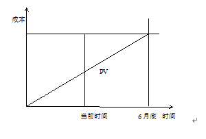

# 2012.11  

## 试题1  

**阅读下列说明，回答问题1至问题3，将解答填入答题纸的对应栏内。**  
某系统集成A公司中标了一个地铁综合监控系统项目，该项目是地铁运营公司公开招标的地铁S号线建设项目中的一个信息系统子项目，涉及信号系统、电气控制系统、广播系统、视频监控系统、通信网络系统的信息互通和集中控制，需要集成多种厂商的设备。  
接到任务后，项目经理小王开始着手编制项目管理计划，根据招标文件，小王列出了一个初步的进度计划，进度计划中的各里程碑点正好是甲方招标文件中规定的各时间节点。随后，小王估计了项目的各项开销，确定了项目预算。项目团队已由公司指派，小王召开了项目启动会，将各项任务分配给项目组成员。  
项目进行了一段时间后，由于天气原因，导致地铁土建工作的延误，因此影响到各厂商设备进场，整个项目进度滞后，监理方与建设方发布了延期通知。项目经理小王马上召开项目会议，口头通知项目组成员所有工作均推迟开展。  
参考答案  

**【问题1】（6分）**  
（1）请结合案例指出小王制定的初步进度计划中存在的最主要问题。  
（2）请结合案例简要叙述在制定进度计划时通常应考虑哪些主要制约问题。  
>（1）里程碑点完全对应招标文件要求，进度计划没有余地。  
（2） a．应考虑进行本子项目的进度网络分析，对应各里程碑事件的任务完成时间留有余地。  
b．应考虑集成的设备的到货及进场受客观因素影响，即外部依赖关系。  
c．应考虑项目内部主要资源（人力资源、环境）约束情况，即内部依赖关系。  
d．应考虑本子项目与主项目之间的协调和制约关系。  

**【问题2】（8分）**  
请结合案例，分析小王在项目管理过程中存在的问题。  
>（1）项目管理计划部应由一人制定，应有项目组参与。  
（2）项目计划缺少相关分计划，如质量计划、沟通计划等。  
（3）制定进度计划的方法不合理，没有预留一定的缓冲时间。  
（4）项目计划缺少评审和审批环节。  
（5）没有处理好外部因素（天气）和内部因素（团队）带来的风险，缺乏有效的应对措施。  
（6）项目发生变更时没有即时更新项目计划。  
（7）应识别设备到场所影响的活动，对于不受影响的活动不应推迟进行。  

**【问题3】（6分）**  
请简要叙述项目管理计划编制工作流程。  
>（1）明确项目目标和阶段目标。  
（2）成立初步的项目团队。  
（3）工作准备与信息收集。  
（4）依据标准、模板等编写初步的概要的项目计划。  
（5）编写项目范围管理、质量管理、进度、预算等分计划。  
（6）将上述分计划纳入项目计划，然后对项目计划进行综合平衡、优化。  
（7）项目经理负责组织编写项目计划。  
（8）评审与批准项目计划。  
（9）项目获批，形成了项目的基准计划。  

---
---
---

## 试题2  

**阅读下列说明，回答问题1至问题4，将解答填入问题纸的对应栏内。**  
系统集成商A与生产型企业B签订了一份企业MIS（管理信息系统）开发合同，合同已执行到设计和开发阶段，由于企业B内部组织结构调整，可能会影响核心业务的流程。集成商A提出建议，合同暂停执行至新的组织机构确定之后，双方经过会议协商和沟通，同意上述建议，后续工作再另行协商确定。  
6个月后，企业B组织结构基本确定，要求继续执行合同，并表示可将工期延后6个月。但集成商A原来参与项目的部分人员离职，新的项目组成员对该项目不熟悉，通过仔细阅读原来的需求文件还是无法理解MIS系统的需求。同时，由于企业B组织结构的调整导致原需求发生了较大变化，因此不得不重新进行所有的需求调研。  
项目继续开展了1个月后，集成商A提出需要增加合同费用，理由是新的需求导致工作量增加，软件系统需要重新开发。但企业B认为需求变更是正常的，集成商A之所以工作量增加也是由于原来的项目文档保留不完整，并且人员更换等原因造成的。双方未就合同变更达成一致，陷入僵局。随后，企业B考虑是否使用法律手段来解决纠纷，但发现整个合同执行过程的备忘录和会议记录都没有，无法提出直接的证据材料。  
参考答案  

**【问题1】（4分）**  
请结合案例分析在合同管理和文档管理过程中集成商A和企业B共同存在的问题。  
>（1）合同中缺少必要的项目需求描述及违约责任约定。  
（2）合同执行过程中没有做好记录保存工作（或合同档案管理不规范）。  
（3）缺少事先约定的合同变更流程。  

**【问题2】（8分）**  
请结合案例分析集成商A在项目管理方面存在的问题。  
>（1）为项目制定的所需求文件不够清晰或完整（或范围管理没有做好）。  
（2）对人员流动给项目带来的风险，缺乏充分的分析和合理有效的应对措施。  
（3）没有充分估计项目变更带来的影响（或变更管理没有做好）。  
（4）与企业B的沟通管理没有做好或存在问题。  

**【问题3】（4分）**  
结合案例简要叙述为使项目继续执行双方应该做的工作。  
>（1）确定一个变更控制委员会，确定合同变更流程。  
（2）对于需求变更带来的影响进行合理的评估，形成新的需求文件。  
（3）双方协商对合同内容进行变更，提交变更控制委员会批准。  
（4）加强沟通，双方各自作出一定的让步（或考虑再延长一定时间的工期，或补偿合理的项目费用）。  
（5）集成商A要加强人员组织管理和团队建设。  

**【问题4】（4分）**  
从候选答案中选择两个正确选项（多选该题得0分），将选项编号填入答题纸对应栏内。  
合同法规定的违约责任承担方式不包括 。  
A．不予承认  B．继续履行  C．采取补救措施  
D．赔偿  E．支付违约金  F．终止  
>A . F  

---
---
---

## 试题3  

**阅读下列说明，回答问题1至问题3，将解答填入问题纸的对应栏内。**  
某项目6个月的预算如下表所示。表中按照月份和活动给出了相应的PV值，当项目进行到3月底时，项目经理组织相关人员对项目进行了绩效考评，考评结果是完成计划进度的90%。  
  
参考答案  

**【问题1】（7分）**  
请计算3月底时项目的SPI、、CPI、CV、SV值，以及表中①、②处的值（注表中①处代表“编制计划”活动的EV的值，表中②处代表“概要设计”活动的EV值）。  
>3月底，PV=4 00+10 000+10 000=24 000  
AC=4  
000+11 000+11 000=26 000  
SPI=90%  
SPI=EV/PV  
EV=SPI×PV=0.9×24 000=21 600  
CPI=EV/AC=21  
600/26 000=83%  
CV=EV-AC=21 600-26 000=-4 400  
SV=EV-PV=21 600-24 000=-2 400  
①=4 000+4 000=8 000  
说明，当某活动完成后，就是EV=PV  
②=21 600-8 000-12 000=1 600  
说明3月底的总EV减去编制计划和调研的EV  

**【问题2】（7分）**  
（1） 如果项目按照当前的绩效继续进行，请预测项目的ETC（完成时尚需估算）和EAC（完成时估算）。  
（2） 请评价项目前3月的进度和成本绩效并提出调整措施。  
>（1）ETC=（BAC-EV）/CPI=（5 000-21 600）/0.83=34216.8  
EAC=AC+ETC=26  
000+34 216.8=60 216.8  
（2）  
进度绩效进度滞后。  
成本绩效成本超支。  
调整措施用效率高的人员更换效率低的人员，或提前开展数据库设计或详细设计工作。  

**【问题3】（6分）**  
假设项目按照当前的绩效进行直至项目结束，请在下图中画出从项目开始直到结束时的EV和AC的曲线，并在图中用相应的线段表明项目完成时间与计划时间的差（用“t”标注）、计划成本与实际成本的差（用“c”标注）。  
  
>AC与EV曲线可以是直线、曲线、折线，只要与PV的相对位置明确就可以，AC在最上面，PV在中间，EV在下面。  

---
---
---

## 试题4  

**阅读下列说明，回答问题1至问题3，将解答填入答题纸的对应栏内。**  
某企业A承接了某一中心城市数字城管工程建设项目，委派小刘负责该项目的质量保证工作。在项目的执行过程中，由于数字城管建设涉及到该市的很多职能部门，互相之间的协调和沟通费时、费力，且在不同单位之间存在需求方面的不一致，导致项目质量管理活动很难开展。  
【事件1】鉴于沟通协调的困难，项目团队建议小刘暂时弱化对项目的质量管理工作，由项目开发团队先开展工作，然后等合适的时机再补充相关质量手续。小刘也考虑到目前项目成本超支、进度滞后的现状，默许了项目组这样的做法。  
【事件2】由于项目进度滞后，为了节约招标时间，项目经理决定对部分产品的采购实行竞争性谈判，通过邀请招标的方式与两家企业谈判，并确定了最终供应方。  
【事件3】企业A另委派小王负责该项目的质量管理工作，小王认为目前项目在管理方面存在很多问题，特别是团队沟通方面的问题对项目的影响不容忽视，虽然小王认为改善团队沟通不应该是他的职责，但还是提出了自己的建议。  
参考答案  

**【问题1】（6分）**  
在事件1中，项目组的做法是否恰当？小刘作为质量保证人员，应做好哪些工作？  
>不恰当。  
小刘应做好如下工作  
（1）协助项目团队积极与该项目涉及的该市相关职能部门之间做好沟通协调工作，在此基础上就质量保证工作达成共识；  
（2）协助项目经理做好相关内外质量保证工作，甚至将相关情况报告高层，谋求解决办法。  

**【问题2】（5分）**  
结合事件2中的相关内容，请说明项目组的做法是否合适；并简要指出小刘作为质量保证人员在项目采购中应具体负责哪些工作。  
>不合适。  
（1）首先项目目前情况不符合竞争性谈判的条件；  
（2）项目的竞争性谈判组织存在问题，如两家企业不可以进行竞争性谈判。  
小刘作为质量保证人员在项目采购中应该负责  
（1）考察潜在供货方是否符合竞争性谈判的条件；  
（2）参与竞争性谈判的厂商是否具有相应的资质；  
（3）拟采购的设备指标是否符合质量要求；  
（4）拟签订的采购合同主要条款是否适用于本项目实际情况及可能的风险防范。  

**【问题3】（4分）**  
结合事件3，请简要叙述小王就项目团队沟通状况可提出哪些改善建议。  
>（1）对团队成员进行沟通方面的相关培训。  
（2）改善团队工作环境，创造有利于沟通的团队氛围。  
（3）必要时更换某些项目团队成员，甚至包括相关经理。  
（4）制订更清晰的组织目标和工作流程。  
（5）制订和实施各种奖惩措施。  
