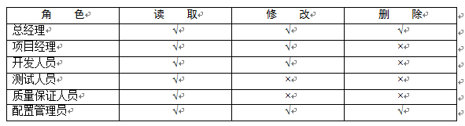
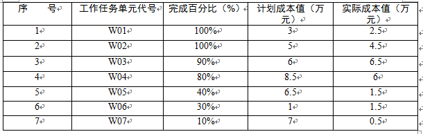

# 2014.5

## 试题1

**阅读下列说明，回答问题1到问题4，将解答填入答题纸的对应栏内。**
小张被任命为公司的文档与配置管理员，在了解了公司现有的文档及配置管理现状和问题后，他做出如下工作计划
（1）整理公司所有文档，并进行归类管理。
小张在核理公司文档时，根据GB/T16680—1996《软件文档管理指南》，从项目生命周期角度将文档划分为开发文档，产品文档和管理文档，并对公司目前的文档进行了如下的分类
a）开发文档可行性研究报告、需求规格说明书、概要设计说明书、数据设计说明书、数据字典。
b）管理文档开发计划、配置管理计划、测试用例、测试计划、质量保证计划、开发进度报告，项目开发总结报告。
c）产品文档用户手册、操作手册。
（2）建立公司级配置管理系统，将配置库划分为开发库与受控库。并规定开发库用于存放在开发过程中的阶段成果，受控库作为基线库存放评审后的正式成果。
（3）建立配置库权限机制，允许公司人员按照不同级别查看并管理公司文档，考虑到公司总经理权限最大、项目经理要查看并了解相关项目资料等额外因素，对受控库进行了下表的权限分配（√表示允许，×表示不允许）。

进行了如上配置管理工作后，此时有一个项目A的项目经理告知小张，发现基线库一个重要功能缺陷要修改，项目经理组织配置控制委员会进行了分析讨论后，]，并指派了程序员小王进行修改，于是小张按照项目经理的要求在受控库中增加了小王的修改权限，以便小王可以在受控库中直接修改该功能。

**【问题1】**
（1）依据16680—1996《软件文档管理指南》，小张对公司项目文档的归类是否正确？
（2）从候选答案中选择8个正确选项（多选该题得0分），将选项编号填入答题纸纸对应栏内。
应归入“开发文档”类的文档有
候选答案
A．可行性研究报告 B．需求规格说明书 C．用户手册 D．数据字典 E．操作手册 F．开发计划 G．配置管理计划 H．测试用例 I．测试计划 J．质量保证计划 K．项目开发总结报告
>（1）不正确
（2）A B D F G H I J

**【问题2】**
小张在建立配置管理系统时，不清楚如何组织配置库，请帮助小张组织配置库（至少写出两种配置库组织形式，并说明优缺点。
>（8分）
（1）按配置项类型分类建库
优点适用于通用的应用软件开发组织、有利于对配置项的统一管理和控制，同时也能提高编译和发布的效率。
缺点工作目录结构过于复杂。
（2）按任务建库
优点适用于专业软件的研发组织、设置策略比较灵活。
缺点不易于配置项统一管理和控制。

**【问题3】**
本案例中当发现基线库中有一个重要的功能缺点需要修改时，你认为小张的做法存在哪些问题，并说明正确的做法。
>存在问题
1.项目经理没有书面的变更申请。
2.项目经理没有组织进行变更影响分析。
3.小张按照项目经理的要求在受控库中增加了小王的修改权限。
4.小王可以在受控库中直接修改该功能。
5.缺少变更确认和发布环节。
正确措施
1.项目经理就存在的缺陷修改提出书面变更申请。
2.项目经理要组织进行变更影响分析。
3.在开发库开辟工作空间，从受控库取出相关的配置项，放于该工作空间，分配权限给程序员小王进行修改。
4.变更实施完成，进行变更结果评估与确认。
5.更新受控库中的相关配置项后，发布给各相关干系人。

**【问题4】**
结合案例，请指出小张在整个受控库的权限分配方面存在哪些问题。
>1.受控库应对项目经理开放。
2.受控库对开发人员只应开放读取权限。
3.受控库对总经理只应开放读取权限。
4.还应添加CCB和PMO角色，并开放读取权限。

---
---
---

## 试题2

**阅读下列说明，回答问题1至问题3，将解答填入答题纸的对应栏内。**
国内某信息系统集成商承接了某跨国公司的一项信息系统集成项目。在双方签订的合同中明确规定，进口材料的关税不包括集成商的材料报价之中，由业主自行支付。但合同未规定业务的交付日期，只是规定，业主应在接到承建方提交的到货通知单30天内完成海关放行的一切手续。
由于到货时间太迟，货物到港后工程方急需这批材料，为避免现场出现仪式待料的情况，集成商先垫支了关税，并完成入关手续。事后集成商向业主提出补偿要求，但业主认为，集成商所有行为都没有经过业主方的同意，不予补偿。并指出补偿时间已经失效，因为已经超过了合同中规定的项目索赔时间。

**【问题1】**
该项目集成商是否可向业主提出补偿关税的要求？如果补偿，是否受合同规定的索赔有效期的限制？在这些过程中，项目集成商是否违约？
>该案，集成商的行为如果有利于双方履行合同，可以推定为有效，并且不受现有合同条款限制，并且业主必须补偿。如果货物没有达到合同规定的质量或者其他约定，业主可以拒绝补偿。

**【问题2】**
简述合同管理的主要内容。并分析说明该案例中哪些环节出了问题。
>合同管理的主要内容合同签订管理、合同履行管理、合同变更管理、合同纠纷管理。
出现的问题有
1.合同签订过程中，合同内容不全面、不详尽。
2.合同履行过程中，承建方没有按合同要求通知业主办理海关放行手续，而是自己办理了放行手续。
3.合同变更管理中，承建方变更没有和业主进行沟通，也没有走合同变更程序。
4.合同纠纷管理中，无事先制定合同纠纷解决程序。

**【问题3】**
根据本案例，项目集成商在合同管理中没有利用好哪些工具和技术。
>1.校验和审计。
2.绩效报告。
3.支付系统。
4.索赔管理。
5.自动的工具系统。

---
---
---

## 试题3

试题3
**mso-hansi-font-family:"Times New Roman"">阅读下列说明，回答问题1"Times New Roman"">至问题3宋体;mso-ascii-font-family:"Times New Roman";mso-hansi-font-family:"Times New Roman"">，将解答填入答题纸的对应栏内。**
M公司是从事了多年铁路领域系统集成业务的企业，刚刚中标了一个项目，该项目是开发新建铁路的动车控制系统，而公司已有多款较成熟的列车控制系统产品。M公司与客户签订的合同中规定自签订合同之日起，项目周期为9个月。在项目开始后不久，客户方接到上级的通知，要求该铁路提前开始，因此，客户要求M公司提前2个月交付项目。
项目经理将此事汇报给公司高层领导，高层领导详细询问了项目情况，项目经理认为，公司的控制系统软件是比较成熟的产品，虽然需要按项目需求进行二次开发，但应该能够提前完成，但列车控制设备需要协调外包生产，比原计划提前2个月没有把握，公司领导认为，从铁路行业的项目特点来考虑，提前开始铁路是必须完成的任务，因此客户的要求不能拒绝。于是他要求项目经理进行讨论无论如何也要想办法满足客户提出的提前交付的需求。

**【问题1】**
结合案例，如果你是项目经理，请分析进度提前对项目管理可能造成哪些方面的变更。
>1.进度提前就需要赶工或者并行跟进，从而可能会造成成本的变更。
2.进度提前就需要赶工或者并行跟进，从而可能会带来人力资源计划的变更。
3.进度提前过大的话，有可能需要缩小项目范围来实现，从而导致项目范围变更。
4.进度提前就需要赶工或者并行跟进，进而影响项目质量，引起质量变更。
5.进度提前可能并行跟进，从而可能会带来项目风险变大，引起风险变更。
6.进度提前也会带来合同变更。
7.进度提前，如果使用外包的话，会引起采购计划变更。
8.进度提前会引起沟通计划变更。
9.进度提前会引起其他领域变更，进而引起整齐计划变更。

**【问题2】**
为了满足客户提出的进度方面“提前2个月交付”的要求，项目经理可以采取的措施有哪些？
>1.赶工。
2.快速跟进。
3.投入更多的优质资源。
4.选派经验丰富高效的人员加入。
5.使用新技术。
6.加强阶段评审。
7.加强外包生产进度的监控，及时处理变更。

**【问题3】**
在采取的上述措施后，项目在执行过程中还可能面对哪些问题？
>1.赶工带来的成本增加，长期加班也会使人效率降低，项目质量降低。
2.快速跟进会使后期返工几率增加，风险提升。
3.投入更多的优质资源会使成本增加。
4.选派经验丰富的人员和投入更多的资源带来成本增加。
5.如果该新技术方法，也可能引入新技术带来的风险。
6.加强阶段评审，会使有限时间变少，成本增加。
7.外包生产可能不能按时交付。

---
---
---

## 试题4

**阅读下列说明，回答问题1至问题4，将解答填入答题纸的对应栏内。**
某系统集成公司项目经理老王在其负责的一个信息系统集成项目中采用绩效衡量分析技术进行成本控制，该项目计划历时10个月，总预算50万元。目前项目已经实施到第6个月末。为了让公司管理层了解项目进展情况，老王根据项目实施过程中的绩效测量数据编制了一份成本执行绩效统计报告，截至第6个月末，项目成本绩效统计数据如下表所示。

PV =3+5+6+8.5+6.5+1+7=
37
AC =
2.5+4.5+6.5+6+1.5+1.5+0.5=23
EV =
3*100%+5*100%+6*90%+8.5*80%+6.5*40%+1*30%+7*10%=23.8
CV = EV-AC =23.8-23= 0.8
SV = EV-PV =23.8-37= -13.2

**【问题1】**
请计算该项目截至第6个月末的计划成本（PV）、实际成本（AC）、挣值（EV）、成本偏差（CV）、进度偏差（SV）。
>无

**【问题2】**
请计算该项目截止到第6个月末的成本执行指数（CPI）和进度指数（SPI）。并根据计算结果分析项目的成本执行情况和进度情况。
>CPI = EV/AC =
23.8/23=13.5%
SPI = EV/PV =
23.8/37=64.3%
CPI>1，故成本节省。
SPI<1，故进度落后。

**【问题3】**
根据所给的资料说明该项目表现出来的问题和可能的原因。
>表现出来的问题是进度落后，PV是37万元，实际成本只有23万元，可能的原因是投入不足，才导致进度落后。

**【问题4】**
假设该项目现在解决了导致偏差的各种问题，后续工作可以按照原计划继续实施，项目的最终完工成本是多少？
>属于非典型问题，所以
ETC = BAC – EV = 5 –
23.8 = 26.2
EAC = AC + ETC = 23 +
26.2 = 49.2
