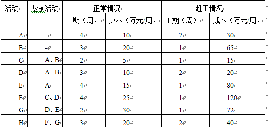

# 2015.11

## 试题1

在某市的政府采购中，系统集成公司甲中标了市政府部门乙的信息化项目。经过合同谈判，双方签订了建设合同，合同总金额为1150万元，建设内容包括搭建政府办公网络平台，改造中心机房，并采购所需的软硬件设备。
甲公司为了更好地履行合同要求，将中心机房的电力改造工程分包给专业施工单位丙公司，并与其签订分包合同。
在项目实施了2个星期后，由于政府部门乙提出了新的业务需求，决定将一个机房分拆为两个，因此需要增加部分网络交换设备。乙参照原合同，委托甲公司采购相同型号的网络交换设备，金额为127万元，双方签订了补充协议。
在机房电力改造施工过程中，由于丙公司工作人员的失误，造成部分电力设备损毁，导致政府部门乙两天无法正常办公，严重损害了政府部门乙的社会形象，因此部门乙就此施工事故向甲公司提出索赔。

**【问题1】（2分）**
案例中，政府部门乙向甲公司提出索赔。索赔是合同管理的重要环节，按照我国建设部、财政部下达的通用条款，以下哪项不属于索赔事件处理的原则？（从修行答案中选择一个正确选顶，将该选项编号填入答题纸对应栏内）
候选答案
A、索赔必须以合同为依据
B、索赔必须以双方协商为基础
C、及时、合理地处理索赔
D、加强索赔的前瞻性
>B
解析
处理索赔实践中依据以下原则
1.索赔必须以合同为依据。
2.必须注意资料的和累。
3.及时、合理地处理索赔。
4.加强索赔的前瞻性，有效地避免过多索赔事件的发生。

**【问题2】（8分）**
请指出甲公司与政府部门乙签订的补充协议是否有不妥之处？如有，请指出并说明依据。
>双方直接签证补充协议的做法是不正确的。因为在政府釆购法中明确要求追加项目不得超过原合总金额的1%。
解析
《政府采购法》第四十九条政府采购合同履行中，采购人拟追加与合同标的相同的货物、工程或者服务的，在不改变合同其他条款的前提下，可以与供应商协商签订补充合同，但所有补充合同的釆购金额不得超过原合同釆购金额的百分之十。所以有这四个点要注意
1、追加期限须在合同履行期间。本题是在2个星期后，符合要求。
2、追加产品须是项目本身的需要。
3、追加标的物须为原合同标的物。
4、追加金额，不超原合同金额1 0%。

**【问题3】（5分）**
请简要叙述合同索赔流程。
>(1)提出索赔要求。
当出现索赔事项时，索赔方以书面的索赔通知书形式，在索赔事项发生后的28天以内，向监理工程师正式提出索赔意向通知。
(2)报送索赔资料。
在索赔通知书发出后的28天内，向监理工程师提出延长工期和（或）补偿经济损失的索赔报告及有关资料。
(3)监理工程师笞复。
监理工程师在收到送交的索赔报告有关资料后，于28天内给予答复，或要求索赔方进一步补充索赔理由和证据。
(4)监理工程师逾期答复后果。
监理工程师在收到承包人送交的索赔报告的有关资料后28天未予答复或未对承包人作进一步要求，视为该项索赔已经认可。
(5)持续索赔。
当索赔事件持续进行时，索赔方应当阶段性向工程师发出索赔意向，在索赔事件终了后28天内，向工程师送交索赔的有关资料知最终索赔报告，工程师应在28天内给予答复或要求索赔方进一步补充索赔理由和证据。逾期末答复，视为该项索赔成立。
(6)仲裁与诉讼。
监理工程师对索賠的答复，索赔方或发包人不能接受，即进入仲裁或诉讼程序。

**【问题4】（5分）**
案例中，甲公司将中心机房的电力改造分包给专业施工单位丙公司，并与其签证分包台同，请问甲公司与丙公司签订分包合同是否合理？为什么？
>合理 。
因为招标投法规定，可以按照合同约定或者经招标人同意，将中标项目的部分非主体、非关键性工作分包给他人完成。电力改造属于强电，不属于项目的主体和关键性工作，但应该经过乙部门的同意，并且需要审核分包单位具有相应的等级资质。

---
---
---

## 试题2

公司在2014年初承接了一个医疗信息系统项目，要求2014年底完成该项目研发任务并进行试运行，2015年负责项目全年的运行维护，运行稳定后甲方验收合格项目才能结束。由于张工具有多年的医疗系统开发管理经验，公司领导任命他为项目经理。
张工首先仔细阅读了项目招标文件、报标书及相应的合同文件，然后指派了王工为需求管理人员负责进行需求梳理、需求分析并编写需求说明书。王工为此制定了详细的需求调研计划，其中调研对象包含甲方的医生、护士、信息科主任。在充分调研后，王工编写了需求说明书提交给了张工，张工组织项目组成员进行了需求评审，评审通过后，项目依据项目计划开始实施并顺利进行到了2014年6月份。此时，王工收到甲方的通知，由于政策变动，医保接口需要修改，否则无法进行医保结算。张工重新更新了项目计划，将研发完成时间调整到2015年1月中旬进行试运行
同时王工重新修改了需求规格说明书。项目按照新计划及需求继续进行到2014年底，公司考核项目完成情况时发现项目未能按计划时间完成，所以扣除了张工的项目奖。

**【问题1】（8分）**
结合案例，您认为张工的项目奖是否应该被扣除？请指出项目经理张工在范围管理过程中存在哪些问题？
>应该扣除张工项目奖。
存在的问题
1、指定王工一人进行需求分析调研人员，并编写需求说明书。
2、调研对象不全面，应该包括所有相关干系人，如甲方髙层、乙方髙层、病人、与本系统接口系统用户（如医保管理局）。
3、张工仅组织项目组成员进行了需求评审，没有包括项目组外的重要干系人，如用户、客户、甲方负责人。
4、需求变更（医保接口需要修改）没有走变更流程，没有经过CCB审批。
5、张工修改需求规格说明书后没有经过再次的需求评审。
6、项目新计划超出了214年底（2015年1月中旬进入试运行），张工没有向公司高层反应，新计划没有得到领导的认可。
7、在项目管理过程中，和髙层的沟通存在问题。

**【问题2】（6分）**
从候选答案中选择3个正确选项（选对一个得2分，选项超过3个该题得0分），将选项编号填入答题纸对应栏内。
以上案例中，请指出需要参与需求评审过程的人员有( )。
A、甲方信息科主任 B、甲方商务 C、公司技术总监
D、公司财务总监 E、公司质量经理 F、公司销售经理
>参与需求评审过程的人员有A C E

**【问题3】（6分）**
简述范围变更控制的基本流程。
>1、编写范围说明书，进行范围确认，建立基线。
2、需求变更以书面的规定格式提出，提交给C C B。
3、C C B对变更申请进行论证、评估，评估对项目的进度、成本、质量等影响大小。
4、需求变更以书面的方式获得通过，并修改进度计划、成本计划等，未获通过的给出原因。
5、分派给项目组进行变更的实施。并通知所有相关干系人。
6、监督并控制变更的实施过程，处理产生的问题。
7、定期评估变更对项目绩效的影响，作为历史数据归入组织过程资产，有利于以后的评估准确。

---
---
---

## 试题3

说明】
在某系统集成项目收尾的时候，项目经理小张和他的团队完成了以下工作
工作一系统测试。项目组准备了详尽的测试用例，会同业主其同进行系统测试。测试过程中为了节约时间，小张指派项目开发人员小李从测试用例中挑选了部分数据进行测试，保证系统正常运行。
工作二试运行。项目组将业主的数据和设置加载到系统中进行正常操作，完成了试运行工作。
工作三文档移交。小张准备了项目最终报告、项目介绍、说明手册、维护手册、软硬件说明书、质量保证书等文档资料直接发送结业主。
工作四项目验收。经过业主验收后，小张派小李撰写了项目验收报告，并发送给双方工作主管。
工作五准备总结会。小张总结了项目过程文档以及项目组各技术人员的经验，并列出了项目执行过程中的若干优点。
工作六召开总结会。小张召集参与项目的一些人员参加了总结会，并就相关内容进行了讨论，形成了总结报告。

**【问题1】（3分）**
工作六中，项目组召开了总结会，以下哪一顶不是总结会讨论的内容？（从候选答案中选择一个正确选项，将选项编号填人答题纸对应栏内）
候选管案
A、项目绩效
B、项目审计
C、经验总结
D、进度计划绩效
>B
解析总结会讨论的内容包括项目绩效、进度绩效、成本绩效、团队绩效、技术绩效、沟通情况、存在的问越级解决方法、总体经验教训、意见与建议。

**【问题2】（3分）**
项目经理小张在验收活动完成后，还需要针对系统集成项目进行后续的支持工作，以下哪一项不属于系统集成项目的后续工作？（从候选答案中选择一个正确选顶，将选顶编号填入答题纸对应栏内）
A、信息系统日常维护工作
B、硬件产品的更新
C、业主针对新员工的培训需求
D、信息系统的新需求
>C

**【问题3】（12分）**
请指出本案例的六顶工作中哪些工作存在问题并具体说明
>1、工作一小李从测试用户中挑选部分数据进行测试是不行的。要完全按照测试计划来进行。（项目开发人员不可以测试自己编写的模块，但可以测试其它人开发的模块）
2、工作二只进行了正常操作并没有达到试运行的效果，还需要输入些非法数据等非正常操作，测试系统的运行状态。
3、工作三文档移交过程中直接发送给业主是不对的，需要当面移交并签字确认。
4、工作四小李撰写项目验收报告并发送给双方工作主管存在问题，验收报告需要双方共同来完成，并签字，承建方还要以此做为支取费用的凭证。
5、工作五只总结了过程文档和各技术人员的经验和执行过程中的优点还不够，还需要了解项目实施过程情况、团队成员的绩效信息。
6、工作六对项目的各类文档进行归档，形成组织过程资产

---
---
---

## 试题4

某项目由A、B、C、D、E、F、G、H活动模块组成，下表给出了各活动之间的依赖关系，以及它们在正常情况和赶工情况下的工期及成本数据。假设每周的项目管理成本为10万元，而且项目管理成本与当周所开展的活动多少无关。

正常情況下的关键路径A D F H,最短工期14周
4*10+20*3+2*5+3*10+4*15+4*25+2*30+3*2 0+14*10=560万元总成本

**【问题1】（6分）**
找出项目正常情况下的关键路径，并计算此时的项目最短工期和项目总体成本。
>无

**【问题2】 （4分）**
假设项目必须在9周内（包括第9周）完成，请列出此时项目中的关键路径，并计算此时项目的最低成本。
>关键路径A E G H B D F H B D G H
最低成本是2*3+3*20+2*5+3*10+4*15+1*1 20+1*72+2*40+9*10=582万元（不对活动B C D E进行赶工）

**【问题3】（7分）**
在计划9周完成的情况下，项目执行完第4周时，项目实际支出280万，此时活动D还需要一周才能够结束，计算此时项目的PV、EV、CPI和SPI（假设各活动的成本按时间均匀分配）。
>PV=2*3 +3*20+1*5+1*10+2*15=60+60+10+10+30+4*10=205
AC=2 8 0
EV=2*3 0+3*20+l*5+2*10+2*15=60+60+10+20+30+4*10=215
CPI=EV/AC=215/280=0.77
SPI=EV/PV=215/205=1.05
