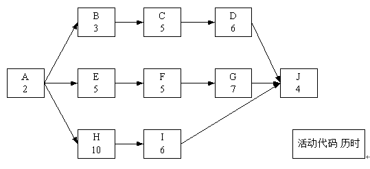
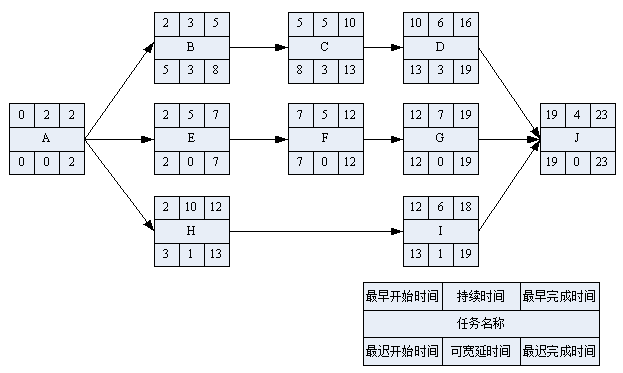

# 2015.5

## 试题1

**阅读下列说明，回答1问题至问题3，将解答填入答题纸的对应栏内。**
项目经理小杨把编号为1401的工作包分配给张工负责实施，要求他必须25天内完成。任务开始时间是3月1日早8点，每天工作时间为8小时。
张工对该工作包进行了活动分解和活动历时估算，并绘制了如下的活动网络图。

1401工作包的直接成本由人力成本（每人每天的成本是1000元）构成，每个活动需要2人完成。
本题考核的是网络进度图知识，关键是找出关键路径和画出如下图。
画出如下解析图

**问题1（9分）**
请将下面（1）～（6）处的答案填写在答题纸的对应栏内。
张工按照《1401工作包活动网络图》制定了工作计划，预计总工期为（1）天。按此计划，预留的时间储备是（1）天。该网络目的关键路径是（3）。按照《1401工作包活动网络图》所示，计算活动C的总时差是（4）天，自由时差是（5）天。正常情况下，张工下达给活动C的开工时间是3月（6）日。
>首先找出关键路径为AEFGJ，2+5+5+7+4=23
（1）23天
（2）2天（预计总工期25-关键路径工期23=2）
（3）AEFGJ
（4）3天
C活动最早结束时间是第1天，最晚结束时间是13，总时差=最晚结束时间-最早结束时间=13-10=3天
（5）0天；活动D最早开始时间-活动C最早结束时间=10-10=0；
（6）6日；3月1日开工，活动C最早在第5天开始，也即3月6日。

**问题2（6分）**
假如活动C和活动G都需要张工主持施工（张工不能同时对C和G进行施工），请进行如下分析
（1）由于各种原因，活动C在3月9日才开工，按照张工下达的进度计划，该工作包的进度是否会延迟？并说明理由。
（2）基于（1）所讲的情况，在不影响整体项目工期的前提下，请分析张工宜采取哪些措施？
>1.因为C活动9日开始，13日下午下班才能结束（9、1、11、12、13）。而关键路径上的G活动，开始时间是13日上午8点。题目要求张工不能同时对C和G进行施工。所以会导致关键活动G延期1天，总工期延迟1天，但工作包有2天的储备时间，所以进度延期1天，但工作包整体进度还会在25天要求内完成。
2.（1）提高活动G、J的工作效率，
（2）增加资源，加快G、J进度
（3）赶工，加班
（4）指派经验更丰富的人去完成工作

**问题3（10分）**
张工按照《1401工作包活动网络图》编制了过渡计划和工作包预算，经批准后发布。在第12天的工作结束后，活动C、F、H都刚刚完成，实际花费为7万元。请做如下计算和分析
（1）当前时点的SPI和CPI。
（2）在此情况下，张工制定的进度计划是否会受到影响，并说明理由。
>（1）根据题意12天A、B、C、E、F、H刚好完工知道，A、E、F分别在第、2、7天开始工作；
B、C分别在第2、5天开始工作；
H在2天开始工作；
设1代表1000；
得到:EV=（2+5+5+3+5+10）天*2*1=6，AC（已知）=7；
PV在第十二天按计划应该加上活动D的两天，即PV=[（2+5++5+3+5+10）+2]*2*1=6.4
SPI=EV/PV=6/6.4=09375
CPI=EV/AC=6/7=0.8571；
（2）会受到影响，因为目前情况下，进度落后，成本超支。

---
---
---

## 试题2

**读下列说明，回答问题1至问题2，将解答填入答题纸的对应栏内。**
某市承办国际服装节，需要开发网站进行宣传。系统集成企业M公司中标了该网站开发项目。该项目即要考虑一般网站建设的共性，又要考虑融入人的艺术创意和构思，以便能够将网站办的耳目一新，不但具有宣传价值，还能利于大数据的积累。
网站的主要内容包括大型活动宣传，名师名模服装展示，服装服饰交易，服装文化传播等。
双方协定项目合同工期为5个月，M公司任命项目经理小曹负责该项目。项目组经过需求调研后制定了项目计划，并按计划完成了网站系统分析、系统设计，包括艺术风格与主页设计、数据库设计等活动。
项目进入编码阶段后，承办单位为了扩大影响力，要求在项目上增加全国服装模特海选的宣传、选拔、评奖与管理。固此，建设方代表直接找到小曹提出增加项目内容，并答应会支付相应的费用，但要确保项目工期不能拖延。
针对上述情况，小曹及其领导进行了如下处理
（1）小曹见到其领导时转述了建设方的要求，
（2）领导考虑了一会儿，对小曹说“答应客户要求”，
（3）小曹通知商务人员与建设方签订补充协议，
（4）因建设单位要求工期不能拖延，故小曹决定项目进度计划不变，
（5）小曹找来设计工程师小廖，把新增部分全权委托给了他，让他加班加点确保进度。交付期至时，项目集成测试中发现的问题还未得到及时解决。

**问题1（10分）**
面对用户的要求，小曹及其领导的做法有何不妥之处？
>1.小曹应该要求建设方提交书面的范围变更申请书。
2.小曹应该组织CCB对变更影响做出合理评估，然后将评估结果报公司领导。
3.公司领导应该要求，小曹进行变更流程而不是自作主张同意客户要求。
4.小曹应该根据项目二期及项目建设内容重新制定进度计划。
5.小曹应该把新增内容合理分配给相关技术人员，不能完全依赖某人去完成。

**问题2（7分）**
为确保进度不受拖延，小曹应该如何执行领导的决定？
试题分析
本题属于综合管理知识考核，要求对项目中发生的变更进行管理。
>1.确认接受客户变更请求后，首先和客户详细沟通，明确增加内容细节要求。
2.修改项目范围说明书，需求说明书，并与客户进行书面确认。
3.根据新的需求进行进度计划和成本计划（估算），与用户签订补充协议（主要设计增加费用问题）。
4.将项目内容分配给合适的技术人员去完成，并定期或按节点对进度、成本进行监督控制。
5.发现问题及时找出原因进行修正，防止出现“交付期至时，项目集成测试中发现的问题还未得到及时解决”等问题。

---
---
---

## 试题3

**阅读下列说明，回答问题1至问题4，将解答填入答题纸的对应栏内。**
信息系统集成公司A（以下简称A公司）于2012年5月承接了某市级银行的计费数据库系统开发项目，约定在该银行十三个本地网点计费系统建设中提供硬件平台及相应软件产品，并由A公司负责系统总集成，以及后期相关的运维工作。由于感觉技术比较单一，因此签订了总价合同，合同中只是简单规定了技术总体要求，并约定依据项目的大致进展进行付款。
2013年3月，A公司已经完成了数据库系统软件的开发，并且将这些功能部署在了5个网点，但是比原计划滞后了差不多二个月。在项目执行的过程中，A公司发现该市银行各网点所用的系统并不完全相同，而且对数据库的个性化需求也有区别，如郊区网点的业务需求与市区网点不同。在签订合同时由于对这些因素估计不足，迫使原定的项目计划不断进行调整，项目预算也已经超支。
2013年4月银行方面以A公司项目进度缓慢，质量不能满足要求，并且对5个已上线网点的运维服务支持不足为由，另外找到了一个信息系统集成公司B（以下简称B公司）接替A。
公司继续做剩余工作。此时A公司也感觉前期准备不足，很难按照合同要求做好项目，因此同意将项目整体移交给B公司但是要求银行必须支付前期建设的费用。由于合同中对相关的工作量缺乏定量的描述条款，合同的价格很难确定，双方陷入僵持之中。尤其是有一批A公司为了项目购买了服务器已经经过了银行的验收，银行希望A公司先移交服务器，然后再谈应付款项，但是A公司坚持要银行先付款，然后再移交服务器。银行甚至准备重新购买一批服务器，放弃已经经过验收的A公司服务器，让B公司重新进行该项目。

**问题1（10分）**
A公司在合同签订过程中应约定哪些内容，以避免提干描述问题或类似问题的出现？
>合同应约定内容
1.项目范围，功能需求，性能需求（软件）。
2.产品型号，技术指标，性能要求（硬件）。
3.项目工期。
4.支付工程进度款的方式、数额及时间。
5.超出约定内容、范围的调整方法，调整因素、程序及支付时间。
6.工程质量保证金的数额，扣留方式及时间。
7.产品质量要求及验收流程、验收标准。
8.售后服务承诺及服务期满的收费标准。
9.违约责任以及发生争执的解决方式、受理法院。

**问题2（5分）**
在A公司同意的情况下，项目是否可以转交给B公司？为什么？
>A公司同意，可以转交给B公司。但要处理好前期遗留问题。

**问题3（2分）**
请问A公司先要银行付款再将会服务器是否恰当？
>不恰当。A公司应当先将服务器移交给银行，再要求银行支付价款。

**问题4（3分）**
银行放弃已经通过验收的服务器，让B公司重新开始该项目的活动是否合适？应该怎么处理？
试题分析
本题考查的是合同管理方面的问题。
>不合适，因为银行已经对该批服务器进行验收，表示已经认可，应该本着合作共赢的态度处理问题，可以接受该批服务器，让B公司继续用于该项目。

---
---
---

## 试题4

**阅读下列说明，回答问题至问题2，将解答填入答题纸的对应栏内。**
某信息系统集成企业，主要从事政法领域的信息系统集成和售后服务。最近公司管理层做出战略调整，要把企业发展的重心转向信息系统运维服务。公司最近与某法院签订了份运维服务合同（公司负责该法院相关系统的集成、售后服务）。服务内容主要包括供配电UPS；路自器；PC服务器。服务级别要求7*24小时服务，服务可用性达到99.9%，服务满意度要达到85%。
公司对该项目非常重视，任命了有丰富售后服务经验的张某为项目经理，全权授权张经理负责该项目，并要求他负责企业运维服务能力建设和提升。张经理也学习了大量项目管理知识和运维管理知识，并将相关知识运用在该项目中。项目中发生的具体事件如下
1.张经理认为做好运维的核心是运维人员的维修水平。由于运维合同价格偏低，在招聘人员时主要考虑人员是否有相关设备维修经验，并指 派本公司有系统集成实施经验的若干名人员加入运维团队，要求团队成员满负荷工作，项目组人员不能有冗余。
2.在运维项目实施期间，遇到值班人员有事或生病，只能由项目经理代班，遇到害户报修的设备问题，维修人员常常以我不懂该专业，让客户第二天再报。运维人员遇到无法解决的技术问题向项目经理汇报时，项目经理回答“你们招进来就是解决设备问题的，我无法提供帮助，你们自己解决”。相关运维人员-经常超过规定时间，也未能使设备恢复运行。
3.项目经理认为团队管理的核心是团队凝聚力强，不发生冲突。项目经理利用工作和业务时间进行了大量的沟通和协调工作。确保在运维实施期间，成员关系比较融洽。但在季末法院信息中心进行的服务满意度调查时，综合满意度只有70‰，设施综合可用性指标只达到98%。

**问题1（5分）**
指出该项目经理在运维团队建设上存在哪些问题。
>团队建设存在如下问题
1.招聘人员时的考核指标不应该仅仅是设备维修经验，还应该注重能力的考查。
2.团队成员应该有冗余，防止因事假、病假造成其他成员的超负荷工作。
3.客服、维修人员要有服务意识，自己解决不了的问题，应该协助客户转交其他维修人员解决，而不是拒绝客户或让客户自己想办法解决。
4.项目经理应该给予必要的帮助和辅导，加快团队成员的成长。
5.项目经理要注重团队绩效和个人绩效的考核，要加强过程的监督和控制。

**问题2（8分）**
结合以上案例，判断下列选项的正误（填写在答题纸的对应栏内，正确的选项填写“√”，错误的选项填写“×”）
（1）满意度调查应作为团队管理的评判依据。（ 1 ）
（2）团对管理不仅要关注团队绩效，还应关注个人绩效。（ 1）
（3）团队管理不包括解决问题。（ 2 ）
（4）项目经理对团队管理的认识是正确的。（ 2 ）
（5）服务内容主要包括供配电UPS；路自器；PC服务器；服务级别要求7*24小时服务，服务可用性达到99.9%，服务满意度要达85%属于《服务级别协议》。（ 1 ）
（6）运行维护能力的建立应由企业管理层负责，不应交给项目经理负责。（ 2 ）
（7）运行维护服务对象不应包括供配电系统。（ 2 ）
试题分析
本题考察团队管理知识。
>（1）√（2）√（3）×（4）×（5）√（6）×（7）×
