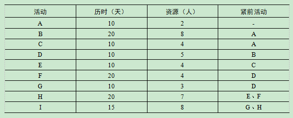

# 2016.5

## 试题1（20分）

**阅读下列说明，回答问题1到问题4，将解答填入答题纸对应栏内。**
已知某信息工程项目由A到I共9个活动组成，项目组根据项目目标，特别是工期要求，经过分析、定义及评审，给出了该项目的活动历时。活动所需资源及活动逻辑关系列表，见下表

**【问题1】（2分）**
请指出该项目的关键路径和工期。
>关键路径为A-B-D-F-H-I，工期为95天。

**【问题2】（6分）**
请给出活动C、E、G的总时差和自由时差。
>活动CES=1，LS=40，C的总时差是30，自由时差为0。
活动EES=20，LS=50，E的总时差是30，自由时差为30。
活动GES=40，LS=70，G的总时差是30，自由时差为30。

**【问题3】（6分）**
项目经理以工期紧、项目难度高为由，向高层领导汇报申请组建12人的项目团队，但领导没有批准。
（1）领导为什么没有同意该项目经理的要求？若不考虑人员能力差异，该项目所需人数最少是多少个人？
（2）由于资源有限，利用总时差、自由时差，调整项目人员安排而不改变项目关键路径和工期的技术是什么？
（3）活动C、E、G各自最迟从第几天开始执行才能满足（1）中项目所需人数最少值？
>（1）领导不同意项目经理的要求是正确的，该项目需要的最少人数是9个人。
（2）资源平滑技术。
（3）C活动第3天开始，E活动第40天开始，G活动第50天开始就可以满足（1）中所需人数的最小值。

**【问题4】（6分）**
在（1）～（6）中填写内容
为了配合甲方公司成立庆典，甲方要求该项目提前10天完工，并同意支付额外费用。承建单位经过论证，同意了甲方要求并按规范执行了审批流程。为了保质保量按期完工，在进度控制及人力资源管理方面可以采取的措施包括
①向（1）要时间，向（2）要资源。
②压缩（3）上的工期。
③加强项目人员的质量意识，及时（4），避免后期返工。
④采取压缩工期的方法尽量（5）安排项目活动，组织大家加班加点进行（6）。
（1）～（6）供选择的答案
A．评审B．激励C．关键路径D．非关键路径
E．赶工F．并行G．关键任务H．串行
>（1）G；（2）D；（3）C；（4）A；（5）F；（6）E。

---
---
---

## 试题2

**阅读下列说明，回答问题1至问题3，将解答填入答题纸的对应栏内。**
某信息系统集成企业承担了甲方的信息系统集成项目，在项目的采购过程中，某项采购合同是在甲方的授意下签订的，然而在项目进展过程中，项目经理发现该采购产品高于市场价格，而且有些性能指标也没有能够完全满足合同规定要求。当项目经理发现此类问题进行调查时，发现该供应商的资质和声誉都存在问题，并且就在不久前已经被其他公司并购，最麻烦的是合同的付款条件是提前支付相关款项，合同的大部分采购款已经支付。
在项目的中期验收中，甲方发现了部分采购产品存在的问题，并要求项目组进行返工和更换相关产品。项目经理则以采购供应商是由甲方推荐为由，拒绝进行返工和更换。而甲方则认为，项目合同里面并没有规定由甲方承担采购责任，甲方只是为项目组推荐了部分供应商，而供应商已被收购，原先的公司已经不存在，原先的责任人已经离职为由，拒绝根据合同相关条款更换产品，项目经理对此束手无策。项目经理和甲方就该问题相持不下，项目处于停滞状态。

**【问题1】（6分）**
结合案例，请指出项目组在采购合同管理中存在什么问题？
>（1）项目组轻信甲方的推荐，没有做考查就选择了未合作过的供应商。
（2）签订合同没有按照正常规范进行。
（3）没有对合同条款进行仔细审核。
（4）没有对供应商进行资质审核和调查，导致在供应商发生变更，未及时进行合同变更。
（5）合同管理不足，未对合同风险进行分析，未对供货商进行监控，缺乏沟通。
（6）没有对新供应商的来料进行及时检测?，合同缺少对违约责任明确规定。
答案不限于以上几条。

**【问题2】（6分）**
在采购合同中，支付方式的规定一般包括哪些方面的内容？甲方的做法是否妥当，是否该为此承担主要责任？
>支付方式的内容
（1）支付货款的条件。
（2）结算支付的方式。
（3）拒付货款。发包方有权部分或全部拒付货款。
甲方的做法不妥当，但不需为此承担责任。

**【问题3】（6分）**
供应商是否可以以公司变更、负责人离职为由，拒绝履行公司变更前签订的协议？为什么？对此项目经理该如何处理？
>不可以。
供应商公司变更不影响其对已经售出的货物的质量保证义务，新公司需要继续履行变更前签订的协议。
参照《民法通则》第44条第2条款企业分立、合并，权利和义务部分。
项目经理可以对此先进行沟通协商谈判，如果不能解决问题可以诉诸法律途径走司法程序解决问题。

---
---
---

## 试题3（20分）

**阅读下列说明，回答问题1至问题3，将解答填入答题纸的对应栏内。**
项目经理小王目前正在负责一个小型的软件开发项目。一开始他觉得项目比较小，变更应该不多，流程也不需要太复杂，因此就没有制定项目变更管理计划，而是强调团队成员间的及时沟通来保证项目按照计划进行根据项目经理小王的理解，所谓变更管理的主要目标就是保证项目能够按照计划进行，如果能够保证不发生超越项目进度计划、成本计划等控制范围外的偏差，就可以不用指定项目变更管理计划，就可以不用指定项目变更管理计划，以减少项目的工作量。而项目执行过程中对计划的微调根本不需要记录和管理，也不需要走项目变更管理流程。而且他认为如果所有项目变更都必需要向相关领导请示汇报，过程太复杂和麻烦，还不如由执行人员提出变更的方案，彼此讨论一致后来的更方便和快捷。
但是在项目进入集成测试阶段的时候，突然多了很多莫名其妙的问题出现。如在调试过程中，由于相关设计和记录的简化和不规范，造成了调试的困难，很难定位各个问题模块的错误；由于项目在执行过程中，人员的调配替换，造成了文档记录的不一致，导致后期人员阅读和理解方面的障碍。并且由于缺乏对开发过程的配置管理和控制，导致版本混乱，很难形成有效支持各模块集成的文档。另外，项目中很多细小的改动由于没有准确的记录，或者是根本没有记录。导致集成测试发现问题时，根本没有办法更改。小王对此也没有办法，不知道因为什么原因导致目前的项目状态，项目面临返工的危险。

**【问题1】（4分）**
结合案例。请说项目经理小王对项目变更管理的认识哪些是正确的？哪些是不正确的？
>小王的认识中正确的
团队之间应该及时沟通，加强协商。
小王的认识中不正确的
（1）小王任务项目比较小，变更应该不多。
（2）流程也不需要太复杂是不正确的。
（3）变更少就不需要变更管理计划。
（4）万一发生变化，可以不按照变更流程来。
（5）细微调整不需要记录和管理，也不需要走流程。

**【问题2】（10分）**
根据你的理解，请说明项目变更管理在软件项目管理中的主要活动内容。
>变更管理在软件项目管理中的主要活动内容
（1）建立基线、变更控制系统和变更控制流程。
（2）识别变更，并以书面格式提出变更请求。
（3）CCB审查变更请求。
（4）CCB批准或否决变更。
（5）将批准的变更纳入项目管理计划中。
（6）实施被批准的变更。
（7）监控被批准变更的实施情况。
（8）变更验证。
（9）沟通存档。

**【问题3】（6分）**
针对项目的当前状态，小王应该采取说明补救措施？
>（1）制定一个变更管理计划。
（2）建立变更管理的流程。
（3）建立变更管理委员会。
（4）加强配置管理。
（5）加强版本管控。
（6）加强变更管理，有变更走流程。

---
---
---

## 试题4（17分）

**阅读下列说明，回答问题1至问题3，将解答填入答题纸的对应栏内。**
某创业型公司乙在2015年1月，凭借着报价低的优势中标承接了一个信息系统工程项目。项目建设内容主要包括建设方甲公司的北京总公司ERP信息系统建设，以及甲公司成都分公司的机房改造项目。甲乙两公司协商签订了工程额为100万元的总价合同，工期为一年。
乙公司指派有过ERP项目经验的张工承担项目经理，因公司还处于创业期间，所以公司管理层非常注重成本的控制，要求项目经理严格控制成本，每周汇报项目的实际花费。为了满足低成本的要求，考虑到北京、成都两地的材料、差旅费用等问题，在征得甲公司与管理层的同意后，张工将机房改造工程外包给成都当地的丙公司，并在合同中要求丙公司必须在2015年底之前完工。
项目执行期间，张工借派了一名成本控制专员。负责每周统计该项目ERP部分所发生的费用。同时向管理层提交费用统计报告。项目进展到6月份，项目ERP部分实际发生的总费用为30万元。成都赶上了梅雨季节，丙公司反馈，因机房地处于某大厦的一层，太潮湿，机房改造工程被迫暂停。待梅雨季节过后继续施工。
项目执行到2015年底，机房改造项目已确定无法在2016年1月如期完工，ERP部分虽然基本到了后期的测试阶段，但其总费用也已经达到了60万元。

**【问题1】（3分）**
根据案例，2016年1月机房改造工程无法如期完工，请指出乙公司是否可以向丙公司索赔？如可以，请说明可以申请什么索赔？如不可以，请说明理由。
>可以向丙公司提出索赔，可以进行工期补偿以及合同规定的违约金补偿。
虽然梅雨季节是天气因素不可控，但是作为成都本地公司，接手项目，就应该要为此风险提前做准备。当然，索赔必须以合同为依据。

**【问题2】（10分）**
结合以上案例，请帮助张工提出成本管理及成本控制方面的改进措施。
>（1）先得制定成本管理计划，进行成本管理。
（2）对项目进行WBS分解，进行成本估算和预算。
（3）运用成本管理与控制技术，如挣值技术，对成本进行有效的控制。
（4）监督成本执行，找出与成本基准的偏差。
（5）防止错误的、不恰当的或未获批准的变更纳入成本或资源使用报告中。
（6）就审定的变更，通知项目干系人。
（7）采取措施，将预期的成本超支控制在可接受的范围内。

**【问题3】（4分）**
结合以上案例，在项目后期，请帮助项目经理张工提出一些可以弥补工期耽误的方法。
>（1）对丙方工程进度严加监控。
（2）要求丙方增加资源进行赶工、快速跟进。
（3）跟甲方签订补充协议，调整范围基线、分期交付。
（4）加快关键任务进度，合理利用总时差、自由时差优化资源。
