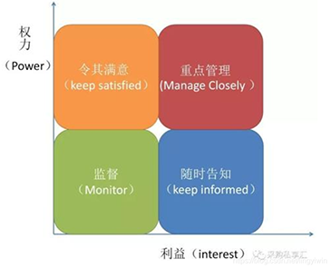

# 2017.11

## 试题1（20分）

**阅读下列说明，回答问题1至问题4，将解答填入答题纸的对应栏内。**
某公司中标一个城市的智能交通建设项目，总投资 350 万元，建设周期 1年。在项目管理计划发布之后，柳工作为本项目的项目经理，领导项目团队按照计划与任务分工开始实施。
在项目初期，项目团队在确定了项目范围后，项目经理制定了项目变更流程
（1）提出变更申请。
（2）针对影响不大的变更，可以直接修改。
（3）针对影响较大的变更，必须上报项目经理，由项目经理审批之后才能修改。
（4）修改后由项目经理确认，确认无误后更新配置库，完成变更。
在一次项目进度协调会上，项目经理柳工与项目成员李工发生了争执，原因如下李工对于客户提出的需求，无论大小都给予解决，客户对此非常满意。但是，项目组其他成员并不知晓李工修改的内容，导致开发任务多次返工。目前，项目已经延期。

**【问题1】（8分）**
结合上述案例，请指出项目经理柳工制定的变更管理流程存在哪些问题。
>（1）没有监理正确的变更流程。
（2）进行变更影响分析。
（3）所有变更都必须走变更流程，而不是影响不大的就直接修改。
（4）由变更控制委员会审核变更请求，而不是项目经理。
（5）对变更没有进行记录。
（6）缺少对变更实施过程的有效监控。
（7）变更结束后要通知相关受影响人员，而不仅仅只项目经理确认。
（8）没有做好配置管理和版本管理。
柳工制定的项目变更流程规定针对影响不大的变更，可以直接修改是错误的。不管变更大小如何，都需要先经过分析论证，然后通过审核批准才能进入实际变更。
针对影响较大的变更，必须上报项目经理，由项目经理审批之后才能修改。这条也有问题，首先变更影响是大还是小必须由项目经理带领项目团队一起进行可行性分析得出，得出结论后应该带领项目团队制定变更方案，然后交由CCB来决策是否实施这个变更，而不是由项目经理一个人说了算。
修改后由项目经理确认，确认无误后更新配置库，完成变更。这条也是有问题的，变更完成应该由质量管理部分根据变更请求进行核对，无误后要通过配置发布程序来进行发布，不能直接更新配置库。另外变更完成也应该告知相应干系人，不是直接放到配置库就完事了。

**【问题2】（3分）**
基于以上案例，请指出项目成员李工在变更过程中的不恰当之处。
>（1）李工对于客户提出的变更不能直接修改，而要走变更流程。
（2）变更实施过程中要做好配置和版本管理。
（3）变更结束后要通知相关受影响人员。
李工在变更过程中不恰当指出。
对于客户提出的需求，无论大小都给予解决。这个有问题，客户提出的需求应该先反馈，然后制订方案，通过评估后由CCB来确定是否变更。
项目组其他成员不知晓李工修改的内容。这里就是缺乏良好的配置管理，没有做好变更记录和版本管理，导致只有一个人知道是怎么变的，这也是李工的不恰当做法。

**【问题3】（3分）**
基于以上案例，请阐述变更过程中包含的配置管理活动。
>（1）配置项识别。
（2）配置状态记录。
（3）配置确认与审计。
变更过程中的配置控制。
首先应该将待变更的配置项从产品库中复制出来，放入受控库。
李工可以将需要修改的代码段从受控库中check out，放入自己的开发库中进行修改。代码被check out后即被“锁定”，以确保同一段代码只能同时被一个程序员修改，李工在修改的时候其他同事无法再check out。
李工将开发库中修改好的代码段check in受控库。Check in后，代码的“锁定”被解除，其他同事就可以check out 该段代码了。
变更完成后，将受控库中的新基线存入产品库中，并更新版本号。旧版本号不删除，继续在产品库中保存。

**【问题4】（6分）**
请阐述变更管理的工作流程。
>（1）提出变更申请。
（2）变更影响分析。
（3）CCB审查批准。
（4）实施变更。
（5）监控变更实施。
（6）结束变更。
变更管理工作流程
变更请求→变更影响评估并提出方案→ CCB同意或否决变更→ 执行变更→检查变更结果→沟通存档。

---
---
---

## 试题2（18分）

阅读下列说明，回答问题 1 至问题 4，将解答填入答题纸的对应栏内。
  某信息系统项目包含如下 A、B、C、D、E，F，G、H 八个活动。各活动的历时估算和活动间的逻辑关系见下表（其中活动 E 的历时空缺）。

**【问题1】（3分）**
假设活动E的最乐观时间为 1 天，最可能时间为 4 天，最悲观时间为 7天，请用三点估算法计算活动 E 的持续时间。
【问题 2】（6分）
下图给出了该项目网络图的一部分（该图仅为方便考生答题，空缺部分不需要在试卷或者答题纸上回答）。

**根据上图并结合基于问题1的计算结果，请计算活动C、D、E 的总浮动时间和自由浮动时间。**
>根据三点估计法活动历时=(乐观时间+4×最可能时间+悲观时间）/6=（1+4×4+7）/6=4天。

无
>C的总时差为，自由时差为0
D的总时差为2，自由时差为2
E的总时差为1，自由时差为1
这个题目首先该填完整问题2给的图表，E活动在第1问里面已经算出持续时间为4，而E最早开始时间是6，所以它最早完成时间是4+6=10。E只有一个紧后活动G，G最早和最迟开始时间都是11，所以E活动的最迟完成时间为11，E的总时差和自由时差都是11-10=1。F的最早开始时间是 7，最早完成时间是11。由于G活动的最迟完成时间是11，所以F最晚完成时间是11，最晚开始时间是7。这样就看出F活动在关键路径上，它的总浮动时间和自由浮动时间都为0。F的最迟开始时间是7，所以C活动的最迟完成时间就必须是7，而C活动本来最早完成时间就是7，所以C活动也在关键路径上，它的总浮动时间和自由浮动时间都为0。D的紧后活动只有F，F最早和最迟开始时间都是7，所以D活动最迟完成时间是7。所以D的总时差和自由时差都是7-5=2。

**【问题3】（4分）**
**基于问题2的计算结果，请计算**
（1）该项目的关键路径。
（2）该项目的总工期。
>（1）ACFGH。
（2）17天．
关键路径为A-C-F-G-H。
总工期为17。

**【问题4】（5分）**
请指出缩短项目工期的方法。
>（1）赶工，投入更多的资源或增加工作时间，以缩短关键活动工期。
（2）快速跟进，并行施工，以缩短关键路径长度。
（3）使用高素质的资源或经验丰富的人员。
（4）减小活动范围或降低活动要求。
（5）改进方法或技术，以提高生产效率。
（6）加强质量管理，及时发现问题，减少返工，从而缩短工期。
缩短项目工期问的是进度压缩，进度压缩一般有三种方法
赶工，即增加资源投入加班加点赶进度。缺点是成本增加，而且有的活动没办法靠赶工提高速度。
快速跟进，即想办法把之前是串行的工作活动改为并行，同时进行以提高速度。缺点是不是所有活动都可以并行，而且并行可能带来多条关键路径，增加风险。
缩减范围，即减少工作量达到早点结束项目的目的。缺点是需要客户同意。

---
---
---

## 试题3（17分）

**阅读下列说明，回答问题1至问题4，将解答填入答题纸的对应栏内。**
A公司是为保险行业提供全面的信息系统集成解决方案的系统集成企业。齐工是A公司的项目经理，目前正在负责某保险公司P公司的客户管理系统开发项目，当前该项目已经通过验收。
齐工将项目所涉及的文档都移交给了P公司，认为项目收尾工作已经基本完成，所以解散了项目团队，并组织剩下的项目团队成员召开了项目总结会议。项目组成员小王提出“项目组有人没有参加总结会议，是否要求所有人员都要参加？”，齐工解释说“项目总结会议不需要全体人员参加，没有实质性的工作内容”。

**【问题1】（5分）**
结合案例，项目经理齐工对小王提出的问题的解释是否恰当？请从项目总结会的规范要求角度，说明理由。
>不恰当。项目总结会需要全体参与项目的成员都参加，并由全体讨论形成文件。通过项目总结会可以了解相关的团队成员绩效状况，了解项目中出现的问题和总结的经验教训。
项目总结会需要全体参与项目的成员都参加，并由全体讨论形成文件。项目总结会议所形成的文件一定要通过所有人的确认，任何有违此项原则的文件都不能作为项目总结会议的结果。所以齐工解释说“项目总结会议不需要全体人员参加，没有实质性的工作内容。”是不恰当的。

**【问题2】（5分）**
结合案例，请简述项目总结会议一般讨论的内容。
>（1）项目绩效。
（2）技术绩效。
（3）成本绩效。
（4）进度计划绩效。
（5）项目的沟通。
（6）识别问题和解决问题。
（7）意见和建议。
项目总结会一般讨论的内容为
1）项目绩效包括项目完成情况、具体的项目计划完成率、项目目标的完成情况等，作为全体参与项目成员的共同成绩。
2）技术绩效最终的工作范围与项目初期的工作范围的比较结果是什么，工作范围上有什么变更，项目的相关变更是否合理，处理是否有效，变更是否对项目质量、进度和成本等有重大影响，项目的各项工作是否符合预计的质量标准，是否达到客户满意。
3）成本绩效最终的项目成本与原始的项目预算费用，包括项目范围的有关变更增加的预算是否存在大的差距，项目盈利状况如何。这牵扯到项目组成员的绩效和奖金的分配。
4）项目进度绩效最终的项目进度与原始的项目进度计划比较结果是什么，进度为何提前或延后，是什么原因造成这样的影响。
5）项目的沟通是否建立了完善并有效利用的沟通体系；是否让客户参与过项目决策和执行的工作；是否要求让客户定期检查项目的状况；与客户是否有定期的沟通和阶段总结会议，是否及时通知客户潜在的问题，并邀请客户参与问题的解决等；项目沟通计划完成情况如何；项目内部会议记录资料是否完备等。
6）识别问题和解决问题项目中发生的问题是否解决，问题的原因是否可以避免，如何改进项目的管理和执行等。
7）意见和建议项目成员对项目管理本身和执行计划是否有合理化建议和意见，这些建议和意见是否得到大多数参与项目成员的认可，是否能在未来项目中予以改进。

**【问题3】（2分）**
请将下面（1）、（2）处的答案填写在答题纸的对应栏内。结合案例，你认为系统集成项目收尾管理工作通常包含 （1） 、项目工作总结、 （2） 、项目后评价工作。
>（1）项目验收工作。
（2）系统维护工作。

**【问题4】（5分〉**
结合案例，请简述系统文档验收所涉及的文档都有哪些。
>（1）系统集成项目介绍。
（2）系统集成项目最终报告。
（3）信息系统说明手册。
（4）信息系统维护手册。
（5）软硬件产品说明书、质量保证书等。
系统文档验收所涉及的文档包括
（1）系统集成项目介绍。
（2）系统集成项目最终报告。
（3）信息系统说明手册。
（4）信息系统维护手册。
（5）软硬件产品说明书、质量保证书等。

---
---
---

## 试题4（20分）

**阅读下列说明，回答问题1至问题4，将解答填入答题纸的对应栏内。**
A公司中标某客户数据中心建设项目。该项目涉及数据中心基础设施、网络、硬件、软件、信息安全建设等方面工作。经高层批准，任命小李担任项目经理。小李从相应的技术服务部门（网络服务部、硬件服务部、软件服务部、信息安全服务部）分别抽调了技术人员加入该项目。这些技术人员大部分时间投入本项目，小部分时间参与公司的其他项目。由于公司没有基础设施方面的技术能力，因此将本项目的基础设施建设工作外包给了 B 公司。小李认为，该项目工作内容复杂，涉及人员较多，人员沟通很关键，作为项目经理，自己应投入较大精力在人员沟通管理上。
首先，小李经过分析，建立了干系人名册，主要人员包括客户方的4名技术人员、3名中层管理人员、2名高管和项目团队人员以及A公司的2名高管。
接着，小李制定了沟通管理计划。在选择沟通渠道时，考虑到干系人较多，召开会议不方便，小李决定采用电子邮件方式。在沟通频率方面，为了让干系人能及时、全面地了解项目进展，小李决定采用项目日报的方式每日沟通。在沟通内容方面，小李制作了项目日报的模板，主要内容包括三部分一是项目成员每日主要工作内容汇总；二是项目的进度、成本、质量等方面的情况、汇总；三是每日发现的主要问题、工作建议等。
项目实施过程中，项目成员严格按照要求，每天下班前发送日报给小李。第二天上午 9 点前，小李汇总所有成员的日报内容，发送给所有干系人。
随着项目的实施，小李发现 B 公司的技术人员的工作质量经常不能满足要求，工作进度也有所延迟，当问及 B 公司的相关负责人时，他们表示对此并不知情。同时，A公司各技术服务部门的负责人也抱怨说，他们抽调了大量技术人员参与该项目，但却无法掌控他们的工作安排，也不知道他们的工作绩效。另外，A 公司高层领导也向小李表示，客户管理层对该项目也有些不满，他们认为每天浪费了大量时间看了一些无用的信息，他们希望小李能当面汇报。

**【问题1】（4分）**
  右图为该项目干系人的权力/利益方格示意图。

结合案例中小李制定的干系人名册，请指出该项目需要“重点管理”的干系人有哪些?
>客户方3名中层管理人员、2名高管，A公司的2名高管。
重点管理的干系人包括客户方的2名高管，A公司的2名高管。

**【问题2】（4分）**
请指出小李在项目沟通管理和干系人管理方面做得好的地方。
>（1）按照沟通管理的要求制定了管理计划。
（2）沟通频率高。
（3）沟通内容很全面。
（4）严格进行沟通管理，保证每天将相关工作内容分发给各干系人。
小李能按照实际情况用电子邮件方式进行沟通。
沟通频率方面考虑周到，做到每日沟通。
小李能根据沟通内容制定沟通模板，方便沟通。

**【问题3】（8分）**
在项目沟通管理和干系人管理方面
（1）小李的做法还存在哪些问题?
（2）针对存在的问题，请给出你的具体改进建议。
>（1）
1）沟通管理计划不能只小李一人制定。
2）小李没有针对不同的干系人选择沟通渠道与项目信息。
3）干系人登记册中忽视了B公司的相关人员。
4）控制沟通工作做得不好，没有对存在的沟通问题及时进行解决。
（2）
1）组织相关干系人一起制定一个详细适合的沟通管理计划。
2）充分识别项目干系人，并将干系人进行分类。
3）根据不同的干系人选择不同的沟通渠道，分发不同的项目信息。
4）进行沟通控制工作，对沟通存在的问题及时进行解决。
未制定正式的沟通管理计划。
控制沟通方面没做好，没有及时和客户确认沟通的结果。导致沟通无效率。
改进建议
首先和团队成员还有客户一起开会讨论出一个沟通管理计划，需要明确弄清楚，然后，在实际项目进行过程中，要时刻和客户保持沟通，确保沟通的效果是客户满意的，对于一些信息传达不到位或者不是客户需要的，要及时做出调整。

**【问题4】（4分）**
判断下列选项的正误（填写在答题纸的对应栏内，正确的选项填写“√”，错误的选项填写“×”）。
一般沟通过程所采用的方式分为四类 推销方式（又称说明方式）、叙述方式、讨论方式、征询方式。
（1）从控制程度来看，讨论方式的控制力最弱。（ ）
（2）从参与程度来看，推销方式参与程度最弱。（ ）
（3）沟通渠道的选择可以从即时性和表达方式两个维度进行考虑。表达方式可以分为文字、语言、混合三种。与文字方式相比，语言方式更节约时间，因为语言速度。（ ）
（4）常用的沟通方法有交互式沟通、推式沟通、拉式沟通等。当信息量很大或受众很多时， 应采用拉式沟通方式。（ ）
>（1）√
（2）×叙述的参与程度才是最低的。
（3）×阅读速度高于语言速度。
（4）√
