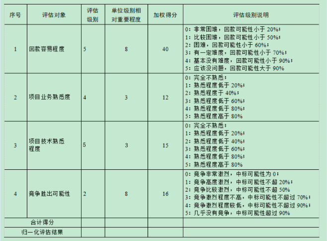
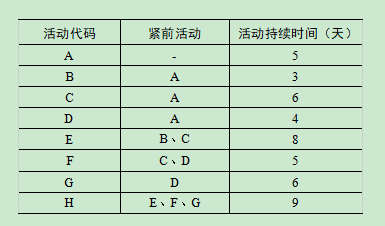
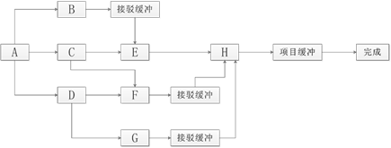

# 2017.5

## 试题1（18分）

**阅读下列说明，回答问题1至问题3，将解答填入答题纸的对应栏内。**
A公司想要升级其数据中心的安防系统，经过详细的可行性分析及项目评估后，决定通过公开招标的方式进行采购。某系统集成商B公司要求在投标前按照项目实际情况进行综合评估后才能做出投标决策。B公司规定评估分数（按满分为100分进行归一化后的得分）必须在70分以上的投标项目才具有投标资格。于是B公司项目负责人张工在购买标书后，综合考虑竞争对手、项目业务与技术等因素，编制了如下评估表

**【问题1】（6分）**
综合上述案例，请帮助项目经理张工计算该项目的评估结果（包括合计得分和归一化结果）。
>合计得分4+12+15+16=83分；
归一化结果100×83/5×(8+3+3+8)=75.45分
注意本题需采用归一化评估结果的公式计算，归一化结果的含义可以理解为综合成本评估结果在百分制评价体系中对应的评价分数。
  公式如下

**【问题2】（4分）**
基于以上案例，如果你是B公司管理层领导，对于该项目，是决定投标还是放弃投标？为什么？
>决定投标。根据B公司规定，归一化后的得分必须在7分以上的投标项目才具有投标资格，该项目归一化结果为75分，满足投标要求。

**【问题3】（8分）**
请指出项目论证应包括哪几个方面？
>（1）项目运行环境评价。
（2）项目技术评价。
（3）项目财务评价。
（4）项目国民经济评价。
（5）项目环境评价。
（6）项目社会影响评价。
（7）项目不确定性和风险评价。
（8）项目综合评价等。

---
---
---

## 试题2（22分）

**阅读下列说明，回答问题1至问题4，将解答填入答题纸的对应栏内。**
某项目细分为A、B、C、D、E、F、G、H共八个模块，而且各个模块之间的依赖关系和持续时间见下表

**【问题1】（4分）**
计算该活动的关键路径和项目的总工期。
>关键路径为A-C-E-H，总工期28天。

**【问题2】（8分）**
（1）计算活动B、C、D的总体时差。
（2）计算活动B、C、D的自由时差。
（3）计算活动D、G的最迟开始时间。
>（1）B的总时差为3，C的总时差为，D的总时差为4。
（2）B的自由时差为3，C的自由时差为0，D的自由时差为0。
（3）D最迟第10天开始，第13天结束；
    G最迟第14天开始，第19天结束。（第一天开始）

**【问题3】（5分）**
如果活动G今早开始，但工期拖延了5天，则该项目的工期会拖延多少天？请说明理由。
>工期会拖延一天。因为G的总时差为4，延误了5天，会影响总工期1天。

**【问题4】（5分）**
请简要说明什么是接驳缓冲和项目缓冲。如果采取关键链法对该项目进行进度管理，则接驳缓冲应该设置在哪里？
>项目缓冲是用来保证项目不因关键链的延误而延误。
接驳缓冲是用来保护关键链不受非关键链延误的影响。
接驳缓冲放在非关键链与关键链的接合点。见下图。

---
---
---

## 试题3（19分）

**阅读下列说明，回答问题1至问题3，将解答填入答题纸的对应栏内。**
某政府部门为了强化文档管理，实现文档管理全部电子化，并达到文档的实时生成和同步流转的目标，使文档管理有一次突破性升级，拟建设一个新的文档管理系统。项目主要负责人希望该系统与政府部门正在建设的新办公大楼能够同期投入使用，因此该部门将原来预计的文档管理系统的开发时间压缩了3个月，然后据此制定了招标文件并进行了招标。
某公司长期从事系统集成项目，但是并不具备文档管理系统的开发经验。在参与此项目的招投标时，虽然认为项目风险较大，但为了企业的业务发展，还是觉定投标，并最终中标。
张某被任命为该项目的项目经理。考虑到该公司对此类项目尚无成熟案例，他认为做好项目风险管理很重要，就参照以前的项目模板，编制了一个项目风险管理计划，经公司领导签字后就下发各小组实施。但随着项目的进行，各成员发现项目中面临的问题与风险管理计划缺乏相关性，就按照各自理解对实际风险控制和应对措施进行了安排，致使验收一拖再拖，项目款项也迟迟不能收回。

**【问题1】（10分）**
请指出该项目经理在项目风险管理方面存在哪些问题？
>在没有成熟案例的情况下，参照以前模板编制的风险计划不妥，偏离项目实际情况。
风险管理计划应该全员参与编制，必要时邀请相关专家以及干系人参与。
没有进行风险识别，并导致实际出现的问题与风险计划没有相关性。
风险管理计划中没有风险控制和风险应对的内容。
管理过程中缺乏对风险的监督和控制。

**【问题2】（4分）**
针对该项目的情况，请指出项目中存在的具体风险项，并简要说明。
>进度风险文档管理系统的开发时间被压缩了3个月。
质量风险该公司不具备文档管理系统的开发经验。
管理风险没有按照规范进行风险管理，方法工具制度等不完善。
人员风险项目经理的经验与管理水平不够。

**【问题3】（5分）**
在（1）～（5）中填写恰当内容（从候选答案中选择一个正确选项，将该选项编号填入答题纸对应栏内）。
项目经理在编制风险管理计划时，参考了以前的计划模板，该计划模板属于（1）；按照项目的目标把风险进行结构化分解，得到的是（2）；在风险识别时，要考虑（3）中所定义的各项假设条件的不确定性；在风险识别时，可参考（4）库中的历史项目风险数据；在进行风险分析时，需要进行风险数据的（5）评估，以确定这些风险数据对风险管理的有用成分。候选答案
A．组织过程资产B．资产C．风险D．质量
E．项目范围说明书F．评审G．工具H．RBS
>（1）A（2）H（3）E（4）A（5）D

---
---
---

## 试题4（16分）

**阅读下列说明，回答问题1至问题3，将解答填入答题纸的对应栏内。**
某大型国企A公司近几年业务发展迅速，陆续上线了很多信息系统，致使公司IT部门的运维工作压力日益增大。A公司决定采用公开招标的方式选择IT运维服务供应商。
A公司选择了一家长期合作的、资质良好的招标代理机构，并协助其编写了详细的招标文件。6月1日，招标代理机构在其官网发布了招标公告。招标公告规定，投标人必须在6月25日10:00前提交投标文件，开标时间定为6月25日14:00。
6月25日14:00，开标工作准时开始，由招标代理机构主持，并邀请了所有投标方参加。开标时，招标代理机构工作人员检查了投标文件的密封情况。经确认无误后，当众拆封，宣读投标人名称、投标价格和投标文件的其他内容。
为保证投标工作的公平、公正，A公司邀请了7名来自本公司内部各部门(法律、财务、市场、IT、商务等）的专家或领导组成了评标委员会。评标委员会按照招标文件确定的评标标准和方法，对投标文件进行了评审和比较。

**【问题1】（6分）**
结合以上案例，请指出以上招标过程中的问题。
>开标时间有问题。开标应在招标文件确定的截止时间的同一时间公开进行。
评标委员会的成员有问题。评标委员会由招标人的代表和有关技术、经济等方面的专家组成，成员人数为五人以上单数，其中技术、经济等方面的专家不得少于成员总数的三分之二。
开标应该由招标人主持而不是招标代理机构。
由招标代理机构工作人员检查投标文件的密封情况不妥，应该由投标人或者其推选的代表检查。

**【问题2】（6分）**
假设你是A公司负责本次招标的人员，在招标过程中，假如发生以下情况，应该如何处理？
（1）开标前，某投标方人员向你打听其他投标单位的名称、报价等情况。
（2）某投标方B公司提交了投标文件之后，在开标前发现投标文件报价有错误，电话联系你希望在评标时进行调整。
>拒绝对方的请求，这样有损其他投标人的权利利益。
拒绝对方的要求，是否需要澄清由评标委员会决定，而不是招标人。

**【问题3】（4分）**
结合本案例判断下列选项的正误(填写在答题纸的对应栏内，正确的选项填写“√”，错误的选项填写“×”）；
（1）招标方具有编制招标文件和组织评标能力的，可以自行办理招标事宜，而不用委托招标代理机构。（）
（2）依法必须进行招标的项目，自招标文件开始发出之日起至提交投标文件截止之日止，最短不得少于15日。（）
（3）招标方和投标方应当自中标通知书发出之日起30日内，按照招标文件和中标方的投标文件订立书面合同。（）
（4）在要求提交投标文件截止时间10日前，招标方可以以书面形式对己发出的招标文件进行必要的澄清或修改。（）
>（1）√（2）×（3）√（4）×
