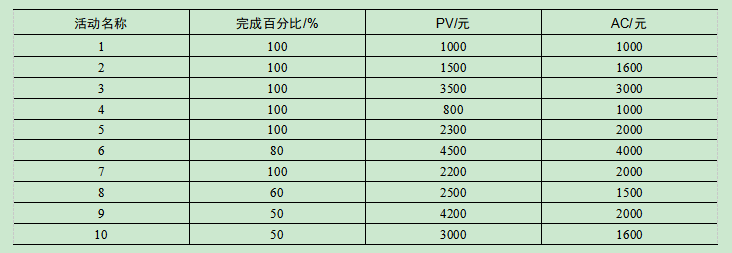

# 2018.11

## 试题1（18分）

**阅读下列说明，回答问题1至问题4，将解答填入答题纸的对应栏内。**
A公司承接了某信息系统工程项目。公司李总任命小王为项目经理，向公司项目管理办公室负责。项目组接到任务后，各成员根据各自分工制定了相应项目管理子计划，小王将收集到的各子计划合并为项目管理计划并直接发布。
为了保证项目按照客户要求尽快完成，小王基于自身的行业经验，对客户需求初步了解后，立即安排项目团队开始实施项目。在项目实施过程中，客户不断调整需求，小王本着客户至上的原则，对客户的需求均安排项目组成员进行了修改，导致某些工作内容多次重复。项目进行到后期才发现项目进度严重滞后，客户对项目进度很不满意，并提出了投诉。接到客户投诉后李总要求项目管理办公室给出说明。项目管理办公室对该项目情况也不了解，因此组织相关人员对项目进行审查，发现了很多问题。

**【问题1】（8分）**
结合案例，请简要分析造成项目目前状况的原因。
>1．项目经理小王项目管理经验不足，管理能力不强，不适合项目经理职位。
2．项目管理子计划应该根据项目管理计划来制定和细化，而不是先有项目管理子计划，再合并为项目管理计划。
3．项目管理计划没有经过相关干系人评审就直接发布。
4．对客户需求没有完整的获取、分析并确认，就开始实施项目。
5．小王没有建立需求变更控制流程，没有进行需求变更控制。
6．小王没有进行有效的进度检查和进度控制。
7．小王与客户的沟通存在问题，没有有效的沟通管理。
8．项目管理办公室没有对小王进行监督和指导，没有对项目过程进行监管。

**【问题2】（5分）**
请简述项目管理办公室的职责。
>1．建立组织内项目管理的支撑环境。
2．培养项目管理人员。
3．提供项目管理的指导和咨询。
4．组织内的多项目管理和监控。
5．项目组合管理。
6．提高企业项目管理能力。

**【问题3】（5分）**
结合案例，判断下列选项的正误（填写在答题纸对应栏内，正确的选项填写“√”，错误的填写“×”）。
（1）项目整体管理包括选择资源分配方案，平衡相互竞争的目标和方案，以及协调项目管理各知识领域之间的依赖关系。（ ）
（2）只有在过程之间相互交互时，才需要关注项目整体管理。（ ）
（3）项目整体管理还包括开展各种活动来管理项目文件，以确保项目文件与项目管理计划及交付成果（产品、服务或能力）的一致性。（ ）
（4）针对项目范围、进度、成本、质量、人力资源、沟通、风险、采购、干系人等九大领域的管理，最终是为了实现项目的整体管理，实现项目目标的综合最优。（ ）
（5）半途而废、失败的项目，只需要说明项目终止的原因，不需要进行最终产品、服务或成果的移交。（ ）
>（1）√
（2）×
（3）√
（4）√
（5）×
暂无

---
---
---

## 试题2（17分）

**阅读下列说明，回答问题1至问题3，将解答填入答题纸的对应栏内。**
某大型央企A公司计划开展云数据中心建设项目，并将公司主要业务应用逐步迁移到云平台上。由于项目金额巨大，A公司决定委托当地某知名招标代理机构，通过公开招标方式选择系统集成商。
6月20日招标代理机构在网站发布了该项目的招标公告，招标公告要求投标人必须在6月30日上午10:00前提交投标文件，地点为黄河大厦五层第一会议室。
6月28日B公司向招标代理机构发送了书面通知，称之前提交的投标材料有问题，希望用重新制作的投标文件替换原有的投标文件，招标代理机构拒绝了该投标人的要求。
6月30日上午9:30，五家公司提交了投标材料。此时招标代理机构接到了C公司的电话，对方称由于堵车原因，可能会迟到，希望开标时间推迟半个小时，招标代理机构与已递交材料的五家公司代表沟通后，大家一致同意将开标时间推迟到上午10:30。
6月30日上午1030，C公司到场提交投标材料后开标工作开始，评标委员会对投标文件进行了评审和比较，向A公司推荐了中标候选人D公司和E公司，经过慎重考虑，A公司决定D公司中标。
7月10日A公司公布中标结果，并向D公司发出了中标通知书。
7月11日B公司向招标代理机构询问中标结果，招标代理机构以保密为由拒绝告知。
8月20日A公司与D公司签署了商务合同，并要求D公司尽快组织人员启动项目实施。
8月22日D公司项目团队正式进场，A公司发现D公司将项目的某重要工作分包给了另一家公司，通过查阅商务合同以及D公司投标文件发现，D公司未在这两份文件中提及任何分包事宜。

**【问题1】（12分）**
综合以上案例，请指出以上招投标及项目实施过程中存在的问题。
>1．6月3日上午10:00前提交投标文件存在问题。（依法必须进行招标的项目，自招标文件开始发出之日起至提交投标文件截止之日止，最短不得少于20日）
2．招标代理机构拒绝了B公司用重新制作的投标文件替换原有的投标文件的要求存在问题。（投标人在投标文件要求提交投标文件的截止时间前，可以补充、修改或者撤回已提交的投标文件，并书面通知招标人）
3．招标代理机构同意将开标时间推迟存在问题。（开标应当在招标文件确定的提交投标文件截止时间的同一时间公开进行）
4．上午10:30，C公司到场提交投标材料后开标工作开始存在问题。（招标人有权也应当对招标文件要求提交的截止时间后送达的投标文件拒收）
5．评标委员会向A公司推荐了中标候选人D公司和E公司存在问题。（中标候选人限定在一至三人，根据评标情况予以排名）
6．A公司公布中标结果，并向D公司发出了中标通知书存在问题。（中标人确定后，招标人应当向中标人发出中标通知书，并同时将中标结果通知所有未中标的投标人）
7．B公司向招标代理机构询问中标结果，招标代理机构以保密为由拒绝告知存在问题。
8．8月20日A公司与D公司签署了商务合同存在问题。（招标人和中标人应当自中标通知书发出之日起30日内，按照招标文件和中标人的投标文件，订立书面合同）
9．D公司将项目的某重要工作分包给了另一家公司存在问题。（中标人按照合同约定或者经招标人同意，可以将中标项目的部分非主体、非关键性工作分包给他人完成）

**【问题2】（3分）**
采购文件为实施采购、控制采购和结束采购等过程提供了依据，请列举常见的采购文件。
>采购文件用来得到潜在卖方的报价建议书。典型的采购文件投标邀请书（IFB）、建议邀请书（RFP）、报价邀请书（RFQ）和建议书。

**【问题3】（2分）**
从候选答案中选择一个正确选项，将该选项编号填入答题纸对应栏内。
（ ）下的卖方100%承担成本超支的风险。
（ ）允许根据条件变化（如通货膨胀，某些特殊商品的成本增加或降低），以事先确定的方式对合同价格进行最终调整。
候选答案
A．固定总价合同B．成本补偿合同
C．总价加奖励费用合同D．总价加经济价格调整合同
>A D
暂无

---
---
---

## 试题3（21分）

**阅读下列说明，回答问题1至问题3，将解答填入答题纸的对应栏内。**
下表给出了某信息系统建设项目的所有活动截止到2018年6月1日的成本绩效数据，项目完工预算BAC为30000元。

**【问题1】（10分）**
请计算项目当前的成本偏差CV、进度偏差SV、成本绩效指数CPI、进度绩效指数SPI，并指出该项目的成本和进度执行情况（CPI和SPI结果保留两位小数）。
>PV=100+1500+3500+800+2300+4500+2200+2500+4200+3000=25500元
EV=1000+1500+3500+800+2300+4500×0.8+2200+2500×0.6+4200×0.5+3000×0.5=20000元
AC=1000+1600+3000+1000+2000+4000+2000+1500+2000+1600=19700元
CV=EV-AC=20000-19700=300
SV=EV-PV=20000-25500=-5500
CPI=EV/AC=20000/19700=1.02
SPI=EV/PV=20000/25500=0.78

**【问题2】（3分）**
项目经理对项目偏差产生的原因进行了详细分析，预期未来还会发生类似偏差，如果项目要按期完成，请估算项目中的ETC（结果保留一位小数）。
>ETC=(BAC-EV)/CPI=(3000-20000)/1.02=9803.9元

**【问题3】（2分）**
假如此时项目增加10000元的管理储备，项目完工预算BAC如何变化？
>无影响。因为管理储备是不作为项目预算分配下去的。计算BAC时，不需要考虑管理储备。

**【问题4】（6分）**
以下成本中，直接成本有哪三项？间接成本有哪三项？（从候选答案中选择正确选项，将该选项编号填入答题纸的对应栏内，所选答案多于三项不得分）。
A．销售费用B．项目成员的工资C．办公室电费D．项目成员的差旅费
E．项目所需的物料费F．公司为员工缴纳的商业保险费
>直接成本BDE
简接成本ACF
暂无

---
---
---

## 试题4（19分）

**阅读下列说明，回答问题1至问题4，将解答填入答题纸的对应栏内。**
某公司规模较小，公司总经理认为工作开展应围绕研发和市场进行，该项目研发过程中，编写相关文档会严重耽误项目执行的进度，应该能省就省。2018年1月公司中标一个公共广播系统建设项目，主要包括广播主机、控制器等设备及平台软件的研发工作。公司任命小陈担任项目经理，为保证项目质量，小陈指定一直从事软件研发工作的小张兼职负责项目的质量管理。
小张参加完项目需求和设计方案评审后，便全身心投入到自己负责的研发工作中。在项目即将交付前，小张按照项目组制定的验收大纲进行了检查，并按照项目组拟订的文件列表，检查文件是否齐全，然后签字通过。客户验收时发现系统存在严重的质量问题，不符合客户的验收标准，项目交付时间推延。

**【问题1】（10分）**
结合案例，分析该项目中质量问题产生的原因。
>1．公司高层（总经理）不重视项目质量。
2．公司高层认为相关文档会耽误项目执行的进度，能省就省的指导思想错误。
3．项目经理小陈缺乏对兼职质量管理员小张的质量管理活动的指导和监控。
4．小张不适合质量管理员岗位要求。
5．小张没有做到兼顾质量管理工作和开发工作，忽略了质量管理工作。
6．没有制定项目质量管理计划。
7．没有进行质量保证过程。
8．质量控制活动频次太低，只在即将交付前进行。
9．质量检查只进行了文件齐全的检查，没有进行可交付成果是否满足质量要求的检查。

**【问题2】（5分）**
请简述质量控制过程的输入。
>1．项目管理计划
2．质量测试指标
3．质量核对单
4．工作绩效数据
5．批准的变更请求
6．可交付成果
7．项目文件
8．组织过程资产

**【问题3】（4分）**
基于案例，请判断以下描述是否正确（填写在答题纸对应栏内，正确的选项填写“√”，错误的选项填写“×”）。
（1）项目质量管理包括确定质量政策、目标与职责的各个过程和活动，从而使项目满足其预定的需求。（ ）
（2）帕累托图是一种特殊形式的条形图，用于描述几种趋势、分散程度和统计分布形状。（ ）
（3）通过持续过程改进，可以减少浪费，消除非增值活动，使各个过程在更高的效率与效果水平上运行。（ ）
（4）从项目作为一项最终产品来看，项目质量体现在其性能或使用价值上，即项目的过程质量。（ ）
>（1）√
（2）×
（3）√
（4）×
暂无
