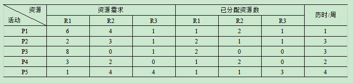
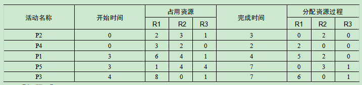

# 2018.5  

## 试题1（20分）  

**阅读下列说明，回答问题1至问题4，将解答填入答题纸的对应栏内。**  
某信息系统集成公司承接了一项信息系统集成项目，任命小王为项目经理。  
项目之初，根据合同中的相关条款，小王在计划阶段简单地描绘了项目的大致范围，列出了项目应当完成的工作。  
甲方的项目经理是该公司的信息中心主任，但该信息中心对其他部门的影响较弱。由于此项目涉及到甲方公司的很多业务部门，因此在项目的实施过程中，甲方的销售部门、人力资源部门、财务部门等都直接向小王提出了很多新的要求，而且很多要求彼此都存在一定的矛盾。  
小王尝试做了大量的解释工作，但是甲方的相关部门总是能够在合同的相关条款中找到变更的依据。小王明白是由于合同条款不明确导致了现在的困境，但他也不知道该怎样解决当前所面临的问题。  

**【问题1】（8分）**  
在本案例中，除了因合同条款不明确导致的频繁变更外，还有哪些因素造成了小王目前的困境?  
>（1）小王对项目的范围没有做细致的分析及调研，确定的范围过粗，没有进行有效的范围确认。  
（2）没有建立整体的变更控制流程，变更发生时也没有按照变更流程进行处理。  
（3）没有制定相应的项目管理计划，相关干系人也没有确认签字，导致变更不断发生。  
（4）甲方信息中心相对弱势，对其他部门影响较弱。  
（5）小王在沟通管理方面存在问题，没有进行有效的沟通。  
（6）没有制定相关的风险管理计划等。  

**【问题2】（4分）**  
结合案例，列举该项目的主要干系人。  
>（1）项目经理小王及项目团队成员。  
（2）甲乙公司高层管理人员。  
（3）甲方信息中心工作人员及中心主任。  
（4）甲方相关业务部门参与人员。  

**【问题3】（4分）**  
简要说明变更控制的主要步骤。  
>（1）提出变更申请。  
（2）变更影响分析。  
（3）CCB审查批准。  
（4）实施变更。  
（5）监控变更实施。  
（6）结束变更。  

**【问题4】（4分）**  
基于案例，请判断以下描述是否正确（填写在答题纸的对应栏内，正确的选项填写“√”，不正确的选项填写“×”）  
（1）变更控制委员会是项目的决策机构，不是作业机构。（ ）  
（2）甲方的组织结构属于项目型。（ ）  
（3）需求变更申请可以由甲方多个部门分别提出。（ ）  
（4）信息中心主任对项目变更的实施负主要责任。（ ）  
>（1）√ （2）× （3）√ （4）×  

---
---
---

## 试题2（17分）  

**阅读下列说明，回答问题1至问题3，将解答填入答题纸的对应栏内。**  
某项目由P1、P2、P3、P4、P5五个活动组成，五个活动全部完成之后项目才能够完成，每个活动都需要用到R1、R2、R3三种互斥资源，三种资源都必须达到活动的资源需求量，活动才能开始。已分配资源只有在完成本活动后才能被其他活动所用。  
目前项目经理能够调配的资源有限，R1、R2、R3的可用资源数分别为9、8、5。活动对资源的需求量、已分配资源数和各活动历时见下表（假设各活动之间没有依赖关系）  
  

**【问题1】（6分）**  
基于以上案例，简要叙述最 优的活动步骤安排。  
>此题在资源受限的情况下，解决如何通过最 优化的活动安排，达到最短时间完成项目的目的。  
经分析最优活动步骤安排如下  
（1）P2、P4并行，活动总共历时三周。  
（2）P1、P5并行，历时一周后P1释放资源。  
（3）P5、P3并行，历时三周后活动完成，项目结束。  

**【问题2】（7分）**  
基于以上案例，请计算项目的完工时间（详细写出每个活动开始时间、占用资源和完成时间以及项目经理分配资源的过程）。  
>  

**【问题3】（4分）**  
在制订项目计划的过程中，往往受到资源条件的限制，经常采用资源平衡和资源平滑方法，请简要描述二者的区别。  
>资源平衡是为了在资源需求与资源供给之间取得平衡，根据资源制约对开始日期和结束日期进行调整的一种技术。如果共享资源或关键资源只在特定时间可用，数量有限，或被过度分配，如一个资源在同一时段内被分配至两个或多个活动，就需要进行资源平衡。也可以为保持资源使用量处于均衡水平而进行资源平衡。资源平衡往往导致关键路径改变，通常是延长。  
资源平滑是对进度模型中的活动进行调整，从而使项目资源需求不超过预定的资源限制的一种技术。相对于资源平衡而言，资源平滑不会改变项目关键路径，完工日期也不会延迟。也就是说，活动只在其自由浮动时间和总浮动时间内延迟。因此，资源平滑技术可能无法实现所有资源的优化。  

---
---
---

## 试题3（18分）  

**阅读下列说明，回答问题1至问题3，将解答填入答题纸的对应栏内。**  
系统集成商甲公司承接了一项信息管理系统建设项目，甲公司任命具有多年类似项目研发经验的张工为项目经理。  
张工上任后，立刻组建了项目团队。人员确定后，张工综合了工作任务、团队人员的经验和喜好，将项目组划分为了三个小组，每个小组负责一个工作任务。  
团队进入了开发阶段，张工发现，项目管理原来没有研发编程那么简单；其中1个项目小组的重要开发人员因病请假，导致该小组任务比其他两个小组滞后2周。另外，每个小组内部工作总出现相互推诿情况，而且小组和小组成员矛盾也接连不断，项目任务一度停滞不前。  
此时，正赶上人事部推出新的项目绩效考核方案，经过对项目进度和质量方面的考评结果，项目绩效成绩较低，直接影响了每个项目团队成员的绩效奖金。项目组成员负面情绪较重，有的成员在加班劳累和无法获得绩效奖金的双重压力下准备辞职，张工得知后，与项目组成员私下进行了逐一面谈。  

**【问题1】（8分）**  
结合案例，请指出本项目在人力资源管理方面存在的问题。  
>（1）项目经理在项目管理方面经验不足，人选方面存在问题。  
（2）没有制定详细的人力资源管理计划。  
（3）组建的项目团队不是一个最 优化的配置。  
（4）人力资源管理存在问题，出现人员缺勤后，没有相应的处理措施。  
（5）项目管理规章制度制定不健全，岗位职责不明确，推诿扯皮时有发生。  
（6）团队建设存在问题，没有有效的团队建设活动。  
（7）团队管理存在问题，冲突发生时不能有效的进行冲突管理，矛盾不断升级。  
（8）项目绩效方面存在问题，加班员工没有激励措施。  

**【问题2】（6分）**  
基于以上案例  
（1）判断当前项目团队处于哪个阶段?  
（2）简述x理论和y理论的主要观点。如果从x理论和y理论的观点来看，项目经理张工在该阶段应该采取哪一理论来进行团队激励?为什么?  
>（1）项目团队处于震荡阶段。  
（2）简述如下  
x理论  
x理论主要体现了独裁型管理者对人性的基本判断，这种假设认为  
1）一般人天性好逸恶劳，只要有可能就会逃避工作。  
2）人生来就以自我为中心，漠视组织的要求。  
3）人缺乏进取心，逃避责任，甘愿听从指挥，安于现状，没有创造性。  
4）人们通常容易受骗，易受人煽动。  
5）人们天生反对改革。  
崇尚x理论的领 导者认为，在领导工作中必须对员工采取强制、惩罚和解雇等手段，强迫员工努力工作，对员工应当严格监督、控制和管理。在领导行为上应当实行高度控制和集中管理，在领导风格上采用独裁式的领导方式。  
y理论  
y理论对人性的假设与x理论完全相反，其主要观点为  
1）一般人天生并不是好逸恶劳，他们热爱工作，从工作得到满足感和成就感。  
2）外来的控制和处罚对人们实现组织的目标不是一个有效的办法，下属能够自我确定目标，自我指挥和自我控制。  
3）在适当的条件下，人们愿意主动承担责任。  
4）大多数人具有一定的想象力和创造力。  
5）在现代社会中，人们的智慧和潜能只是部分地得到了发挥。  
基于y理论对人的认识，信奉y理论的管理者对员工采取民主型和放任自由型的领导方式，在领导行为上遵循以人为中心的、宽容的及放权的领导原则，使下属目标和组织目标很好地结合起来，为员工的智慧和能力的发挥创造有利的条件。  
应该采取y理论进行团队激励。  

**【问题3】（4分）**  
结合案例，从候选答案中选择一个正确答案，将该选项的编号填入答题纸对应栏内。  
（1）项目经理根据工作任务和团队人员的经验和喜好进行分组，这采用了影响员工的方法中的___方法。  
A．权力B．任务分配C．工作挑战D．友谊  
（2）项目经理张工针对成员负面情绪较重的问题，采取了___方法进行团队建设。  
A．人际关系技能B．冲突管理C．绩效评估D．观察和交谈  
>（1）C （2）A  

---
---
---

## 试题4（20分）  

**阅读下列说明，回答问题1至问题4，将解答填入答题纸的对应栏内。**  
某系统集成公司b承建了a公司的办公自动化系统建设项目，任命张伟担任项目经理。  
该项目所使用的硬件设备（服务器、存储、网络等）和基础软件（操作系统、数据库、中间件等）均从外部厂商采购，办公自动化应用软件采用公司自主研发的软件产品。采购的设备安装、部署、调试工作分别由公司硬件服务部、软件服务部、网络服务部完成。  
由于该项目工期紧，系统相对比较复杂，且涉及实施人员较多，张伟认为自己应投入较大精力在风险管理上。  
首先，张伟凭借自身的项目管理经验，对项目可能存在的风险进行了分析，并对风险发生的可能性进行了排序。排名前三的风险是①硬件到货延迟；②客户人员不配合；③公司办公自动化软件可能存在较多bug。针对上述三项主要风险，张伟制定了相应的应对措施，并且计划每月底对这些措施的实施情况进行回顾。  
项目开始2个月后，张伟对项目进度进行回顾时，发现项目进度延迟，主要原因有两点①购买的数据库软件与操作系统的版本出现兼容性问题，团队成员由于技术技能不足无法解决，后通过协调厂商工程师得以解决，造成项目周期比计划延误一周。②服务器工程师、网络工程师被自己所在的部门经理临时调走支持其他项目，造成项目周期延误一周。客户对于项目进度的延误很不满意。  

**【问题1】（4分）**  
请指出张伟在项目风险管理方面做得好的地方。  
>（1）项目经理风险意识较强，认识到了风险管理的重要性。  
（2）项目经理对风险进行了识别及排序。  
（3）制定相应的风险应对措施。  
（4）对风险实施情况进行了风险控制。  

**【问题2】（8分）**  
张伟在项目风险管理方面还有哪些待改进之处?  
>（1）没有指定详细的风险管理计划。  
（2）风险识别不能仅凭个人经验完成，需与项目组成员一起沟通参与。  
（3）没有对风险进行相应的量化分析。  
（4）分析识别颗粒度不够，没有识别出所有风险。  
（5）风险监控频率过低，发现风险时影响已经非常大。  
（6）风险应对措施不合理，不全面。  
（7）没有进行风险再识别。  

**【问题3】（4分）**  
如果你是项目经理，针对本案例已发生的人员方面的风险，给出应对措施。  
>（1）与公司高层协商人员安排，采用加班或赶工形式加快进度。  
（2）外聘有经验和相关能力的专业技术人员。  
（3）申请外包部分模块或者借助外力，如采用虚拟团队方式，提升工作效率。  
（4）调整工作计划，安排现有人员完成相关工作。  

**【问题4】（4分）**  
关于风险管理，判断下列描述是否正确（填写在答题纸的对应栏内，正确的选项填写“√”，错误的选项填写“×”）  
（1）按照风险性质划分，买卖股票属于纯粹风险。（ ）  
（2）按风险产生原因划分，核辐射、空气污染和噪声属于社会风险。（ ）  
（3）风险性质会因时空各种因素变化而有所变化，这反映了风险的偶然性。（ ）  
（4）本案例中，针对硬件到货延迟的风险，b公司与供应商在采购合同中需明确因到货延迟产生的经济损失由供应商承担，这属于风险转移措施。（ ）  
>（1）× （2）× （3）× （4）√  
