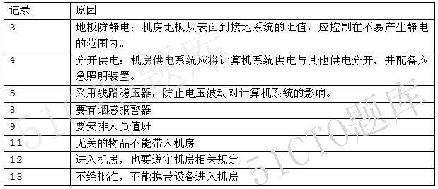
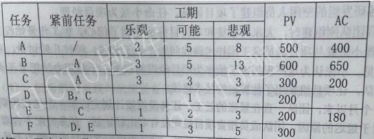
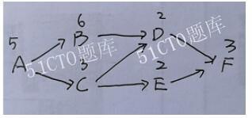
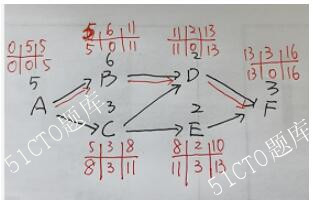

# 2019.11

## 试题1

**阅读下列说明，回答问题1至问题3，将解答填入答题纸的对应栏内。**
系统集成A公司承接了某市政府电子政务系统机房升级改造项目，任命小张为项目经理。升级改造工作实施前，小张安排工程师对机房进行了检查，形成如下14条记录
（1）机房有机架30组
（2）机房内中各个区域温度保持在25度左右
（3）机房铺设普通地板，配备普通办公家具
（4）机房照明系统与机房设备统一供电，配备了应急照明装置
（5）机房配备了UPS，无稳压器
（6）机房设置了避雷装置
（7）机房安装了防盗报警装置
（8）机房内配备了灭火器，但没有烟感报警装置
（9）机房门口设立门禁系统，无人值守
（10）进入机房人员需要佩戴相应证件
（11）工作人员可以使用个人手机与外界联系
（12）所有来访人员需经过正式批准，批准通过后可随意进入机房
（13）来访人员可以携带笔记本电脑进入机房
（14）机房内明确标示禁止吸烟和携带火种
参见解析。

**【问题1】（8分）**
根据以上检查记录，请指出该机房在信息安全管理方面存在的问题，并说明原因（将错误编号及原因填写在答题纸对应表格）。
>

**【问题2】（4分）**
信息系统安全的属性包括保密性、完整性、可用性和不可抵赖性。请说明各属性的含义。
>1．保密性是应用系统的信息不被泄露给非授权的用户、实体或过程，或供其利用的特
性。
2．完整性是信息未经授权不能进行改变的特性。
3．可用性是应用系统信息可被授权实体访问并按需求使用的特性。
4．不可抵赖性也称作不可否认性，在应用系统的信息交互过程中，确信参与者的真实
同一性。

**【问题3】（6分）**
请列举机房防静电的方式。
>机房防静电的措施有
①接地与屏蔽采用必要的措施，使计算机系统有一套台理的防静电接地与屏蔽
系统。
②服装防静电人员服装采用不易产生静电的衣料，工作鞋采用低阻值材料制作。
③温、湿度防静电控制机房温湿度，使其保持在不易产生静电的范围内。
④地板防静电机房地板从表面到接地系统的阻值，应控制在不易产生静电的范
围内。
⑤材料防静电机房中使用的各种家具，如工作台、柜等，应选择产生静电小的
材料。
⑥维修MOS电路保护在硬件维修时，应采用金属板台面的专用维修台，以保护
MOS电路。
⑦静电消除要求在机房中使用静电消除剂等，以进一步减少静电的产生。

---
---
---

## 试题2

**阅读下列说明，回答问题1至问题3，将解答填入答题纸的对应栏内。**
某公司承接了一个软件开发项目，客户要求4个月交付。鉴于系统功能不多且相对独立，公司项目管理办公室评估后，认为该项目可以作为敏捷方法的试点项目。公司抽调各研发组的空闲人员组建了项目团队，任命小张为项目经理。
项目团队刚组建时，大家对敏捷和项目目标都充满了信心，但工作开始没多久，项目经理小张就与项目成员老王因技术路线问题产生了分歧。经过几轮讨论，双方都坚持己见，小张认为这严重损害了他作为项目经理的权威，于是想办法把老王调离了项目团队，让项目组采用了他提出的技术路线。
一个月以来，团队一直在紧张的赶工，还是没能按计划完成第一个迭代周期的任务。对于延迟的原因，团队成员指责项目经理没有制定好计划、任务分配不合理、对个人的考核规则不明确、工位分散沟通不顺畅；项目经理指责项目成员能力不足、工作习惯不好、对任务的理解不一致。团队出现了超出预想的困难，这很可能导致无法按时交付。
参见解析。

**【问题1】（6分）**
（1）请简述一般项目团队建设的五个阶段及其特点。
（2）请说明案例中项目团队当前所处的阶段。
>（1）项目团队的五阶段
1、形成阶段(Forming)，一个个的个体转变为团队成员，逐渐相互认识并了解项目情况及他们在项目中的角色与职责，开始形成共同目标。团队成员倾向于相互独立，不怎么开诚布公。在本阶段，团队往往对未来有美好的期待。
2、震荡阶段(Storming)，团队成员开始执行分配的项目任务，一般会遇到超出预想的困难，希望被现实打破。个体之问开始争执，互相指责，并且开始怀疑项目经理的能力。
3、规范阶段(Norming)，经过一定时间的磨合，团队成员开始协同工作，并调整各自的工作习惯和行为来支特团队．团队成员开始相互信任，项目经理能够得到团队的认可。
4、发挥阶段(Performing)，随着相互之间的配合默契和对项目经理的信任加强，团队就像一个组织有序的单位那样工作。团队成员之问相互依靠，平稳高效地解决问题。这时团队成员的集体荣誉感会非常强，常将团队换成第一称谓，如“我们组”“我们部门”等，并会努力捍卫团队声誉。
5、解散阶段(Adjourning)，所有工作完成后，项目结束，团队解散。
（2） 震荡阶段

**【问题2】（4分）**
（1）请指出常用的冲突解决方法。
（2）针对案例中发生的冲突，请指出项目经理采用了哪种冲突管理方法，并说明其特点。
>（1）有6种常用的冲突解决方法。
①问题解决（Problem Solving/Confrontation）。这个过程中，需要公开地协商，这是冲突管理中最理想的一种方法。
②合作（Collaborating）。得出一个多数人接受和承诺的冲突解决方案。
③强制（Forcing）。适用于赢-输这样的零-和游戏情景。
④妥协（Compromising）。使冲突各方都有一定程度满意、但冲突各方没有任何一方完全满意。
⑤求同存异(Smoothing/Accommodating)。关注他们一致的一面，而淡化不一致的一面。
⑥撤退（Withdrawing/Avoiding）。
（2）强制适用于输赢这样的零和游戏情景。

**【问题3】（10分）**
（1）请简述成功的项目团队的特点。
（2）对照成功项目团队的特点，指出案例中存在的问题，并写出改进措施。
>（1）成功团队的特点
1、团队的目标明确，成员清楚自己工作对目标的贡献。
2、团队的组织结构清晰，岗位明确。
3、有成文或习惯的工作流程和方法，而且流程简明有效。
4、项目经理对团队成员有明确的考核和评价标准，工作结果公正公开，赏罚分明。
5、有共同制定并遵守的组织纪律。
6、团队成员相互信任，协同工作，善于总结和学习。
（2）改进措施
1、采用合适的团队建设手段，消除团队成员间的隔阂。
2、明确项目团队的目标，及项目组各成员的分工。
3、建立清晰的工作流程和沟通机制。
4、建立明确的考核评价标准。
5、鼓励团队成员之间建立参与和分享的氛围。
6、制定有效的激励措施。

---
---
---

## 试题3

**阅读下列说明，回答问题1至问题4，将解答填入答题纸的对应栏内。**
某公司中标了一个软件开发项目，项目经理根据以往的经验估算了开发过程中各项任务需要的工期及预算成本，如下表所示。

  到第13天晚上，项目经理检查了项目的进展情况和经费使用情况，发现A、B、C三项活动均已完工，D任务明天可以开工，E任务完成了一半，F尚未开工。
参见解析。

**【问题1】（5分）**
请采用合适的方法估算各个任务的工期，并计算项目的总工期和关键路径。
>解题思路根据三点估算的公式分别计算出各活动的期望工期；
PERT对各项目活动的完成时间按照三种不同情况估计
乐观时间(Optimistic Time，OT)——任何事情都顺利的情况下，完成某项工作的时间。
可能时间(Mostlikely Time，MT)——正常情况下，完成某项工作的时间。
悲观时间(Pessimistic Time，PT)——最不利的情况下，完成某项工作的时间。假定三个估计服从β分布，由此可算出每个活动的期望ti

因此得到
A=（2+4*5+8）/6=5;
B=（3+4*5+13）/6=6；
C=（3+4*3+3）/6=3;
D=（1+4*1+7）/6=2；
E=（1+4*2+3）/6=2；
F=（1+4*2+5）/6=3；
根据表格的紧前关系，我们得到其单代号网络图

因此该项目的总工期是A+B+D+F=5+6+2+3=16
关键路径是ABDF。

**【问题2】（3分）**
分别给出CDE三项活动的总时差。
>解题思路根据顺推选最大，逆推选最小，得到下图

得到C的总时差是3，D的总时差是0，E的总时差是3.

**【问题3】（7分）**
请计算并分析该项目第13天晚上时的执行绩效情况。
>根据题干的图表和单代号网络图，首先计算AC，然后求PV，在求EV。
AC=40+650+200+180=1430
PV=A+B+C+D+E=500+600+300+200+200=1800
EV=A+B+C+0.5*E=500+600+300+0.5*200=1500
因为要判断项目绩效，根据CV和SV来计算
CV=EV-AC=1500-1430=70，CV大于0，成本节约
SV=EV-PV=1500-1800=-300，SV小于0，进度落后。

**【问题4】（5分）**
针对项目目前的绩效情况，项目经理应该采取哪些措施。
>赶工的措施有
①赶工，投入更多的资源或增加工作时间，以缩短关键活动的工期；
②快速跟进，并行施工，以缩短关键路径的长度；
③使用高素质的资源或经验更丰富的人员；
④减少活动范围或降低活动要求，需投资人同意；
⑤改进方法或技术，以提高生产效率；
⑥加强质量管理，及时发现问题，减少返工，从而缩短工期。

---
---
---

## 试题4

**阅读下列说明，回答问题1至问题3，将解答填入答题纸的对应栏内。**
系统集成A公司中标某市智能交通系统建设项目。李总负责此项目的启动工作，任命小王为项目经理。小王制定并发布了项目章程，其中明确建设周期为1年，于2018年6月开始。
项目启动后，小王将团队分为了开发实施组与质量控制组，分工制定了范围管理计划、进度管理计划与质量管理计划。
为了与客户保持良好沟通，并保证项目按要求尽快完成，小王带领开发团队进驻甲方现场开发。小王与客户经过几次会议沟通后，根据自己的经验形成一份需求文件。然后安排开发人员先按照这份文档来展开工作，具体需求细节后续再完善。
开发过程中，客户不断提出新的需求，小王一边修改需求文件一边安排开发人员进行修改，导致开发工作多次反复。2019年2月，开发工作只完成了计划的50%，此时小王安排项目质量工程师进驻现场，发现很多质量问题。小王随即组织开发人员加班修改。由于项目组几个同事还承担其他项目的工作，工作时间没法得到保障，项目实施进度严重滞后。
小王将项目进展情况向李总进行了汇报，李总对项目现状不满意，抽调公司两名有多年项目实施经验的员工到现场支援。经过努力，项目最终还是延期四个月才完成。小王认为项目延期与客户有一定关系，与客户发生了争执，导致项目至今无法验收。
参考解析

**【问题1】（7分）**
结合案例，从项目管理角度，简要分析项目所存在的问题。
>1.项目章程不是小王制定的，而是发起人制定的，项目经理可以参加制定，须在制定项目章程之前和之中被发起人任命。
2.项目管理计划制定的不全，还要包含包括范围管理、风险管理、采购管理等具体领域的计划、辅助资料和组织方针。
3.小王应该整合所有的子计划和其他文件，形成项目管理计划。
4.在项目的执行过程中没有加强质量保证工作，采取多种行动执行项目管理计划，完成项目范围说明书中明确的工作。
5.小王在项目整体管理的监控过程中，没有分析绩效信息，采取必要的措施就行纠正等相关措施。
6.小王在实施整体变更过程中没有严格按照变更流程处理相关变更，没有做好配置管理工作。
7.小王缺乏和项目团队成员之间的沟通，造成不断的冲突。
8.小王管理还需提高，不能一味的采用强制的手段去处理相关问题，应该学习好冲突管理的相关措施。
9.制定相关计划的时候，只有项目团队成员参与，还缺少其他的相关干系人。
1.相关计划没有经过批准和审批就执行。
11.收集需求过程有问题，不能小王个人经验形成需求文件，需和相关关系人一起参加收集，并采用多种工具，比如需求调查表，访谈等等。还要做好需求跟踪矩阵。

**【问题2】（6分）**
结合案例，判断下列选项的正误（填写在答题纸对应栏内，正确的选项填写“√”，错误的选项填写“×”）
（1）制定项目管理计划采用从上到下的方法，先制定总体项目管理计划，再分解形成其他质量、进度等分项计划。 （ ）
（2）项目启动阶段不需要进行风险识别。 （ ）
（3）整体变更控制的依据有项目管理计划、工作绩效报告、变更请求和组织过程资产。
（ ）
（4）项目收尾的成果包括最终产品、服务或成果移交。 （ ）
（5）项目管理计划随着项目进展而逐渐明细。 （ ）
（6）项目执行过程中，先执行范围、进度、成本等其他过程管理，然后项目整体管理汇总其他知识领域的执行情况再进行整体协调管理。 （ ）
>1、错；项目管理计划可以先制定各个子计划，然后在整合在一起。
2、错；风险识别是一个反复的过程，项目启动阶段也要做。
3、对；
4、对；
5、对；
6、错；执行过程中要同时进行相关计划，而不能只注重其中一个。

**【问题3】（4分）**
请简要叙述项目整体管理中监控项目工作的输出。
>项目整体管理中监控项目工作的输出有变更请求，项目绩效报告，项目文件更新和项目管理计划更新。
