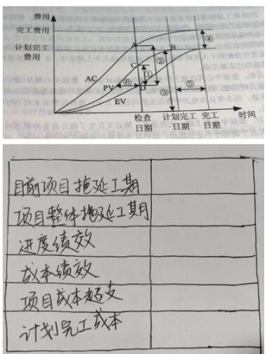
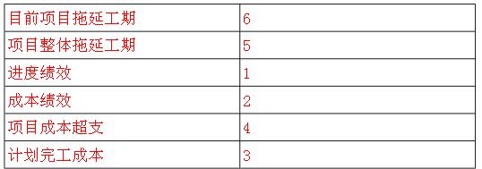
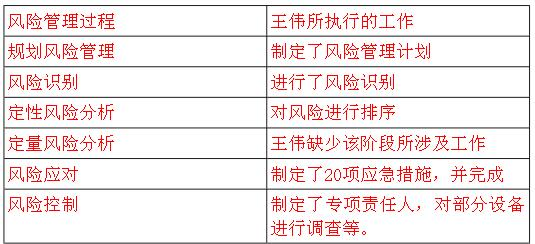

# 2020.11

## 试题1（18分）

阅读下列说明，回答问题1至问题3,将解答填入答题纸的对应栏内。
某公司刚承接了菜市政府的办公系统集成项目，急需一名质量管理人员。因公司有类似项目经验，资料比较齐全。项目经理考虑到配置管理员小张工作积极负责，安排他来负责本项目的质量管理工作。
小张自学了质量管理的相关知识，并选取了公司之前做过的省级办公系统项目作为参照物，制定了本项目的质量管理计划。
项目执行过程中，小张按照质量管理计划，通过质量核对单进行检查，把全部精力投入到项目交付成果的质量控制中。在试运行阶段，客户提出需求变更，此时小张发现之前未与客户签订需求确认文件。随后项目组只好按照新需求对系统进行了修改并通过了内部测试，小张认为测试没问题就算达到了验收标准，因此出具了质量报告，并向客户提交了验收申请。客户依据合同，认为项目尚未达到验收标准，拒绝验收。

**【问题1】 （10分）**
结合案例，请指出本项目质量管理过程中存在的问题。
>（1分）
1、规划质量管理过程的不足之处
项目经理不应该安排配置管理员小张负责质量管理，因此他之前没有质量管理的工作经验。
小张不应该单独一个人制定质量管理计划，应该与相关干系人一起制定。
没有制订质量测量指标，造成后期不符合客户需求。
2、质量保证过程的不足之处
没有进行质量保证工作。
质量保证工作中没有严格按照质量管理计划和过程改进计划进行。
质量保证工作中没有定期或不定期的进行质量审计和过程分析，找到相关问题。
项目经理和小张质量管理意识不足，公司高层需要定期进行培训等相关质量管理工作。
没有收集质量管理过程中的项目绩效数据
3、质量控制过程的不足之处
质量控制过程中没有认真执行相关工作，没有分析绩效数据。
没有认真的进行质量控制，不仅仅要对可交付物进行质量控制，还需要对质量保证过程进行质量控制。
需求管理工作不到位，需求没有经过确认；
客户提交需求变更，没有严格按照配置管理和变更管理流程进行管理。
软件内部测试后，还需相关干系人参与，进行第三方测试，符合验收标准才能出示质量报告。
4、其它相关知识域的不足之处
在整个质量管理过程中，需要多方参与，进行全面质量管理。
与客户沟通存在问题，在发现问题后需及时与相关干系人进行沟通，处理好相关问题，得到相关干系人的理解和支持。
项目经理在整个项目期间，没有进行质量管理相关工作。任命小张之后，就不管了。
阅卷要求只要答够5条，就是满分，不用原句，意思一样即可，根据匹配度，是看每条给1分还是2分。
【问题1】（10分）
1、规划质量管理过程的不足之处
项目经理不应该安排配置管理员小张负责质量管理，因此他之前没有质量管理的工作经验。
小张不应该单独一个人制定质量管理计划，应该与相关干系人一起制定。
没有制订质量测量指标，造成后期不符合客户需求。
2、质量保证过程的不足之处
没有进行质量保证工作。
质量保证工作中没有严格按照质量管理计划和过程改进计划进行。
质量保证工作中没有定期或不定期的进行质量审计和过程分析，找到相关问题。
项目经理和小张质量管理意识不足，公司高层需要定期进行培训等相关质量管理工作。
没有收集质量管理过程中的项目绩效数据
3、质量控制过程的不足之处
质量控制过程中没有认真执行相关工作，没有分析绩效数据。
没有认真的进行质量控制，不仅仅要对可交付物进行质量控制，还需要对质量保证过程进行质量控制。
需求管理工作不到位，需求没有经过确认；
客户提交需求变更，没有严格按照配置管理和变更管理流程进行管理。
软件内部测试后，还需相关干系人参与，进行第三方测试，符合验收标准才能出示质量报告。
4、其它相关知识域的不足之处
在整个质量管理过程中，需要多方参与，进行全面质量管理。
与客户沟通存在问题，在发现问题后需及时与相关干系人进行沟通，处理好相关问题，得到相关干系人的理解和支持。
项目经理在整个项目期间，没有进行质量管理相关工作。任命小张之后，就不管了。
阅卷要求只要答够5条，就是满分，不用原句，意思一样即可，根据匹配度，是看每条给1分还是2分。

**【问题2】（5分）**
请简述规划质量管理过程的输入。
>（5分）
项目管理计划、干系人登记册、风险登记册、需求文件、事业环境因素、组织过程资产
阅卷要求只要答够5条，就是满分。
【问题2】（5分）
项目管理计划、干系人登记册、风险登记册、需求文件、事业环境因素、组织过程资产
阅卷要求只要答够5条，就是满分。

**【问题3】（3分）**
请将下面①~③处的答案填写在答题纸的对应栏内。
（1）①用于描述项目或产品的质量属性，用于实施质量保证和控制质量过程，其常见的有:缺陷频率、可用性、可靠性等。
(2)小张使用的质量核对单属于②的输出。
(3)实际技术性能，实际进度绩效、实际成本绩效，这些都被称为③。
>（3分）
答案（1）质量测量指标、（2）规划质量管理、（3）工作绩效数据
【问题3】（3分）
答案（1）质量测量指标、（2）规划质量管理、（3）工作绩效数据

---
---
---

## 试题2（20分）

阅读下列说明，回答问题1至问题4,将解答填入答题纸的对应栏内。
以下是某项目的挣值图，图中A、B、C、D对应的数值分别是600，570，500，450。

**【问题1】（6分）**
结合案例，请将图中的编号①~⑥填写在答题纸的对应栏内。
>（6分）
  结合案例，请将图中的编号①~⑥填写在答题纸的对应栏内。

  备注右侧为答案
【问题1】（6分）
  结合案例，请将图中的编号①~⑥填写在答题纸的对应栏内。

  备注右侧为答案

**【问题2】 (6分）**
结合案例，请计算项目在检查日期时的成本偏差(CV)和进度偏差(SV)，并判断当时的执行绩效。
>(6分）
EV=45, AC=600, PV=500,
CV=EV-AC=-150 成本超支
SV=EV-PV=-50 进度落后
【问题2】(6分）
EV=450, AC=600, PV=500,
CV=EV-AC=-150 成本超支
SV=EV-PV=-50 进度落后

**【问题3】（4分）**
**结合案例，针对问题2的分析结果，项目经理应该采取哪些措施?**
>（4分）
答案
用高效人员，替换低效人员
赶工或并行施工以控制进度。
答以上2条，就是满分。
阅卷要求如果按上面答，就是满分。如果按下面答，可以给2-3分。
赶工、快速跟进、使用高素质或经验丰富的人员、经过业主同意降低活动范围或者降低质量要求；改进工作方法或技术，提高工作效率；加强质量管理，减少返工。
【问题3】（4分）
答案
用高效人员，替换低效人员
赶工或并行施工以控制进度。
答以上2条，就是满分。
阅卷要求如果按上面答，就是满分。如果按下面答，可以给2-3分。
赶工、快速跟进、使用高素质或经验丰富的人员、经过业主同意降低活动范围或者降低质量要求；改进工作方法或技术，提高工作效率；加强质量管理，减少返工。

**【问题4】 （4分）**
结合案例，如果项目在检查日期时的偏差是典型偏差，请计算项目的完工估算成本(EAC)。
>（4分）
EAC=ETC+AC=（BAC-EV）/CPI+AC=（57-450）/（450/600）+600=760
【问题4】（4分）
EAC=ETC+AC=（BAC-EV）/CPI+AC=（570-450）/（450/600）+600=760

---
---
---

## 试题3（20分）

2018年底，某公司承接了大型企业数据中心的运行维护服务项目，任命经验丰富的王伟为项目经理。
2019年1月初项目启动会后，王伟根据经验编制了风险管理计划，整理出了风险清单，并制定了应对措施，考虑到风险管理会发生一定的成本，王伟按照应对措施的实施成本和难易程度对风险进行了排序。
在项目会议上，王伟挑选了20项实施成本相对较低，难度相对较小的应对措施，将实施责任分配到个人并将实施进度和成果纳入个人绩效中，3月底各责任人反馈应对措施均已实施完成。
4月初数据中心周边施工作业造成城市电临时中断，数据中心部分，ups由于电池老化未能及时供电，造成部分设备停机，该风险在20项应对措施覆盖范围内，当时安排小李负责二小，李认为电力中断发生的可能性太小，没有按照要求对ups做健康检查及测试。
6月初，数据中心新上线一大批设备。随后又发生了部分设备停机事件，经过调查发现是机房空调制冷不足引起的。客户认为这是运维团队工作的疏忽，王伟坚持认为，大批设备上限在年初做风险识别时属于未知风险，责任不该由运维团队承担。

**【问题1】10分**
结合案例，请指出本项目风险管理中存在的问题。
>1分
1、规划风险管理过程的不足之处
没有制定详细的风险管理计划
制订风险管理计划应该有项目组成员共同参与制定；
2、识别风险过程的不足之处
风险识别不够全面；
风险识别的时候还需相关干系人的参与。
风险识别是一个反复的过程，不能一次性，后期要定期或不定期的进行。
3、风险定性分析过程的不足之处
定性分析的内容不全仅仅是进行了排序；
4、风险定量分析过程的不足之处
没有进行定量分析。
5、制订应急计划过程的不足之处
风险应对措施制定不全面、不详细，导致进度滞后；
没有做好风险应急应对策略；
6、风险控制过程的不足之处
没有进行风险再识别；
风险控制工作是一个不断的 ，项目经理不应该以设备老化作为借口推卸责任。
没有加强风险管理的培训工作。及时要发现问题，处理问题。
阅卷要求答任意五条就是满分，每条2分。意思相同即可。
【问题1】10分
1、规划风险管理过程的不足之处
没有制定详细的风险管理计划
制订风险管理计划应该有项目组成员共同参与制定；
2、识别风险过程的不足之处
风险识别不够全面；
风险识别的时候还需相关干系人的参与。
风险识别是一个反复的过程，不能一次性，后期要定期或不定期的进行。
3、风险定性分析过程的不足之处
定性分析的内容不全仅仅是进行了排序；
4、风险定量分析过程的不足之处
没有进行定量分析。
5、制订应急计划过程的不足之处
风险应对措施制定不全面、不详细，导致进度滞后；
没有做好风险应急应对策略；
6、风险控制过程的不足之处
没有进行风险再识别；
风险控制工作是一个不断的 ，项目经理不应该以设备老化作为借口推卸责任。
没有加强风险管理的培训工作。及时要发现问题，处理问题。
阅卷要求答任意五条就是满分，每条2分。意思相同即可。

**【问题2】6分**
结合案例，请写出风险管理的主要过程，并说明王伟在这些过程中做了哪些具体工作。
>6分
结合案例，请写出风险管理的主要过程，并说明王伟在这些过程中做了哪些具体工作。

阅卷要求左列得一半分，右列得一半分。逐条给分，顺序可以不同。
【问题2】6分
结合案例，请写出风险管理的主要过程，并说明王伟在这些过程中做了哪些具体工作。

阅卷要求左列得一半分，右列得一半分。逐条给分，顺序可以不同。

**【问题3】4分**
应对威胁或可能给项目目标带来消极影响的风险。可采用(1)、(2)、(3)和(4)四种策略。
>4分
答案规避、转移、减轻、接受
阅卷要求如果规避答成回避，也是满分。
【问题3】4分
答案规避、转移、减轻、接受
阅卷要求如果规避答成回避，也是满分。

---
---
---

## 试题4（17分）

A公司近期计划启动一个系统集成项目，合同额预付5000万左右，公司领导安排小张负责项目立项准备工作，小张组织相关技术人员对该项目进行可行性研究，认为该项目基本可行，并形成了一份初步可行性研究报告，通过了公司内部评审。
一个月后，项目审批通过。A公司迅速组织找来项目招标会，共收到8家单位的投标书，评标委员会专家共有六人，其中经济和技术领域专家共三人，评标结束后，评标委员会公布了 四个中标候选人，中标结果公示两天后，A公司选定施工经验丰富的B公司中标。

**【问题1】（7分）**
结合案例请指出，A公司在项目立项及招投标阶段的工作不合理的地方。
>试题4参考答案（分）
缺少项目建议书（解释本项目5000万，国家规定对于小项目立项建议书可以和可研合并，但是5000万的是小项目，因此不能缺少项目建议书。）
缺少详细可行性研究，且缺少详细可行性研究报告；
没有进行项目评估（解释只有论证，没有评估）。
招标未进行公示；
专家人数应该为5人以上单数
经济、技术专家不能少于总人数的2/3；
中标候选人应该为3人，不能是4人。
中标候选人要进行排序。
中标结果要公示3天，不能只公示2天。
A公司选定施工经验丰富的B公司中标不对，应该选排名第1的中标。
阅卷要求答任意7条即满分。
试题4参考答案【问题1】（7分）
缺少项目建议书（解释本项目5000万，国家规定对于小项目立项建议书可以和可研合并，但是5000万的是小项目，因此不能缺少项目建议书。）
缺少详细可行性研究，且缺少详细可行性研究报告；
没有进行项目评估（解释只有论证，没有评估）。
招标未进行公示；
专家人数应该为5人以上单数
经济、技术专家不能少于总人数的2/3；
中标候选人应该为3人，不能是4人。
中标候选人要进行排序。
中标结果要公示3天，不能只公示2天。
A公司选定施工经验丰富的B公司中标不对，应该选排名第1的中标。
阅卷要求答任意7条即满分。

**【问题2】（5分）**
请描述项目可行性研究的内容。
>（5分）
组织可行性；技术可行性；投资必要性；经济可行性；财务可行性；社会可行性；风险因素及对策；
阅卷要求答任意5条即满分。
【问题2】（5分）
组织可行性；技术可行性；投资必要性；经济可行性；财务可行性；社会可行性；风险因素及对策；
阅卷要求答任意5条即满分。

**【问题3】（5分）**
结合案例判断正误。
（1）项目立项阶段包括项目可行性分析，项目审批，项目招投标，项目合同谈判与签订和项目章程制定五个阶段。（ ）
（2）招标人有权自行选择招标代理机构，委托其办理招标事宜（）
（3）国有资金占控股或者占主导地位的，依照国家有关规定是必须进行招标的，项目必须公开招标（）
（4）投标人少于五个的不得开标；招标人应当重新招标（）
（5）履约保证金不能超过中标合同金额10%（）
>（5分）
答案X√XX√
【问题3】（5分）
答案X√XX√
