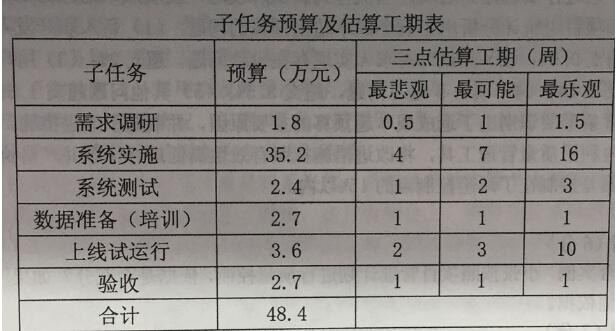
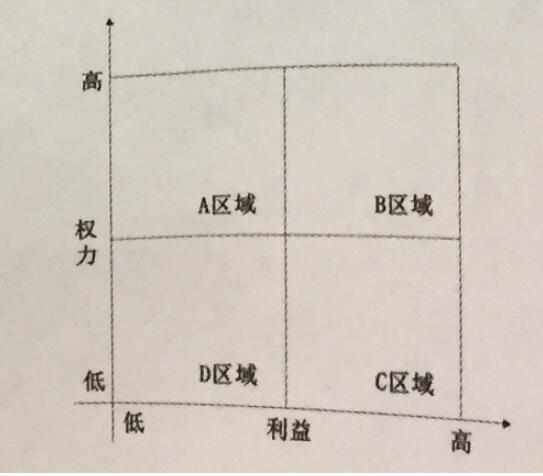

# 2021.11

## 试题一(18分)

阅读下列说明，回答问题1至问题3,将解答填入答题纸的对应栏内。  
A公司承接了某信息系统建设项目，任命小张为项目经理。  
在项目启动阶段，小张编制了风险管理计划，组织召开项目成员会议对项目风险进行了识别并编制了项目风险清单。随后，小张根据自己多年的项目实施经验，将项目所有的风险按照时间先后顺序制定了风险应对计划，并亲自负责各项应对措施的执行。风险及应对措施的部分内容如下:  
风险1:系统上线后运行不稳定或停机造成业务长时间中断。  
应对措施1:系统试运行前开展全面测试。  
应对措施2:成立应急管理小组，制定应急预案。  
风险2:项目中期人手出现短期不足造成项目延期。  
应对措施3:提前从公司其它部门协调人员。  
风险3:设备到货发生损坏，影响项目进度。  
应对措施4:购买高额保险。  
风险4:人员技能不足。  
应对措施5:提前安排人员参加原厂技术培训。  
... ...  
项目实施过程中，公司相关部门反馈，设备发生损坏的概率低，建议降低保额；原厂培训价格过高，建议改为非原厂培训。小张坚持原计划没有进行调整。系统上线后发生故障停机，由于缺少应急预案造成业务长时间中断，公司高层转达 了客户的投诉，也表达了对项目成本管理的不满。

**【问题1】(10 分)**
结合案例，请指出小张在项目风险管理各个过程中存在的问题。
>1.项目风险管理计划不应只由项目经理制订，应邀请团队成员、甲方相关人员、必要时还应邀请相关专家参与。  
2.风险识别不能邀请团队成员，风险识别活动的参与者可包括:项目经理、项目团队成员、风险管理团队、客户、项目团队之外的主题专家、最终用户、其他项目经理、干系人和风险管理专家。  
3.风险定性分别不能凭经验，而是应结合项目实际，采用如风险概率与影响矩阵等工具评估并综合分析风险的概率和影响，然后才对风险进行优先排序  
4.没有进行风险定量分析  
5.风险应对措施不当，风险应对措施应在当前项目背景下现实可行，能获得全体相关方的同意。  
6.项目经理亲自负责各项应对措施的执行不妥，应由一名责任人具体负责。  
7.缺乏对风险的监控，未根据风险变化调整风险应对措施。  
8.小张缺乏项目管理经验  
9.未能与干系人进行良好沟通，导致客户投诉  
无

**【问题2】(5分)**
请指出以上案例中提到的应对措施1-5分别采用了什么风险应对策略。
>应对措施1:减轻  
应对措施2:接受  
应对措施3:减轻  
应对措施4:转移  
应对措施5:减轻

**【问题3】(3 分)**
请将下面(1)~ (3)的答案填写在答题纸的对应栏内。  
风险具有一些特性。 其中，(1)指风险是一种不以人的意志为转移，独立于人  
的意识之外存在; (2) 指由于信息的不对称，未来风险事件发生与否难以预测；(3)指风险性质会因时空各种因素变化而有所变化。
>风险客观性、风险偶然性、风险相对性

---
---
---

## 试题二(20分)

阅读下列说明，回答问题1至问题4,将解答填入答题纸的对应栏内。  
某公司拟建设一个门户平台， 根据工作内容，该平台项目分为需求调研、系统实施、系统测试、数据准备(培训)、上线试运行、验收六个子任务，各子任务预算和三点估算工期如下表所示。  
  
到第6周周末时，对项目进行了检查，发现需求调研已经结束，共计花费1.8万元，系统实施的工作完成了一半， 已花费17万元。

**【问题1】(5分)**
(1)请采用三点估算法估算各个子任务的工期:  
(2)请分别计算系统实施和系统测试两个任务的标准差。
>（1）各子任务工期如下  
需求调研（.5+1.5+4*1）/6=1周  
系统实施（4+16+4*7）/6=8周  
系统测试（1+3+4*2）/6=2周  
数据准备(培训)（1+1+4*1）/6=1周  
上线试运行（2+10+4*2）/6=4周  
验收（1+1+4*1）/6=1周  
（2）系统实施的标准差（16-4）/6=2周  
系统测试的标准差（3-1）/6=0.33周

**【问题2】(9分)**
该项目开发过程采用瀑布模型，请评估项目到第6周周末时的执行绩效。
>PV=1.8+35.2*5/8=23.8  
AC=1.8+17=18.8  
EV=1.8+35.2*1/2=19.4  
CPI=EV/AC=19.4/18.8=1.3  
SPI=EV/PV=0.82  
因CPI>1,SPI<1，项目成本节约，进度滞后。  
关于5/8的解释，检查结点在第6周末，第1周是需求调研阶段，系统实施计划只占的5周。系统实施根据三点估算法有8周工期，PV在第6周周末时占5/8。

**【问题3】 (4分)**
如果项目从第7周开始不会再发生类似的偏差，请计算此项目的完工估算EAC和完工偏差VAC。
>因后期不再发生偏差，属于非典型偏差  
BAC=48.4  
EAC=AC+（BAC-EV)=18.8+（48.4-19.4）=47.8  
VAC=BAC-EAC=48.4-47.8=.6

**【问题4】 (2分)**
为了提升项目的执行绩效，项目组成员提出采取并行施工的方法加快进度，请指出采取该方式的缺点。
>可能造成返工和风险增加。它只适用于能够通过并行活动来缩短项目工期的情况。

---
---
---

## 试题三(17分)

阅读下列说明，回答问题1至问题3,将解答填入答题纸的对应栏内。  
A公司承接了某系统集成项目，任命小王为项目经理。在项目初期，小王制定并发布了项目管理计划。公司派小张作为质量保证工程师(QA)进入项目组，小张按照项目管理计划进行质量控制活动，当执行到测试阶段时，发现成本超预算10%。  
小张和项目组统计分析出了五个成本超出预算的问题: (1) 新入职开发人员小王效率低，超支0. 5%; (2)测试时需求A实现存在设计问题，超支2%; (3) 用户增加新需求，超支2.5%; (4)模块B返工问题，超支3.5%; (5) 其他问题超支1.5%。小张绘制了垂直条形图识别出了造成成本超预算的主要原因，并制定了改进措施，在剩余的2个月内利用质量管理工具，将改进措施按照有效性高低进行排序并严格执行，最终将成本偏差控制在了风险控制点的15%以内。

**【问题1】(5分)**
请结合案例，小张按照项目管理计划进行质量控制，依据是否充分?如果不充分，请补充其他依据。
>小张按照项目管理计划进行质量控制的依据不够充分，还有以下依据  
1.质量测量指标包括功能点、平均故障间隔时间（MTBF）和平均修复时间（MTTR）  
2.质量核对单有助于核实项目工作及其可交付成果是否满足一系列要求。.  
3.可交付成果可交付成果是任何独特并可核实的产品、成果或能力，最终将成为项目所需的、确认的可交付成果。  
4.项目文件(1)协议；(2)质量审计报告；(3)培训计划和效果评估；(4)过程文档。  
5.组织过程资产(1)组织的质量标准和政策；(2)标准化的工作指南；(3)问题与缺陷报告程序及沟通政策。

**【问题2】(7分)**
(1)请说明小张使用的是哪种质量管理工具，并写出其质量管理原理。  
(2)依据(1)中质量管理原理，请列出首要要解决的问题。
>（1）帕累托是一种特殊的垂直条形图，用于识别造成大多数问题的少数重要原因。在横轴上所显示的原因类别，作为有效的概率分布，涵盖10％的可能观察结果。在帕累托图中，通常按类别排列条形，以测量频率或后果。  
（2）模块B返工问题，超支3.5%。

**【问题3】(5分)**
判断下列选项的正误(填写在答题纸的对应栏内，正确的选项填写“√”，错误的选项填写“×”)  
(1)菲利普●克劳士比提出“零缺陷”的概念，他指出“质量是免费的” 。 （ ）  
(2)一个高等级、低质量的软件产品，适合一般使用， 可以被认可。 （）  
(3)质量管理计划可以是正式的，也可以是非正式的，可以是非常详细的，也可以是高度概括的。 （ ）  
(4)测试成本属于非一致性成本。 （ ）  
(5)在实际质量管理过程中，多种质量管理工具可以综合使用，例如可以利用树形图产生的数据来绘制关联图。 （ ）
>【问3】  
√、×、√、×、√

---
---
---

## 试题四(20 分)

阅读下列说明，回各问题1至问题3. 将解答填入各题纸的对应栏内。  
A公司承接了某金融行业用户(甲方)信息系统建设项目，服务内容涉及咨询、开发、集成、运维等。公司任命技术经验丰富的张伟担任项目经理，张伟协调咨询部、研发部、集成部、运维部等部门负责人抽调相关人员加入项目组。  
考虑到该项目涉及甲方单位多个部门，为使沟通简便、高效，张伟编制了干系人清单，包括甲方各层级管理人员及技术人员、公司高层人员以及项目组成员。同时，计划采用电子邮件方式，每周群发周报给所有项目干系人。周报内容涵盖每周工作内容、项目进度情况、质量情况、问题/困难、 需要甲方单位配合及决策的各类事宜等。  
在项目团队内部，采用项目例会的方式进行沟通。  
项目实施过程中，个别项目成员联系张伟，希望能单独沟通个人发展及工作安排问题，张伟建议将问题在月度例会上提出。在月度例会上，部分项目成员抱怨自己承担的项目工作经常与所在部门年初制定的培训工作及团队建设活动冲突，对个人发展不利。为了避免造成负面影响，张伟制止了这些项目成员的发言。之后，张伟向公司高层抱怨相关部门的培训团建等工作总与项目安排有冲突，建议相关部门作出调整。高层不认可张伟的说法，建议张伟加强项目的沟通管理。

**【问题1】(12分)**
(1)结合案例，请补充干系人清单。  
(2)请指出张伟沟通管理中存在的问题。
>（1）咨询部、研发部、集成部、运维部等部门负责人、其它与项目相关的人员，如项目组成员家属等。  
（2）  
1.未制订沟通管理计划  
2、张伟单独编制干系人清单不妥  
3、没有分析沟通的需求。个别项目成员联系张伟，希望能单独沟通个人发展及工作安排问题，张伟建议将问题在月度例会上提出。  
4、 管理沟通存在问题，沟通方式方法不正确。如工作例会上，把团队成员私下沟通的问题放到大会上来讲。  
5、沟通方式单一，只发电子邮件。  
6、控制沟通存在问题，为了避免造成负面影响，张伟制止了这些项目成员的发言。造成冲突升级。  
7、与公司高层沟通效果欠佳，张伟向公司高层抱怨相关部门的培训团建等工作总与项目安排有冲突，建议相关部门作出调整。未得到高层支持  
8、张伟管理经验欠缺。  
9、识别干系人，不够全面，没有36识别，没有相关干系人参与。

**【问题2】(4分)**
请列出项目干系人管理包括哪些内容。
>答项目干系人管理的具体内容如下。  
1.识别干系人项目存在众多项目干系人，项目干系人从项目中获利或受损，对项目的开展 会有推进或阻碍的作用。  
2.编制项目干系人管理计划依据项目跟干系人之间互相影响的大小、项目干系 人的需要，确定干系人管理的思路，确定对项目干系人进行沟通的措施，并制定信息沟 通等级。  
3.管理干系人参与在项目的整个生命周期中，还要与项目的干系人维持不断地沟通，解决他们之间的问题。  
4.项目干系人参与的监控根据需要定期地或者及时地监控干系人之间的关系，观察计划和实际之间的偏差，管理干系人 之间的冲突，为项目推进助力，并尽量减少对项目的干扰。

**【问题3】(4分)**
在下图的权力/利益矩阵中，针对(1)区域的干系人，项目经理应该“重点管理，及时报告”，采取有力的行动让其满意:针对(2)区域的干系人，项目经理应该“随时告知”项目状况，以维于以维持干系人的满意度:针对(3)区域的干系人，项目经理应该“令其满意”，争取支持；针对(4)区域的干系人，项目经理主要通过“花最少的精力来监督他们”即可。  
请将区域代号(A. B. C、D)填写在答题纸(1)~(4)的对应栏内。  

>（1）B、（2）C、（3）A、（4）D
