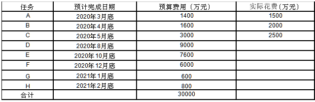

# 2021.5  

## 试题1（18分）  

阅读下列说明，回答问题1至问题3，将解答填入答题纸的对应栏内。  
某银行计划开发一套信息系统，为了保证交付质量，银行指派小张作为项目的质量保证工程师。  
项目开始后，小张开始对该项目质量管理进行规划，并依据该项目的需求文件、干系人登记、事业环境因素和组织过程资产制定了项目质量管理计划，质量管理计划完成后直发给了项目经理和质量部主管，并打算按照质量管理计划的安排对项目进行质量检查。  
项目执行过程中，小张依据质量管理计划，利用质量工具，将组织的控制目标作为上下控制界限，监测项目的进度偏差、缺陷密度等度量指标，定期收集数据，以便帮助确定项目管理过程是否受控。  
小张按照质量管理计划进行检查时，出现多次检查点和项目实际不一致的情况。  
例如针对设计说明书进行检查时，设计团队反馈设计说明书应在两周后提交；  
针对编码完成情况进行检查时，开发团队反馈代码已经测试完成并正式发布。  

**【问题1】（6分）**  
结合案例，请简要分析小张在做质量规划时存在的问题。  
>1.规划质量管理缺少输入项目管理计划  
2.规划质量管理缺少输入风险登记册  
3.规划质量管理的输出缺少过程改进计划  
4.规划质量管理的输出缺少质量核对单  
5.规划质量管理的输出缺少质量测量标准  
6.规划质量管理缺少相关干系人参与  
7.计划做完后，还需主管领导和相关干系人审核后进行执行  
8.项目经理应该参与规划质量管理的过程中，不能全让质量管理小张去制订  

**【问题2】（7分）**  
请写出常用的七种质量管理工具，并指出在本案例中小张用的是哪种工具?  
>常用的质量管理工具是：因果图、流程图、核查表、帕累托图、直方图、控制图、散点图。  
小张用的是控制图。  

**【问题3】（5分）**  
请将下面①~⑤的答案填写在答题纸的对应栏内。  
(1)实施①过程的主要作用是促进质量过程改进。  
(2)测量指标的可允许变动范围称为②。  
(3)③是一种结构化工具，通常具体列出各项内容，用来核实所要求的一系步骤是否已得到执行。  
(4)GB/T190001对质量的定义为一组④满足要求的程度。  
(5)可能影响质量要求的各种威胁和机会的信息记录在⑤中。  
>①质量保证  
②公差  
③质量核对单  
④固有特性  
⑤风险清单  

---
---
---

## 试题2（22分）  

阅读下列说明，回答问题1至问题4，将解答填入答题纸的对应栏内。  
赵工担任某软件公司的项目经理，于2020年5月底向公司提交项目报告。  
该项目各任务是严格的串行关系，合同金额3.3亿元，总预算为3亿元。  
赵工的项目报告描述如下，5月底财务执行状况很好，只花了6000万元。  
进度方面，已完成A, B任务,尽管C任务还没有完成，但项目团队会努力赶工，使工作重回正轨。  
按照公司的要求，赵工同时提交了项目各任务实际花费的数据(见下表)。  
项目成本数据（单位万元）  
  

**【问题1】 （6分）**  
请计算出目前项目的PV, EV, AC（采用50/50规则计算挣值，即工作开始记作完50%，工作完成记作完成100%）。  
>PV=6000,AC=6000,EV=4500  

**【问题2】（8分）**  
(1)请计算该项目的CV、SV、CPI、SPI；  
(2)基于以上结果，请判断项目当前的执行状况。  
>（1）CV=-1500;SV=-1500;CPI=75%;SPI=75%.  
（2）成本超支，进度落后  

**【问题3】 （4分）**  
(1)按照项目目前的绩效情况发展下去，请计算该项目的EAC；  
(2)基于以上结果，请计算项目最终的盈亏情况。  
>（1）因为绩效情况一直发展下去，是典型计算。  
EAC=4（亿元）  
（2）VAC=-1（亿元）  

**【问题4] （4分）**  
针对项目目前的情况，项目经理应该采取哪些措施?  
>采用高效人员替代低效人员，然后进行并行施工，并加强质量管理。  

---
---
---

## 试题3（15分）  

阅读下列说明，回答问题1至问题3，将解等填入答题纸的对应栏内。  
A公司承接了可视化系统建设项目，工作内容包括基础环境升级改造、软硬件采购和集成适配、系统开发等，任命小刘为项目经理。  
小刘与公司相关部门负责人进行了沟通，从各部门抽调了近期未安排任务的员工组建了项目团队，并指派一名质量工程师编写项目人力资源管理计划。  
为了使管理工作简单、高效，小刘对团队成员采用相同的考核指标和评价方式，同时承诺满足考核要求的成员将得到奖金，考虑到项目团队成员长期加班，小刘向公司管理层申请了加班补贴，并申请了一个大的会议室作为集中办公地点。  
项目实施中期的一次月度例会上，部分项目成员反馈:  
一是加班过多，对家庭和生活造成了影响；  
二是绩效奖金分配不合理，小刘认为公司已经按照国家劳动法支付了加班费用，项目成员就应该按照要求加班，同时绩效考核过程是公开、透明的，奖金多少跟个人努力有关，因此针对这些不满，小刘并没有理会。  
项目实施一段时间后，团队成员士气逐渐低落，部分员工离职。  
同时，出现特殊情况导致项目组无法现场集中办公，需采取远程办公方式。  
如此种种事先未预料情况发生，小刘紧急协调各技术那门抽调人员救火，但是项目进度依然严重港后,客户表示不满。  

**【问题1】(8分）**  
结合案例，请指出项目在人力资源管理方面存在的问题？  
>1、制订人力资源管理计划，小刘必须参加制订。  
2、制订人力资源管理计划，让一个质量工程师来制订不妥，应该安排熟悉团队成员和项目情况的人来制订初步的人力资源管理计划，然后相关干系人参与制订。  
3、组建项目团队有问题，没有根据项目需求来组建，而不是从各部门抽调了近期未安排任务的员工来。  
4、建设项目团队有问题，仅仅是奖金是不够的，要多种措施进行，比如加班累了，适当给大家休息；周末搞一下团队活动；  
5、管理项目团队有问题，没有和团队成员及时沟通，没有观察和检查，没有及时发现问题，解决问题。  
6、冲突处理不当，对于不同的问题要采取不同的措施，而不是对这些不满，不予理会  
7、对团队成员没有定期或不定期进行相关专业培训，加强团队知识储备和技术提高  
8、绩效考核标准不对，应该多标准进行考核，不能采用相同的考核指标和评价方式。  
9、没有做好人员配置计划，员工离职就没有AB人选。  
10、采取远程办公这样的方式，需要加强沟通管理。  

**【问题2】 （4分）**  
结合案例，采取远程办公方式后，项目经理在项目沟通管理计划中应该做哪些调整？  
>沟通管理计划中需要调整  
沟通方式的调整，  
沟通渠道的选择，  
沟通频率设定，  
干系人沟通需求的收集渠道和方法，  
沟通成本和时间的调整，  
沟通过程中产生风险的应急措施，  
沟通过程中需要的技术或方法等等。  

**【问题3】 （3分）**  
判断下列选项的正误(填写在答题纸的对应栏内,正确的选项填写“√” ,错误的选项填写“×")  
(1)在组建项目团队过程中，如果人力资源不足或人员能力不足会降低项目成功的概率，甚至可能导致项目取消。（ ）  
(2)项目人力资源管理计划的编制应在项目管理计划之前完成。（ ）  
(3)解决冲突的方法包括问题解决，合作、强制、妥协、求同存异、撤退。（ ）  
>（1）√；（2）×；（3）√。  

---
---
---

## 试题4（20分）  

阅读下列说明，回答问题1至问题3，将解答填入答题纸的对应栏内。  
某单位(甲方)因业务发展需要，常建设一套智能分析管理信息系统，并将该研究任务委托给长期合作的某企业（乙方）,乙方安排对甲方业务比较了解且有同类项目实施经验的小陈担任项目经理。  
考虑到工期比较紧张，小陈连夜加班，参照同类项目文档编制了项目范围说明书，然后安排项目成员向甲方管理层进行需求调研并编制了需求文件，依据项目范围说明书，小陈将任务分解之后，立即安排项目成员启动了设计开发工作。  
在编码阶段尾声，甲方向小陈提出了一个新的功能要求。考虑到该功能实现较为简单，不涉及其它功能模块，小陈答应了客户的要求。  
在试运行阶段，发现一个功能模块不符合需求和计划要求,于是小陈立即安排人员进行了补救，虽然耽误了一些时间，但整个项目还是按照客户要求如期完成。  

**【问题1】 （8分）**  
结合案例，请指出该项目在范围管理过程中存在的问题。  
>1.没有做规划范围管理，没有制订相关的范围管理计划和需求管理计划。  
2.进行收集需求，不能仅仅想甲方管理层调研，还需收集其他项目干系人的需求。  
3.没有做好需求跟踪矩阵。  
4.制订范围说明书的依据不充分，仅仅同同类文档编制还不够，还需参照项目的范围管理计划、需求文件、项目章程、干系人管理计划等等相关资料。  
5.制订范围说明书没有相关干系人参与。  
6.创建WBS工作没有干系人参与，仅仅就小陈制订。  
7.没有进行范围确认工作。范围确认工作应该贯穿整个项目，需要安排时间点进行相关工作。  
8.没有进行范围控制工作，对范围管理中做的不好的地方进行监督管理，并采取相关措施。  
9.对于客户需求，进行修改，需要先进行变更管理流程，不是客户提出就可以立马修改。  
10.小陈没有进行项目经理相关培训，加强项目经理相关知识学习。  

**【问题2】（6分）**  
请列出项目范围管理的主要过程。  
>规划范围管理、  
收集需求、  
定义范围、  
创建WBS、  
确认范围和范围控制。  

**【问题3】 （6分）**  
从候选答案中选择正确选项，将该选项的编号填入答题纸对应栏内。  
工作分解结构是逐层分解的，工作分解结构(1)层的要素总是整个项目的最终成果。  
一般情况下，工作分解结构控制在(2)层为宜。(3)位于工作分解结构每条分支最底层的可交付成果或项目组成部分。  
A.工作包  
B.最低  
C.最高  
D.里程碑  
E.3-6  
F.中间  
G.2-5  
>（1）C；（2）E；（3）A  
