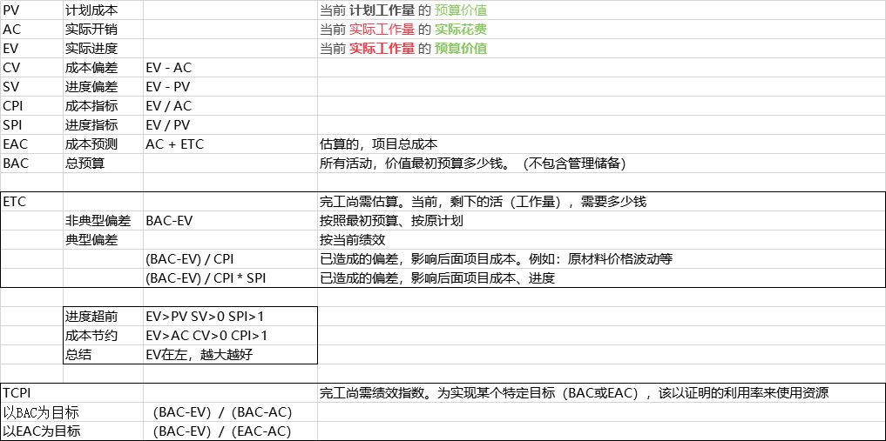
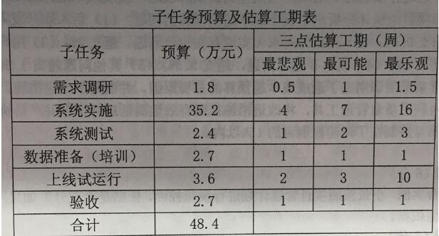
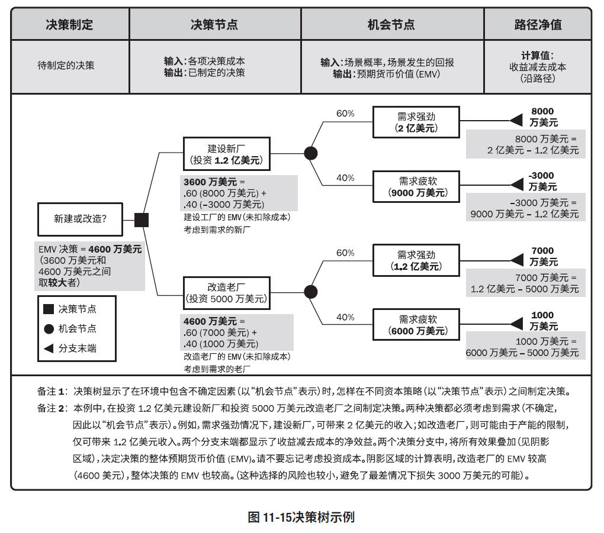

# 例题

---
---
---

## 三点估算 执行绩效

某公司拟建设一个门户平台，根据工作内容，该平台项目分为需求调研、系统实施、系统测试、数据准备(培训)、上线试运行、验收六个子任务，各子任务预算和三点估算工期如下表所示。  
到第6周周末时，对项目进行了检查，发现需求调研已经结束，共计花费1.8万元，系统实施的工作完成了一半,已花费17万元。  

**【问题1】 (5分)**  
(1)请采用三点估算法估算各个子任务的工期：(悲 + 4x中 + 乐) / 6
>需求调研=(0.5+4x1+1.5)/6=1周  
系统实施=(4+4x7+16)/6=8周  
系统测试=(1+4x2+3)/6=2周  
数据准备=(1+4x1+1)/6=1周  
上线试运行=(2+4x3+10)/6=4周  
验收=(1+4x1+1)/6=1周

(2)请分别计算系统实施和系统测试两个任务的标准差。
>(乐 - 悲) / 6  
系统实施标准差=(16-4)/6=2周  
系统测试标准差=(3-1)/6=0.33周

**【问题2】 (9分)**  
该项目开发过程中采用瀑布模型，请评估项目到第六周周末时的执行绩效。
>第6周时，计划完成了需求调研1周，系统实施5周，即PV=1.8+35.2x5/8=23.8万  
实际需求调研结束+系统实施了一半，  
EV=1.8+35.2x50%=19.4万  
AC=1.8+17=18.8万  
SV=EV-PV=19.4-23.8=-4.4万， 进度落后  
CV=EV-AC=19.4-18.8=0.6万，成本节余（计算绩效指数也可）

**【问题3】(4分)**  
如果项目从第7周开始不会再发生类似的偏差，请计算此项目的完工估算EAC和完工偏差 VAC。
>非典型偏差:  
BAC=48.4万  
EAC=AC+(BAC-EV)=18.8+(48.4-19.4)=47.8万  
VAC=BAC-EAC=48.4-47.8=0.6万

**【问题4】(2分)**  
为了提升项目的执行绩效，项目组成员提出采取并行施工的方法加快进度，请指出采取该方式的缺点。
>并行施工可能造成返工等质量问题、风险增加和成本超支

---
---
---

## 定量风险分析工具之决策树分析

**用决策树在若干备选行动方案中选择一个最佳方案， 在决策树分析中，通过计算每条分支的预期货币价值，就可以选出最优的路径（EMV预期货币价值分析）**  
老外是资本主义社会，一切都喜欢用钱来测量，这个EMV也是如此, M是Monetary的意思,这个单词是money的变种。
>第1步，先是要分解备选决策为两个或多个方案（是新建还是扩建呢，哪个更划算，或者说哪个利润多）  
第2步，计算每一个分支结束的价值（叶子结点的利润）  
原谅我这里用了利润一词，是因为我想突出这张图最终关心的并不是收入，也不是费用（投资建厂花出去的钱）  
而是挣的利润，学过会计学基础的同学们都知道有一个公式， 收入-费用=利润  
以建新厂，强需求（2亿美元）为例来计划: 利润=收入（2亿美元）- 费用（1.2亿美元）= 8000万  
类似的，弱需求也可以计算，只不过这种情况下是市场不景气，收入太少了，导致利润是负数，亏钱嘛  
第3步，按百分比加权算出各方案的整体EMV  
例如建设新厂方案的EMV=8000x60%+(-3000)x40%=3600万美元  
在我理解，这就是个典型的利润值，当然随便发明新名词是我的不对  
第4步，决策即比较不同的方案EMV哪个大， 哪个EMV大就选哪个方案。

最后补充，我理解每个机会节点的分支可以不仅有2个，3个或多个也可以的，例如需求可以分为强需求，中等需求，弱需求。

---
---
---

**项目工作说明书SoW(Statement of Work)**
SoW的撰写是在【招标成功后】  
简单理解的话，SoW就类似我们已经拿到了offer，这时候，需要更加明确的规范工作范围、工作的内容以及如何定义工作是保质保量完成的。  
所以，SoW是对项目需交付的产品、服务活成果的叙述性说明。  
对于内部项目，项目启动者或发起人提供工作说明书  
对于外部项目，工作说明书则由客户提供，可以是招标文件的一部分，或合同的一部分

**组织过程资产**是从过去的项目中积累起来的、最重要的无形资产。  
这里的资产指的是可以在未来带来效益的任何东西，包括：政策、流程、程序、模板、工作指南和知识库。  
其本质就是：从依靠人，变为依靠系统，将人的经验和知识，变成组织的过程资产。

**我国企业信息化发展的战略要点**:

1. 信息化带动工业化
2. 信息化与企业业务全过程的融合、渗透
3. 信息产业化发展与企业信息化良性互动
4. 充分发挥政府的引导作用
5. 高度重视信息安全

**B2B**: 阿里巴巴  
**B2C**: 京东，当当，苏宁  
**C2C**: 淘宝，易趣  
**O2O**: online 2 offline，实体店的优惠信息，推送给互联网用户，将他们转化为实体店的线下客户

我国的企业信息化经历了产品信息化、生产信息化、流程信息化、管理信息化、决策信息化、商务信息化等过程，  
而**实施两化深度融合**是企业落实《中国制造2025》战略规划的重要途径

**数据挖掘**是从具有固定形式的数据中，集中提炼知识的过程

ITSS（信息技术服务标准）定义的IT服务生命周期包括：  
规划设计、部署实施、服务运营、持续改进、监督管理

**软件验证**过程视图确保活动的输出产品已经被正确制造，即活动的输出产品满足前面活动施加的规范说明；  
**软件确认**过程则视图确保建造了正确的产品，即产品满足其特定的目的。  

**数据仓库**是一个面向主题的、集成的、相对稳定的、反应历史变化的数据集合，用于支持管理决策。  
与数据库相比，数据仓库的数据相对稳定

J2EE应用服务器运行环境包括：  
**构件(Component)**: 代码  
**容器**: 构件的运行环境  
**服务**: 应用服务器提供的各种功能接口，可以同系统资源进行交互

**OSI七层协议**:  
**物理层**: RS232, V.35, RJ-45, FDDI  
**数据链路层**: 将从网络层接收到的数据分割成特定的可被物理层传输的帧。IEEE802.3, HDLC, PPP, ATM  
**网络层**: 将网络地址IP翻译成物理地址MAC，IP, ICMP, IGMP, IPX, ARP  
**传输层**: 负责确保数据可靠、顺序、无错地从A点传输到B点。TCP, UDP, SPX  
**会话层**: 负责在网络中的两节点之间建立和维持通信，以及提供交互会话的管理功能  
**表示层**: 管理数据的加密解密、数据转换、格式化和文本压缩，JPEG, ASCII, GIF, DES, MPEG  
**应用层**: 负责对软件提供接口以使程序能使用网络服务，Http, Telnet, FTP, SMTP  

**IEEE802规范定义了**：

1. 网卡如何访问传输介质（如光缆、双绞线、无线等）；
2. 如何在传输介质上传输数据的方法；
3. 传输信息的网络设备之间连接建立、维护和拆除的途径。

遵循IEEE802标准的产品包括网卡、桥接器、路由器以及其他一些用来建立局域网的组件。

**IEEE802规范包括**：  
802.1: 802协议概论  
802.2: 逻辑链路控制层LLC协议  
802.3: 以太网的CSMA/CD载波监听多路访问/冲突检测协议  
802.4: 令牌总线Token Bus协议  
802.5: 令牌环Token Ring协议  
802.6: 城域网MAN协议  
802.7: FDDI宽带技术协议  
802.8: 光纤技术协议  
802.9: 局域网上的语音/数据集成规范  
802.10: 局域网安全互操作标准  
802.11: 无线局域网WLAN标准协议

**IaaS**: 基础设施即服务，Amazon， 阿里云  
**PaaS**:平台即服务, HeroKu  
**SaaS**:软件即服务, Gmail

24
