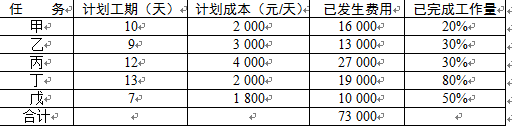
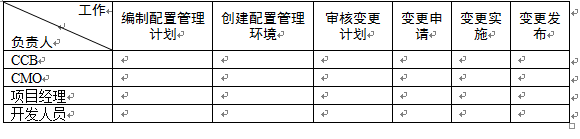
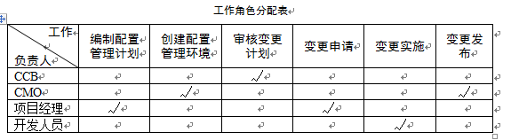

# 2010.11  

## 试题1  

**阅读下列说明，回答问题1至问题3，将解答填入答题纸的对应栏内。**  
某信息系统集成公司（承建方）成功中标当地政府某部门（建设方）办公场所的一项信息系统软件升级改造项目。项目自2月初开始，工期1年。承建方项目经理制定了相应的进度计划，将项目工期分为四个阶段需求分析阶段计划8月底结束；设计阶段计划9月底结束；编码阶段计划11月底结束；安装、测试、调试和运行阶段计划次年2月初结束。  
当年2月底，建设方通知承建方，6月至8月这3个月期间因某种原因，无法配合项目实施。经双方沟通后达成一致，项目仍按原合同约定的工期执行。  
由于该项目的按时完成对承建方非常重要，在双方就合同达成一致后，承建方领导立刻对项目经理做出指示（1）招聘新人，加快需求分析的进度，赶在6月之前完成需求分析；（2）6月至8月期间在本单位内部完成系统设计工作。  
项目经理虽有不同意见，但还是根据领导的指示立即修改了进度管理计划并招募了新人，要求项目组按新计划执行，但项目进展缓慢。直到11月底项目组才刚刚完成需求分析和初步设计。  
试题分析  
本题考察项目进度管理、变更管理、范围管理等相关理论与实践，并偏重在进度控制中的应用。从题目的说明中，可以初步分析出以下一些信息。  
承建方领导对项目开发实际情况掌握不够，认为可以通过增加新人来缩短需求分析工作的时间，同时理想地认为只要需要分析阶段的工作完成之后便可以脱离承建方的配合而独立完成系统设计工作。承建方项目经理在没有准确及时的掌握当前的项目进度状态，没有进行适当的绩效评估和风险评估的情况下便按照领导的意图执行，这说明该项目的进度管理和风险管理存在一定的问题。  
在项目实验过程中，对于变更的处理存在问题。当领导提出变更要求时，项目经理根据领导的指示立即修改了进度管理计划并招募了新人，没有按照变更控制流程的要求对变更的影响进行评估，没有经过变更控制委员会的批准，缺乏相应的变更确认环节，这些做法不符合进度变更控制的要求。  
以上的分析可以看出，试题1主要考察进度管理、风险管理和范围管理的理论在项目事件中的应用，考生应结合案例的背景，综合运用理论知识和实践经验回答问题。  

**【问题1】（3分）**  
除案例中描写的具体事项外，承建方项目经理在进度管理方面可以采取哪些措施？  
供选择答案（将正确选项的字母填入答题纸对应栏内）  
A．开发抛弃型原型 B．绩效评估 C．偏差分析  
D．编写项目进度报告 E．确认项目范围 F．发布新版项目章程  
>正确选项为B、C和D。  
A选项不适合案例所述的信息系统软件升级改造项目，通常新信息系统项目才考虑开发抛弃型原型。  
E选项不适合案例的背景。范围确认是客户等干系人正式验收并接收已完成的项目可交付物的过程。本案例中，建设方和承建方经过沟通后达成一致，项目仍按原合同约定工期执行，未明确涉及项目范围的变化和客户验收交付物的相关问题。  
F选项不适合案例的背景。项目章程通常是由项目发起人发布的，而不是由项目经理发布。此外，制定和发布项目章程不属于进度管理的主要工作。  

**【问题2】（6分）**  
（1）基于你的经验，请指出承建方领导的指示中可能存在的风险，并简要叙述进行变更的主要步骤。  
（2）请简述承建方项目经理得到领导指示之后，如何控制相关变更。  
>解答要点  
盲目增加人力未必可以加快项目进度，尤其是增加没有经验的员工，反而可能会拖延进度。  
项目的风险是否能够规避，需要按照风险管理的方法进行风险识别、风险分析和风险监控。  
解答要点  
根据领导指示的内容，向变更控制委员会提出相关变更申请；  
推动变更控制委员会对变更进行评估，分析变更造成的影响及风险；  
根据变更决策推动变更的实施，包括更新进度计划、招聘新人和相关活动；  
执行或推动变更后项目活动。  

**【问题3】（6分）**  
针对项目现状，请简述项目经理可以采用的进度压缩技术，并分析利弊。  
>进度压缩的技术有以下两种  
赶进度对费用和进度进行权衡，确定如何在尽量减少费用的前提下缩短项目所需时间。  
利——有可能在尽量减少费用的前提下缩短项目所需时间；  
弊——赶进度并非总能产可行的方案，有可能反而使费用增加。  
快速跟进同时进行按先后顺序的阶段或活动。  
利——适当增加费用，可以缩短项目所需时间；  
弊——以增加费用为代价换取时间，并因缩短项目进度时间而增加风险。  

---
---
---

## 试题2  

**阅读下列说明，回答问题1至问题4，将解答填入答题纸的对应栏内。**  
某项目经理将其负责的系统集成项目进行了工作分解，并对每个工作单元进行了成本估算，得到其计划成本。各任务同时开工，开工5天后项目经理对进度情况进行了考核，如下表所示  
  
本题主要考查考生对成本管理中挣值分析的计算方法的掌握情况。  
挣值分析的核心是将已完成的工作的预算成本（挣值）按其计划的预算进行累加值与计划工作的预算成本（计划值）和已经完成工作的实际成本（实际值）进行比较，根据比较的结果得到项目的绩效情况。  
参考答案  

**【问题1】（6分）**  
请计算该项目在第5天末的PV、EV值，并写出计算过程。  
>PV=2 00×5+3  
000×5+4 000×5+2 000×5+1 800×5=64  
000（3分）  
EV=2000×10×20%+3000×9×30%+4000×12×30%+2  
000×13×80%+1 800×7×50%=53600（3分）  

**【问题2】（5分）**  
请从进度和成本两方面评价此项目的执行绩效，并说明依据。  
>进度滞后，成本超支。（1分）  
原因  
SV=EV-PV=5360-64 000=-10400<0  
或SPI=EV/PV=53600/64 000=0.84<1（2分）  
CV=EV-AC=53600-73 000=-19400<0  
或CPI=EV/AC=53600/73 000=0.73<1（2分）  

**【问题3】（2分）**  
为了解决目前出现的问题，项目经理可以采取哪些措施？  
>(1)用高效人员替代低效人员  
(2)加班或者赶工在在防范风险的情况下并行施工  
(3)采取措施，控制成本  
(4)对于不同的任务，采取不同的成本和进度措施，必要时候调整成本基准。  

**【问题4】（2分）**  
如果要求任务戊按期完成，项目经理采取赶工措施，那么任务戊的剩余日平均工作量是原计划日平均工作量的多少倍？  
>任务戊计划的平均日工作量为1/7=14.3%（.5分）；  
现在的平均日工作量为50%/2=25%（0.5分）；  
所以平均日工作量增加值为25%/14.3%=1.75（1分）。  

---
---
---

## 试题3  

**阅读下列说明，回答问题1至问题4，将解答或相应的编号填入答题纸的对应栏内。**  
某市ZGY石油销售公司计划实施全市的加油卡联网收费系统项目。该石油销售公司选择了系统集成商M作为项目的承包方，M公司经石油销售公司同意，将系统中加油机具改造控制模块的设计和生产分包给专业从事自动控制设备生产的H公司。同时，M公司任命了有过项目管理经验的小刘作为此项目的项目经理。  
小刘经过详细的需求调研，开始着手制定项目计划，在此过程中，他仔细考虑了项目中可能遇到的风险，整理出一张风险列表。经过分析整理，得到排在前三位的风险如下  
项目进度要求严格，现有人员的技能可能无法实现进度要求；  
现有项目人员中有人员流动的风险；  
分包商可能不能按期交付机具控制模块，从而造成项目进度延误。  
针对发现的风险，小刘在做进度计划的时候特意留出了20%的提前量，以防上述风险发生，并且将风险管理作为一项内容写进了项目管理计划。项目管理计划制定完成后，小刘通知了项目组成员，召开了第一次项目会议，将任务布置给大家。随后，大家按分配给自己的任务开展了工作。  
第四个月底，项目经理小刘发现H公司尚未生产出联调所需要的机具样品。H公司于10天后提交了样品，但在联调测试过程中发现了较多的问题，H公司不得不多次返工。项目还没有进入大规模的安装实施阶段，20%的进度提前量就已经被用掉了，此时，项目一旦发生任何问题就可能直接影响最终交工日期。  
试题分析  
本题主要考查的是项目整体管理和风险管理的理论及应用。风险管理是一种综合性的管理活动，它的理论和实践涉及技术、系统科学和管理科学等多种学科的应用，在实际中还经常使用概率论、数理统计和随机过程的理论和方法。  
项目的风险管理过程包括的内容有风险管理计划、风险识别、定性风险、定量风险分析、风险应对计划和风险监控的内容在本案例背景下的应用。  

**【问题1】（4分）**  
请从整体管理和风险管理的角度指出该项目的管理存在哪些问题。  
>（1）项目计划不应该只由项目经理一个人完成；  
（2）项目组成员参与项目太晚，应该在项目早期（需求阶段或立项阶段）就让他们加入；  
（3）分析识别不应该由项目经理一人进行；  
（4）风险应对措施（或风险应对计划）不够有效；  
（5）没有对风险的状态进行监控；  
（6）没有定期地对风险进行再识别；  
（7）项目的采购管理或合同管理工作没有做好。  

**【问题2】（3分）**  
项目经理小刘为了防范风险发生，预留了20%的进度提前量，在风险管理中这叫做 （1） 。  
在风险管理的各项活动中，头脑风暴法可以用来进行 （2） ，风险概率及影响矩阵可用来进行 （3） 。  
>（1）风险储备（或风险预留、风险预存、管理储备）；  
（2）风险识别；  
（3）风险分析（或风险定性分析）。  

**【问题3】（2分）**  
针对“项目进度要求严格，现有人员的技能可能无法实现进度要求”这条风险，请提出你的应对措施。  
>（1）分析项目组人员的技能需求，在项目前期有针对性提供培训；  
（2）根据项目组人员的技能及特长分配工作；  
（3）从公司外部引进具有相应技能的人才。  

**【问题4】（6分）**  
针对“分包商可能不能按期交付机具控制模块，从而造成项目进度延误”这条风险，结合案例，分别按避免、转移、减轻和应急响应四种策略提出具体应对措施。  
>（1）避免策略此部分工作不分包，自主开发。  
（2）转移策略签订分包合同，在合同中作出明确的约束，必要时可加入惩罚条款。  
（3）减轻策略定期监控分包商的相关工作，增加后期项目预留。  
（4）应急响应策略制定应急计划，一旦目前的分包商无法完成任务，马上采取应急计划。  

---
---
---

## 试题4  

**阅读下列说明，回答问题1至问题3，将解答或相应的编号填入答题纸的对应栏内。**  
某公司为当地一家书店开发图书资料垂直搜索引擎产品，双方详细约定了合同条款，包括合同金额、产品验收标准等。此项目是该公司独立承担的一个小型项目，项目经理小张兼任项目技术负责人。项目进行到设计阶段后，由于小张从未参与过垂直搜索引擎的产品开发，产品设计方案经过两次评审后仍未能通过。公司决定将小张从该项目组调离，由小李接任该项目的项目经理兼技术负责人。  
小李仔细查阅了小张组织撰写的项目范围说明书和产品设计方案后，进行了修改。小李将原定从头开发的方案，修改为通过学习和重用源代码来实现的方案。小李还相应地修改了小张组织编写的项目范围说明书，将其中按照项目生命周期分解得到的大型分级目录列表形式的WBS改为按照主要可交付物分解的树形结构图形式，减少了WBS的层次。小李提出的设计方案和项目范围说明书，得到了项目干系人的认可，通过了评审。  
试题分析  
本题考查项目范围管理的理论与时间，并偏重于在工作分解结构、范围控制和范围确认中的应用。考生应结合案例的背景，综合运用理论知识和实践经验回答问题。  

**【问题1】（5分）**  
结合本案例，判断下列选项的正误（填写在答题纸的对应栏内，正确的选项填写“√”，错误的选项填写“×”）  
（1）项目范围控制需要按照项目整体变更控制过程来处理。  
 （ ）  
（2）项目范围说明书通过了评审，标志着完成了项目范围确认工作。  （ ）  
（3）小李修改了项目范围说明书，但原有的项目范围管理计划不需要变更。  （ ）  
（4）小李编写的项目范围说明书中应该包括产品验收标准等重要合同条款。  （ ）  
（5）通过评审后，新项目范围说明书将成为该项目的范围基准。  
 （ ）  
>参考答案为（1）√ （2）× （3）× （4）√ （5）√  
选项（1）正确，控制项目范围以确保所有请求的变更和推荐的行动，都要通过整体变更控制的过程处理。  
选项（2）错误，项目范围确认是客户等项目干系人正式验收并接受已完成的项目可交付物的过程。项目范围确认应该贯穿项目的始终。  
选项（3）错误，新的项目管理计划（包括范围管理计划）是范围控制的输出。  
选项（4）正确，项目的验收标准和项目的约束条件是项目范围说明书（详细）中的组成部分。  
选项（5）正确，经过批准（含评审）后的项目范围说明书等将成为新的项目范围基准。  

**【问题2】（4分）**  
请简述小李组织编写的项目范围说明书中WBS的表示形式与小张组织编写的范围说明书中WBS的表示形式各自的优缺点及适用场合。  
>小李编写的项目范围说明书中WBS的表示形式为分级的树型结构图。  
（1）树型结构图的WBS层次清晰，非常直观，结构性很强，但是不易修改；对于大的、复杂的项目也很难表示出项目的全景，大型项目的WBS要首先分解为子项目，然后由各个子项目进一步分解出自己的WBS；  
（2）由于其直观性，一般在一些中小型的应用项目中用得比较多。  
小张编写的项目范围说明书中WBS的表示形式为分级目录（列表形式）。  
（1）该表格能够反映出项目所有的工作要素，但是直观性较差，有些项目分解后内容分类较多，容量较大；  
（2）常用在一些大的、复杂的项目中。  

**【问题3】（6分）**  
结合项目现状，请简述在项目后续工作中小李应如何做好范围控制工作。  
>结合案例，简要叙述下列内容  
（1）小李首先要负责组织建立项目范围基准。  
（2）小李其次要负责组织范围基准的维护，必要时按照公司变更流程变更项目范围。  
（3）小李还要负责组织实施项目范围变更、确认变更结果，以及后续项目范围控制。  

---
---
---

## 试题5  

**阅读下列说明，回答问题1至问题3，将解答或相应的编号填入答题纸的对应栏内。**  
某公司的质量管理体系中的配置管理程序文件中有如下规定  
1.由变更控制委员会（CCB）制定项目的配置管理计划；  
2.由配置管理员（CMO）创建配置管理环境；  
3.由CCB审核变更计划；  
4.项目中配置基线的变更经过变更申请、变更评估、变更实施后便可发布；  
5.CCB组成人员不少于一人，主席由项目经理担任。  
公司的项目均严格按照程序文件的规定执行。在项目经理的一次例行检查中，发现项目软件产品的一个基线版本（版本号V1.3）的两个相关联的源代码文件仍有遗留错误，便向CMO提出变更申请。CMO批准后，项目经理指定上述源代码文件的开发人员甲、乙修改错误。甲修改第一个文件后将版本号定为V1.4，直接在项目组内发布。次日，乙修改第二个文件后将版本号定为V2.3，也在项目组内发布。  
试题分析  
本题考查配置管理的概念、方法、程序和实践，主要考查信息系统集成项目配置管理中的典型人员角色及其在配置管理中的作用。考生应结合案例的背景，综合运用理论知识和时间经验回答问题。  

**【问题1】（6分）**  
请结合案例，分析该公司的配置管理程序文件的规定及实际变更执行过程存在哪些问题？  
>规定中存在的问题  
（1）配置管理计划不应由CCB制定；  
（2）基线变更流程缺少变更验证（或确认）环节；  
（3）CCB成员的要求不应以人数作为规定，而是以能否代表项目干系人利益为原则。  
实际中存在的问题  
（1）甲乙修改完后应该由其他人完成单元测试和代码走查；  
（2）该公司可能没有版本管理规定或甲乙没有统一执行版本规定；  
（3）变更审查应该提交CCB审核；  
（4）变更发布应交由CMO完成；  
（5）甲乙两人不能同时修改错误，这样会导致V2.3只包含了乙的修改内容而没有甲的修改内容。  

**【问题2】（3分）**  
请为案例中的每项工作职责指派一个你认为最合适的负责角色。（在答题纸相应的单元格中画“√”，每一列最多只能有一个单元格画“√”，多画、错画“√”不得分。）  
  
>（注变更申请可以由CMO、项目经理或开发人员提出，只要不选CCB即算正确，对于表格中的其他列，多选或选错均不得分）  
  

**问题3】（6分）**  
请就配置管理，判断以下概念的正确性（在答题纸对应栏内，正确的画“√”，错误的画“×”）  
（1）配置识别、变更控制、状态报告、配置审计是软件配置管理包含的主要活动。  
（ ）  
（2）CCB必须是常设机构，实际工作中需要设定专职人员。   （ ）  
（3）基线是软件生存期各个开发阶段末尾的特定点，不同于里程碑。  （ ）  
（4）动态配置库用于管理基线和控制对基线的变更。  （ ）  
（5）版本管理是对项目中配置项基线的变更控制。   （ ）  
（6）配置项审计包括功能配置审计和物理配置审计。   （ ）  
>参考答案（1）√ （2）× （3）× （4）× （5）× （6）√  
选项（1）正确。配置管理包括4个主要活动配置识别、变更控制、状态报告和配置审计。  
选项（2）错误。CCB是由企业或项目组的主要成员组成的，根据实际需要的不同，既可以设置组织的变更控制委员会，也可以设置项目的变更控制委员会，还可以设置其他形式的变更控制委员会，某些情况下不需要常设。  
选项（3）错误。一组拥有唯一标识号的需求、设计、源代码文卷及相应的可执行代码、构造问卷和用户文档等构成一条基线。在建立基线之前，工作产品的所有者能快速、非正式地对工作产品做出变更。但基线建立之后，变更要通过评价和验证变更的正式程序来控制。因此，基线不一定是软件生存期各个开发阶段末尾的特定点。基线主要用于控制变更，里程碑主要用于控制时间进度，两者并非一个概念。  
选项（4）错误。配置库可以分为动态库、受控库、静态库和备份库4种类型。动态库也称为开发库、程序库或工作库，用于保存开发人员当前正在开发的配置实体。动态库是软件工程师的工作区，由工程师控制。受控库也称为主库或系统库，是用于管理当前基线和控制对基线的变更。  
选项（5）错误。版本管理包括配置项状态变迁规则、配置项版本号标识和配置项版本控制，并非等同于对项目中配置项基线的变更控制。  
选项（6）正确。考生需要了解配置审计中的相关内容。  
