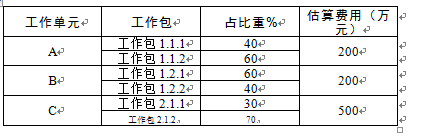

# 2013.11  

## 试题1  

阅读下列说明，将答案填入答题纸的对应栏内。  
某大型信息技术企业销售部门根据市场情况需研制一种新型产品。公司在开展研发此产品项目的起步阶段，为能拥有较好的销售业绩，降低市场风险，对该产品项目进行了一系列的调研和论证。公司召开了项目评审会议，制定了相关流程，并聘请了有关专家对需求进行评审，为节省时间，专家根据自己对项目的描述进行简单的评审，最终确定了需求，便快速地进行产品的研发工作。在项目接近收尾时，销售部门不断提出一些问题需要对部分研发内容进行修改，该项目技术负责人亲自下达指令较快地满足了客户的要求，获得了客户的好评。产品被很快研制成功，但是与销售部门开结项会议后，销售部门的人反映目前开发的产品不是他们需要的产品，更麻烦的是相关政府部门出台政策，为了稳定市场秩序，限制了该类产品进行市场销售。  
参考答案  

**【问题1】**  
项目立项时对项目风险及项目市场前景和相关的社会经济效益进行反复论证，一般情况下，项目立项前大致分为哪几个过程，分别起到什么作用？  
>项目立项前要进行以下工作  
（1）进行项目的需求分析，其作用是弄清楚项目发起人及其他干系人的要求；  
（2）编写项目建议书，其作用是项目建设单位向上级主管单位提交项目申请必需的文件，其内包括①项目的必要性，②项目的市场预测，③产品方案的市场预测，④项目建设的必要条件；  
（3）编写项目可行性分析报告，其作用是从项目的投资必要性、财务可行性、组织可行性、经济可行性、社会可行性、风险因素应对策略等方面分析项目的可行性。  

**【问题2】**  
项目在实施过程中，项目团队“发现了新的、更简单易行的技术方案”说明了项目前期的什么工作没有做好，为什么？  
>（1）在项目的执行过程中发现了新的更简单易行的技术方案，说明“项目的论证工作”和“可行性的研究工作”没有做好。  
（2）理由项目论证是对拟定实施的项目技术上的先进性、适用性，经济上的合理性，事实上的可行性进行论证，在执行过程中发现有更简单易行的技术方案说明原来选定的技术方案不适应当前的项目，所以说是项目论证工作没有做好。  

**【问题3】**  
销售部门反映“目前开发的产品不是他们需要的产品”，请简要分析可能的问题。  
>销售部门反映目前开发的产品不是他们需要的产品，其可能的原因如下  
（1）项目需求调研工作不明确。  
（2）项目需求评审工作流程不完善（专家根据自己对项目的描述进行简单的评审）。  
（3）对项目的需求估计不足。  
（4）项目进行中没有与客户及时沟通。  
（5）发生变更没有遵循正确的变更流程。  
（6）项目的范围定义不完善。  

**【问题4】**  
在（1）至（2）中填写恰当的内容，选择正确的选项。  
可行性的研究包括多方面的内容。其中 （1） 主要是从资源配置的角度来衡量其价值；而  
（2） 包括法律可行性，是指在项目开发过程中可能涉及到的相关知识产权等法律方面的可行性问题。  
（1）、（2）可供选择的答案  
A．系统可行性 B．经济可行性 C．组织可行性  
D．执行可行性 E．社会可行性 F．操作可行性  
>（1）B、（2）E  

**【问题5】**  
根据你的理解，请指出该项目的主要风险。  
>项目的主要风险如下。  
（1）技术风险该系统运行后，产品和技术能否符合客户的要求，能否提供相应的技术以解决相应的问题。  
（2）市场风险该产品研发成功以后是否能满足市场的需求，市场前景如何。  

---
---
---

## 试题2  

阅读下列说明，将答案填入答题纸的对应栏内。  
以下是某系统集成项目合同书的节选部分，合同部分节选如下  
一、合同书  
1．项目概况  
该项目主要是数据中心建设，其中包括整个大厦智能控制平台的建设与开发。  
2．项目建设内容  
合同中所述的全部内容。  
3．合同有效期  
2012年3月21日至2012年10月30日。  
4．合同价款和付款方式  
本项目采用总价合同，合同总价为2 400万元人民币，按照工程量逐段支付款项，工程竣工时支付全部合同价款。  
5．质量标准  
由于本工作的质量标准不好衡量，因此质量标准要达到承建方最优质的质量标准。  
6．维护和保修  
承建方在该项目设计规定的使用年限内承担全部保修责任。  
7．变更条款  
项目所涉及的变更由双方协商解决。  
二、其他补充条款  
1．承建方在施工前不允许将工程分包，只可以转包。  
2．建设方不负责提供大厦布线工程的相关资料。  
3．承建方应按照项目经理批准的施工内容组织设计和施工。  
4．设计质量标准的变更由承建方自行确定。  
5．合同变更时，按有关程序确定变更工程价款。  
参考答案  

**【问题1】**  
该工程的“合同书”中有哪些不妥之处，请指出并修改。  
>该工程的合同书不妥之处如下  
（1）项目的范围没有明确的约定；  
（2）甲方乙方对工程质量要求没有统一的标准（标准模糊）；  
（3）合同中对项目的维护保养责任约定不明确（期限）；  
（4）合同中对于违约责任和处罚约定不明确；  
（5）合同中对于合同履行地没有详细的约定；  
（6）合同中对付款方式没有明确的约定；  
（7）合同中关于变更和索赔条款约定不明确。  

**【问题2】**  
该工程的“其他补充条款”中有哪些不妥之处，请指出并修改。  
>1．根据法律法规的条文规定，工程承包后，不能转包。根据合同条款或者征得建设方的同意，承包方可以将非主体工程进行分包。  
2．建设方要负责提供大楼布线工程的相关资料，作为供承建方布线的依据。  
3．承建方应该按照监理单位批准的施工内容组织设计和施工。  
4．设计质量标准的变更不能由承接方自行确定，应该有监理单位审核，由建设方确定。  
5．“有关程序”表述不清，容易有歧义，应该写明具体的程序。  

**【问题3】**  
该工程按照WBS进行进度估算，所需工期为212天，你认为该工程的合同应为多少天？  
>合同工期212年3月21日—2012年10月30日，总共224天。  

---
---
---

## 试题3  

阅读下列说明，回答问题，将答案填入答题纸的对应栏内。  
S公司是某地区从事电子政务应用系统研发的系统集成公司。公司总经理为政府信息中心总工程师，S公司最近承接了该市政府X部门的一个软件项目。该部门是S公司的老客户，因为当时公司总经理急于出差，所以在系统范围界定等问题不明确的情况下，就和客户签订了合同，并任命李工为该项目的项目经理。  
项目启动后，李工和项目技术负责人陈工，以及X部门的副处长胡某共同组成了变更控制委员会。随着项目的逐步开展，客户方不断地提出一些变更要求。项目组起初严格按照变更管理流程进行处理，但是由于S公司与X部门比较熟悉，且胡某强调这些变更都满足必需的业务要求，因此几乎所有变更都被批准和接受。项目组先后多次修改设计方案模块代码，甚至返工了部分功能模块以应对这些变更。  
由于客户方属于机关单位，审批程序严格，即使是很小的意见分岐也需要开会进行讨论，项目进行得比预期的要慢。李工要求项目组人员天天加班以保证进度，但需求变更似乎没完没了。为了节省时间，客户的业务人员不再正工提变更申请，而是直接和程序员商量，程序员也往往直接修改代码而来不及做相关的文档记录。对此李工也很无奈。有一次，客户方的两个业务负责人对软件界面风格的看法发生分岐，李工认为自己不便于发表意见，于是保持了沉默。最终客户决定调整所有界面，李工动员大家加班修改，项目进度因此延误了10天，这时客户方的这两个业务负责人却一同来质问李工“为什么不早点告诉我们会造成进度延期！早知道这样，当初就不要修改了！”李工感到非常苦恼。  
参考答案  

**【问题1】**  
请将下面（1）到（7）处的答案填写到对应栏内。  
从本质上说，整体变更控制的过程就是对 （1） 的变更进行 （2） 、 （3） 批准或拒绝，并进行控制的过程。  
整体变更控制的依据包括 （4） 、 （5） 、 （6） ，以及已经完成的 （7） 。  
>整体变更控制过程实际上是对项目基准的变更进行标识、文档化、批准或拒绝，并进行控制的过程。  
整体变更控制的依据包括项目管理计划、申请的变更、工作绩效信息，以及已经完成的可交付物。  

**【问题2】**  
在本案例中，李工在变更控制方面存在哪些问题？  
>1．变更控制委员会成员不合理，应该包括客户代表，最好是高级管理人员。  
2．没有严格控制项目变更申请的提交。  
3．没有进行变更的评审，对变更造成的影响没有进行分析。  
4．没有将变更可能造成的影响告诉变更提出者。应该对变更提出方施加影响，确认变更的必要性，确保变更是有价值的。  
5．没有严格按照变更控制流程进行变更管理。  
6．没有对变更实施进行监控，造成变更需求的不可追溯性。  

**【问题3】**  
针对本案例，请指出李工在该项目的后续管理中可采取哪些措施？  
>1．邀请客户的决策人员参加变更控制委员会（CCB）。  
2．对变更提出方施加影响，确认变更的必要性，确保变更是有价值的。  
3．对变更进行评审论证，确定变更的信息完整，实际可行。  
4．分析变更造成的进度、成本、质量等方面的影响，并告知相关人员。  
5．要对变更的实施进行监控跟踪。  
6．要对变更的效果进行评估。  
7．严格按照变更控制流程进行变更管理。  
8．记录变更信息，以便追溯变更需求。  

---
---
---

## 试题4  

阅读下列说明，将答案填入答题纸的对应栏内。  
某公司凭借丰富的行业经验和精湛的技术优势，坚持沿着产品技术专业化道路，为信息技术领域大型公司提供完整全面的解决方案。李工是信息化事业部的高级项目经理，目前正负责国内A银行信贷业务系统的开发项目。  
作为项目经理，项目正式立项后，为尽快开展项目李工对项目进行了成本估算，下列是项目某模块的成本估算费用表。  
  
李工还特别重视成本的控制方法的管理工作，跟踪每项工作的实际成本，确保成本得到较好的控制，在对项目进行检查时发现项目的成本有超支的现象，李工在项目前期便准备了储备金以防应急需要，在发现SPI大于1时，便顺利地启用了管理储备金，为了严格控制成本，在项目接近结束时，李工抽时间偶尔对项目成本进行检查，由于李工工作量较大，为不影响项目进度，李工将成本监控的工作分给了刚入公司不久的小王，李工还亲自对小王进行培训，想让小王尽快承担起成本监控的工作。  
项目进入到后期时，公司对李工负责的项目进行了审查，发现项目成本超支严重，而此时，不可能再增加项目经费，在现有的项目预算的情况下很难顺利完成项目，公司领导对李工进行了批评教育，客户方对公司的项目管控能力产生质疑。  
参考答案  

**【问题1】**  
试计算该模块的总成本。  
>20+200+500=900（万元）  

**【问题2】**  
请描述成本预算的步骤，分别计算工作单元A中工作包1.1.1、工作单元B和工作单元C中工作包2.1.2的费用。  
>成本预算步骤首先要得到项目的总体估算。  
（1）将项目总成本分摊到项目工作分解结构的各个工作包。  
（2）将各个工作包成本再分配到该工作包所包含的各项活动上。  
（3）确定各项成本预算支出的时间计划及此项目成本预算计划。  
工作包1.1.1成本20×40%=80万元  
工作包1.2.1成本200×60%=120万元  
工作包1.2.2成本200×40%=80万元  
工作单元B的成本120+80=200万元  
工作包2.1.2成本500×70%=350万元  

**【问题3】**  
试描述成本估算和预算的异同。  
>成本估算和预算的异同。  
相同点  
（1）都运用类比估算、参数模型、自下而上等工具和技术。  
（2）都是以WBS为基础的。  
不同点  
（1）估算成本是对完成项目活动所需资金进行近似估算的过程。  
（2）估算成本其输出是成本估算，这种估算并未得到管理层的批准。  
（3）成本估算的精确程度以工作包为基础。  
（4）制定预算是汇总所有单个活动或工作包的估算成本，建立一个经批准的成本基准的过程。  
（5）成本预算将基于工作包的成本估算分配到每项活动及相应时间段。  
（6）成本预算输出的是成本基准计划亦即经过批准的成本预算。  

**【问题4】**  
请从项目管理的角度，分析案例中李工存在哪些问题。  
>（1）首先应该制定成本管理计划，然后才进行成本估算预算。  
（2）成本控制不仅要跟踪每项工作的实际成本，还将实际成本与预算成本进行对比分析，找出成本基准的偏差。  
（3）成本超支也有可能是进度提交造成的，项目经理应该进行挣值计算，进行绩效衡量分析。如果SPI>1，则不需要启动管理储备金。  
（4）项目经理应该定期、不定期进行项目成本控制检查，而不是偶尔的检查。在开始、实施中、结束时都要进行检查。  
（5）不应该将监控项目成本的工作交给新来的小王，应该由有经验的人员负责。  
