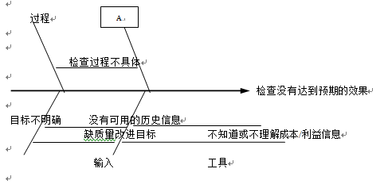
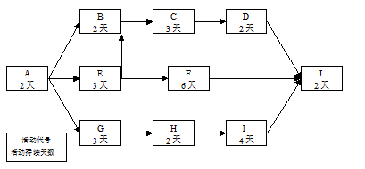

# 2013.5  

## 试题1  

**阅读下列说明，回答问题l至问题4，将答案填入答题纸的对应栏内。**  
公司承接了一个信息系统开发项目，按照能力成熟度模型CMMI制定了软件开发的流程与规范，委派小赵为这个项目的项目经理。小赵具有3年的软件项目开发与管理经验。公司认为这个项目的技术难度比较低，把两个月前刚从大学招聘来的9个计算机科学与技术专业的应届毕业生分配到这个项目组，这样，项目开发团队顺利建立了。项目的开发按照所制定的流程规范进行。在需求分析、概要设计、数据库设计等阶段都按照要求进行了评审，编写了需求分析说明书、概要设计说明书、数据库设计说明书等文档。但在项目即将交付时，发现了很多没有预计到的缺陷与BUG。这说明许多质量问题并没有像原来预计的那样在检查与评审中发现并予以改正。由于项目的交付期已经临近，为了节省时间，小赵让程序员将每个模块编码完成后仅由程序员自己测试一下，就进行集成测试和系统测试。在集成测试和系统测试的过程中，由于模块的BUG太多，集成测试越来越难，该项目没有能够按照客户的质量要求如期完成。为了查找原因，公司的质量部门调查了这一项目的进展情况，绘制下面的图形。  
  
参考答案  

**【问题1】（4分）**  
这图是一种质量控制所采用的工具，叫做 （1） 图。根据上述描述，图中的A应该是 （2） 。  
请将上面（1）、（2）处的答案填写在答题纸的对应栏内。  
>（4分）  
因果图（或鱼骨图）、人员  

**【问题2】（7分）**  
质量控制中所依据的一个最重要的模型是计划、执行、检查、行动。请根据这一模型，给出质量控制的基本步骤。  
>（7分）  
确定控制对象，如工序、设计过程、制造过程。  
规定控制标准，详细说明控制对象应达到的质量要求。  
制定具体的控制方法，如工艺规程。  
明确所采用的检验方法，包括检验手段。  
实际进行检验。  
说明实际与标准之间有差异的原因。  
为解决差异而采取的行动。  

**【问题3】（7分）**  
分析本案例中产生质量问题的原因。  
>（7分）  
项目团队成员能力不足。  
设计质量不高。  
测试不充分。  
审查过程没有按照规范进行。  
项目评审环节未达到预期效果。  
没有组织过程资产。  
没有制定好的质量管理计划。  

**【问题4】（6分）**  
针对案例中项目的现状，假设项目无重大设计缺陷，为完成该项目，从质量管理的角度，给出改进措施。  
>（6分）  
聘请经验丰富的技术人员（测试人员）。  
重新对每个模块进行测试，修改缺陷和BUG，直到满足质量要求。  
按照规范进行充分的集成测试和系统测试。  
加强项目评审工作。  

---
---
---

## 试题2  

**阅读下列说明，回答问题1至问题3，将答案填入答题纸的对应栏内。**  
项目经理在为某项目制定进度计划时绘制了如下所示的前导图。图中活动E和活动B之间为结束—结束关系，即活动E结束后活动B才能结束，其他活动之间的关系为结束—开始关系，即前一个活动结束，后一个活动才能开始。  
  

**【问题1】（6分）**  
请指出该网络图的关键路径并计算出项目的计划总工期。  
>（6分）  
关键路径AEFJ和AGHIJ。  
计划总工期为13天。  

**【问题2】（8分）**  
根据上面的前导图，活动C的总时差为 （1） 天，自由时差为 （2） 天。  
杨工是该项目的关键技术人员，他同一时间只能主持并参加一个活动。若杨工要主持并参与E、C、I三个活动，那么项目工期将比原计划至少推迟 （3） 天。在这种情况下杨工所涉及的活动序列（含紧前和紧后活动）为 （4） 。  
请将上面（1）到（4）处的答案填写在答题纸的对应栏内。  
>（8分）  
1、、1、AECIJ  

**【问题3】（4分）**  
**针对问题2所述的情形，如仍让杨工主持并参与E、C、I三个活动，为避免项目延期，请结合网络图的具体活动顺序叙述项目经理可采取哪些措施。**  
>（4分）  
在活动A或E或C或I或J处进行赶工，包括加班、改进技术、增加资源等措施。  
见参考答案  

---
---
---

## 试题3  

**阅读下列说明，回答问题l至问题3，将答案填入答题纸的对应栏内。**  
某工业企业的生产管理系统项目委托系统集成商A公司进行开发和实施，由A公司的高级项目经理李某全权负责。按照双方制定的项目计划，目前时间已经到达最后的交付阶段，李某对整体进度情况进行了检查。检查结果是生产管理系统软件基本开发完成，目前处于系统测试阶段，仍然不断发现缺陷，正在一边测试一边修复；硬件系统已经在客户现场安装完毕，设备正常运行。未来不延误进度，李某决定将目前发现的缺陷再集中修改2天，然后所有开发人员一同去现场进行整体安装联调。2天后，项目组进入现场，对软件系统进行了部署。李某与客户代表确定了参加验收测试的工作人员，然后开始进行项目验收。在验收过程中，客户认为软件的部分功能不能满足实际工作需要，要求项目组修改。项目组经过讨论后认为对软件进行适当的修改便能够满足客户的需求，便在现场对软件进行了修改。验收测试过程中发现了部分小缺陷。客户方认为这些小缺陷不影响系统的正常使用。为此双方签署了备忘录，约定系统交付使用后再修复这些缺陷。按照双方的约定，项目组应在试运行前将系统安装手册、使用和维护说明等全套文档移交给客户，但是由于刚刚对软件进行了现场修改，一些文档还未及时更新，因此客户未接受这些文档。由于客户最关心的是试运行，因此李某组织所有力量开展试运行工作。系统上线后，客户发现了一些新问题，同时还有以前遗留的问题未解决。经双方协商，这些问题解决之后再签署验收报告和付款。回到公司后，公司领导高度重视该项目。项目经理第一时间撰写了项目总结报告，对整个项目实施过程进行了认真的总结和分析。该报告的结论是项目整体进展状况良好，未出现明显问题，本项目可以正常结项。  
参考答案  

**【问题1】（6分）**  
请简要叙述该项目在收尾环节存在的主要问题。  
>没有充分做好验收前的准备工作，或软件系统没有达到验收前的标准，或软件还存在计划修复的缺陷。这些缺陷未经修复和确认便进入正式验收环节。  
在验收过程中未根据变更控制流程对软件进行修改，导致文档与软件不一致。  
软件更新后没有对文档进行更新便交付给客户。  
项目验收未正式完成，未签署验收报告便进行了项目总结。  
项目收尾过程不完整，缺少正式的项目总结环节，不能只编写总结报告。  
项目总结报告未能反映项目的实际情况。  
缺少项目评估或审计环节。  

**【问题2】（6分）**  
请简要叙述项目经理的总结报告中应包含的主要内容。  
>项目绩效（整体情况），技术绩效（技术方案的实施情况），成本绩效，进度绩效，项目沟通情况，识别问题和解决问题情况，意见和建议（经验教训和知识总结）。  

**【问题3】（5分）**  
请指出项目组在该系统集成项目收尾后应该向客户移交哪些文档？  
>系统集成项目介绍。  
系统集成项目最终报告。  
信息系统维护手册。  
信息系统说明手册。  
软硬件产品说明书、质量保证书等。  

---
---
---

## 试题4  

**阅读下列说明，回答问题1至问题3，将答案填入答题纸的对应栏内。**  
小李担任了A公司的项目经理，他认识到项目配置管理的重要性，指派小王负责项目的配置管理，公司以前的项目很少采用配置管理，在这方面没有可以借鉴的经验。小王刚到公司上班不到一年，他从网上下载了开源的配置管理软件CVS，进行了认真的准备。项目组成员有12人，小王为每个成员安装了CVS的客户端，但并没有为每位成员仔细讲解CVS的使用规则与方法。项目组制订了一个初步的开发规范，并据此识别了配置项，但在文档的类型与管理的权限方面大家并没有十分在意。小王在项目开发会议上，特别强调了要求大家使用配置管理系统，却没有书写并发布有效的配置管理计划文件。  
参考答案  

**【问题1】（5分）**  
结合本题案例判断下列选项的正误（填写在答题纸的对应栏内，正确的选项填写“√”，错误的选项填写“×”）  
（1）在文档计划正式批准后，文档管理者不一定要控制文档计划和它的发布。  
（ ）  
（2）文档的评审应由需方组织和实施。  （ ）  
（3）需方同意文档计划意味着同意在计划中定义的用户文档的所有可交付的特征。  
（ ）  
（4）软件配置管理的目的是建立和维护整个生存期中软件项目产品的完整性和可追溯性。  
 （ ）  
（5）在进行配置管理过程中，一定要采用高档的配置管理工具。  （ ）  
>（5分）  
×、×、√、√、×  

**【问题2】（6分）**  
请简要叙述本案例在建立配置管理系统方面存在哪些问题。  
>（6分）  
配置管理方案设计小组只有小王一人。  
对目标机构了解不够。  
对配置管理工具没有进行有效评估。  
没有制定实施计划。  
没有定义配置管理流程。  
没有实验项目的实施经验可以借鉴。  

**【问题3】（5分）**  
结合项目实践，给出本项目中在配置管理方面的改进建议。  
>（5分）  
组建配置管理方案设计小组。  
仔细了解单位的情况，如历史、人员、组织形式等。  
对配置管理工具进行有效评估。  
制定实施计划。  
定义配置管理流程。  
制定全面有效的配置管理计划，包括建立配置管理环境、组织结构、成本等。在配置管理计划中详细描述建立案例配置库、配置标识管理、配置库控制、相关的检查和评审工作、配置库的备份、配置管理计划附属文档。  
