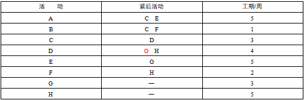
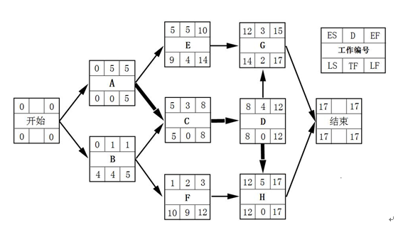

# 2014.11  

## 试题1  

**阅读下列说明，回答问题l至问题3，将答案填入答题纸的对应栏内。**  
**下表是某项目的工程数据，根据各个问题中给出的要求和说明，完成问题1至问题3，将答案填入答题纸的对应栏内。**  
  

**【问题1】**  
请指出该项目的关键路径，并计算该项目完成至少需要多少周？假设现在由于外部条件的限制，E活动结束3周后G活动才能开始；F活动开始5周后H活动才可以开始，那么项目需要多长时间才能完成？  
>在没有约束条件情况下的单号图如下所示  
  
关键路径为ACDH，项目完成至少需要17周。  
在有外部限制条件下的计算如下  
E作业具有4周的总时差，延迟3周后G作业开始，会导致G作业的最早开始时间变为第13周，关键路径不会发生变化。  
F作业具有9天的总时差，延迟5周后H作业仍然为第12周开始（H作业的最早开始时间选F和D作业最早结束时间的最大值12），因此也不会导致关键路径的变化。  
综上所述  
在有外部限制条件的情况下，关键路径仍为ACDH，项目完成至少需要17周。  

**【问题2】**  
**分别计算在没有外部条件限制和问题1中涉及的外部条件的限制下，活动B和G的总时差和自由时差。**  
>没有外部条件限制，由上图可以算出。  
B的总时差=LF-EF=5-1=4，自由时差=紧后作业ES的最小值-本作业的EF=1-1=  
G的总时差=LF-EF=17-15=2，自由时差=总工期-本作业的EF=17-15=2。  
有外部条件限制，由上图可以算出  
B的总时差为4，自由时差为0  
G的总时差=17-16=1（因G作业的最早开始时间受E作业的影响变为13，最早结束时间变为16），自由时差=17-16=1。  

**【问题3】**  
假设项目预算为280万元，项目的所有活动经费按照活动每周平均分布，并与具体的项目无关，则项目的第一周预算是多少？项目按照约束条件执行到第10周结束时，项目共花费200万元，共完成了A、B、C、E、F 5项活动，请计算此时项目的PV、EV、CPI和SPI。  
>该题目项目活动总持续时间为5+1+3+4+5+2+3+5=28周。  
总预算为28万元，所以每周预算为280/28=10万元。第一周开始的活动有A和B两项活动，故第一周的预算为10×2=20万元。  
第10周末项目情况如下  
AC=200万  
PV计划完成的工作×预算价值=  
A+B+C+1/2×D+E+F=50+10+30+1/2×40+50+20=180  
EV已经完成的工作×预算价值=  
A+B+C+E+F=50+10+30+50+20=160  
CPI=EV/AC=160/200=0.8  
SPI=EV/PV=160/180=0.89  

---
---
---

## 试题2  

**阅读下列说明，回答问题l至问题3，将答案填入答题纸的对应栏内。**  
甲公司是一家通信技术运营公司。经公司战略规划部开会讨论，决定开发新一代通信管理支持系统，以提升现有系统综合性能，满足未来几年通信业务高速发展需要。战略规划部按照以下步骤启动该项目  
（1）起草立项申请，报公司总经理批准。  
（2）总经理批准后，战略规划部开展了初步的项目可行性研究工作，主要从国家政策导向、市场现状、成本估算等方面进行了粗略的调研。  
（3）战略规划部依据初步的项目可行性研究报告，认为该项目符合国家政策导向，肯定要上马。公司立即成立了建设方项目工作小组，计划以公开招标的方式选择承建方。  
乙公司成立时间不足两年，研发队伍能力较强，也有为其他通信技术公司开发过软件产品的经验。乙公司得知甲公司的招标信息后，马上组织人员开始投标工作。该项目的投标工作由软件研发部的郑工负责。郑工是公司的软件工程师，具有丰富的软件代码编写经验。郑工从技术角度分析认为项目可行，独立编制完成了投标文件。开标后，甲公司认为乙公司具有类似项目开发经验，选定乙公司中标，但在后续合同谈判过程中，甲、乙双方在项目进度延期违约金、项目边界，交付质量标准等方面存在较大分歧。甲公司代表认为项目范围在投标文件中有明确说明，且乙公司在投标文件中也已经默认；交付质量标准是他们公司专家给定的，不能更改。同时也发现战略规划部当初做的初步的项目可行性研究报告内容不全面，缺少定量的描述，比如实施进度等。  
乙公司代表认为，甲公司合同中要求的进度延期违约金数额太高，担心一旦项目交付延期，损失将会非常大该项目的质量标准明显高于行业标准，很难达到。此时，距中标通知时间超过一个月，双方仍因为以上分歧未达成一致，合同也未签订，最终甲公司与另外一家投标公司签订了系统集成技术合同。  

**【问题1】**  
结合案例，试分析甲公司（建设方）在项目立项时存在哪些问题。  
>甲方的立项管理中存在问题如下  
1.立项申请应用甲方的上级主管单位，而非甲方总经理批准。  
2.初步可行性研究内容不全面，缺少对项目进度安排、项目的总体规划。  
3.缺少详细可行性研究步骤。  
4.缺少项目论证步骤。  
5.缺少项目评估步骤。  
6.项目决策过于简单，仅根据符合目国家政策导向就决定上马。  
7.定标有问题，只认为乙公司有相关经验就觉得乙公司中标。  
8.以公开招标的方式选择承建方未必是最好的方式，有可能邀请招标更合适。  
9.招标书内容不够全面，应该有项目进度、项目范围、项目质量等要求。  

**【问题2】**  
结合案例，试分析乙公司（承建方）在项目立项时存在哪些问题。  
>乙方的立项管理中存在问题如下  
1.投标工作由软件研发部的郑工负责不合适，郑工缺少投标书编写工作经验。  
2.郑工从技术角度分析认为项目可行，需要综合考虑经济、技术、社会等因素。  
3.郑工单独完成项目投标书不合适，需要其他项目团队成员或者专业技术人员共同参与。  
4.投标书的部分关键内容没有实质性的响应招标书，比如项目进度、项目范围、项目质量等，导致后期合同谈判时破裂。  
5.投标书投标之前没有经过公司内部评审，导致没有发现其中问题。  
6.承建方没有充分论证项目，分析公司能否实现该项目。  
7.没有考虑项目风险，缺少风险管理。  
8.合同谈判期间，乙方与甲方之间缺少有效的沟通。  

**【问题3】**  
从候选答案中选择6个正确选项（每选对一个得1分，选项超过6个该题得0分），将选项编号填入答题纸对应栏内。  
结合案例，属于系统集成类技术合同包含的内容有_______________________。　　  
候选答案  
A．名词和术语的解释  
B．范围和要求  
C．成本率  
D．技术情报和资料的保密要求  
E．技术成果的归属和收益的分成办法  
F．开发工具来源  
G．验收标准和方法  
H．项目经理的资格要求  
I．项目名称  
>A、B、D、E、G、I  

---
---
---

## 试题3  

某信息系统开发公司承担了某企业的ERP系统开发项目，由项目经理老杨带领着一支6人的技术团队负责开发。由于工期短、任务重，老杨向公司申请增加人员，公司招聘了2名应届大学毕业生小陈和小王补充到该团队中。老杨安排编程能力强的小陈与技术骨干老张共同开发某些程序模块，而安排编程技术弱的小王负责版本控制工作。在项目开发初期，小陈由于不熟悉企业的业务需求，需要经常更改他和老张共同编写的源代码文件，但是他不知道哪个是最新版本，也不知道老张最近改动了哪些地方。一次由于小王的计算机中了病毒，造成部分程序和文档丢失，项目组不得不连续一周加班进行重新返工。此后，老杨吸取教训，要求小王每天下班前把所有最新版本程序和文档备份到2台不同的服务器上。一段时间后，项目组在模块联调时发现一个基础功能模块存在重大BUG，需要调取之前的备份进行重新开发。可是小王发现，这样一来，这个备份版本之后的所有备份版本要么失去意义，要么就必须全部进行相应的修改。项目工期过半，团队中的小李突然离职，老杨在他走后发现找不到小李所负责模块的最新版本源代码了．只好安排其他人员对该模块进行重新开发。  
整个项目在经历了重重困难，进度延误了2个月后终于勉强上线试运行。可是很快用户就反映系统无法正常工作。老杨带领所有团队成员在现场花费了1天时间终于找出问题所在，原来是2台备份服务器上的版本号出现混乱，将测试版本中的程序打包到了发布版中。  

**【问题1】**  
在（1）～（5）中填写恰当内容（从候选答案中选择一个正确选项，将该选项编号填入答题纸对应栏内）。  
为了控制变更，软件配置管理中引入了 （1） b这一概念。根据这个定义，在软件的开发流程中把所有需加以控制的配置项分为两类，其中， （2）d 配置项包括项目的各类计划和报告等。配置项应该按照一定的目录结构保存到 （3）g 中。所有配置项的操作权限由（4） h进行严格管理，其中 （5）e 配置项向软件开发人员开放读取的权限。  
（1）～（5）供选择的答案  
A．版本 B．基线 C．配置项 D．非基线 E．受控库  
F．静态库 G．配置库 H．CMO I．PM J．CCB  
>B、D、G、H、E  

**【问题2】**  
结合案例，请分析为什么要进行配置项的版本控制？  
>版本控制是对软件开发进程中文件或目录的发展过程提供有效的追踪手段，保证在需要时可回到旧的版本，避免文件的丢失、修改的丢失和相互覆盖，版本控制在空间上可以保证完成集中统一管理，解决一致性和冗余问题。具体本案例来说可以实现如下功能  
1.能够对项目版本进行统一管理，实现项目团队成员的协同工作。  
2.能够对项目版本权限进行控制，避免案例中小陈修改老张编写的源代码文件。  
3.能够对历史版本进行追踪，可以定位最新版本和相关版本的修改人。  
4.能够保留配置项的所有版本，可以恢复任意版本，不至于中病毒而丢失程序和文件，也不至于小李离职导致源代码丢失。  
5.能够管理版本冲突，在多个版本冲突的情况下，有效地进行版本合并，避免案例中两台服务器版本混乱。  

**【问题3】**  
简述配置项的版本控制流程。  
>配置项的版本控制流程如下  
1.识别配置项，并为配置项建立唯一标识。  
2.建立配置管理系统。  
3.创建或发行基线。  
4.跟踪变更。  
5.控制变更。  
6.建立配置管理记录。  
7.执行配置审核。  

**【问题4】**  
针对该项目在配置管理方面存在的问题，结合你的项目管理经验，为老杨提出一些改进措施  
>案例中配置管理存在的问题有  
1.没有制定配置管理计划，没有成立统一的配置管理委员会。  
2.没有统一的创建配置标识和基线。  
3.没有创建一个统一的配置环境。  
4.没有进行有效的版本管理和发行管理。  
5.没有进行配置状态的报告和审计。  
6.配置管理员小陈没有工作经验。  
改进措施  
1.使用有经验的人做配置管理工作，或者对小陈进行培训。  
2.统一制定配置管理计划，成立配置管理委员会做好配置管理流程工作。  
3.识别配置项，并为配置项建立唯一标识，保证其可追溯。  
4.建立配置基线，所有对基线的修改都必须经过CCB的审批。  
5.创建好配置管理环境，设置开发库、受控库、产品库。并设置不同的权限，防止无秩序更改。  
6.做好版本管理和发行管理，让备份服务器和主服务器的版本统一，防止测试版本的程序打包到发布版本中。  
7.定期提交配置状态报告和进行配置审计，及时发现问题，改正错误，防止最后出现不可控制的错误。  

---
---
---

## 试题4  

某信息系统集成公司，根据市场需要从2013年初开始进入信息系统运营服务领域。公司为了加强管理，提高运营服务能力，企业通过了GB/T24405.l-2009idtIS020000-12005认证。  
2013年12月该公司与政府部门就某智能交通管理信息系统运营签订了一份商业合同，并附有一份《服务级别协议》（SLA），该级别协议部分内容如下  
（1）系统运维要求  
内容检查、维修、监控  
服务等级7×24小时  
服务可用性要求全年累计中断不超过20分钟  
（2）服务器维修  
数量1台  
内容检查、维修、监控  
服务等级7×24小时  
此外，对一些网络设施维护等也进行了规定。  
公司为了确保该项目达到SLA要求，任命了有运维经验的小王为项目经理，并在运维现场建立了备件库、服务台，配备了3名一线运维工程师3班轮流驻场服务。公司要求运维团队要充分利用这些资源，争取服务级别达成率不低于95%，满意度不低于95%。项目进入实施阶段后，小王根据企业和客户要求，建立了运维实施程序和运维方案，为了完成SLA和公司下达的指标，小王建立了严格的监督管理机制，利用企业的打卡系统，把运维人员也纳入打卡考核。  
但在第一个季度报告时，客户就指出，系统经常中断、打服务电话也经常没人接，满意度调查结果也只有65%。  

**【问题1】**  
根据题目说明，请归纳该项目的范围说明书应包括哪些具体内容。  
>项目的范围说明书应该包括  
1.项目目标。  
2.产品范围描述。  
3.项目的可交付物。  
4.项目边界。  
5.产品验收标准。  
6.项目的约束条件。  
7.项目的假定。  

**【问题2】**  
围绕题干中列举的现象，请指出造成满意度低的原因。  
>造成满意度低的原因有  
1.系统经常中断，未达到全年累计中断不超过2分钟的要求。  
2.打服务电话也经常没人接，未达到服务等级7×24小时的要求。  
3.该系统集成公司2013年初开始进入信息系统运营服务领域，运维经验可能不足。  
4.该系统集成公司虽然通过了GB/T24405等认证，但实际工作可能没有贯彻认证要求。  
5.该系统集成公司应该在早期建立了运维实施程序和运维方案，并通过评审，而不是在实施阶段。  
6.该系统集成公司没有经常性地对员工进行培训，提升工作能力。  
7.服务中断多次，打电话多次没有人接说明项目经理小王没有对运维工程师的工作情况进行有效监督。  

**【问题3】**  
在（1）～（4）中填写恰当内容（从候选答案中选择一个正确选项，将该选项编号填入答题纸对应栏内）。  
客户接受运维服务季度报告的过程属于范围 （1） 。满意度调查属于质量 （2）。运维企业管理要符合《信息技术服务运行维护第1部分通用要求》，除了要加强人员、资源、流程管理外，还要强化 （3）管理。服务台属于 （4）。  
（1）～（2）供选择的答案  
A．控制 B．确认 C．评审 D．审计  
（3）～（4）供选择的答案  
A．知识库 B．流程工具 C．技术 D．资源  
>B、D、C、D  
