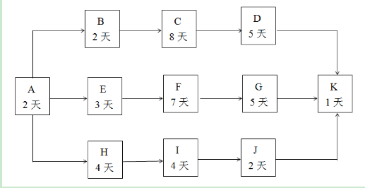
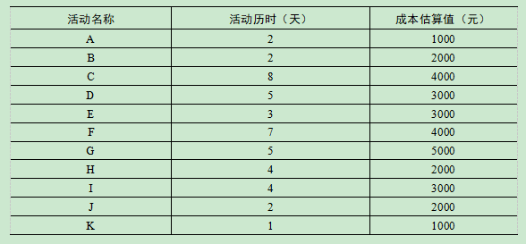

# 2016.11  

## 试题1（20分）  

**阅读下列说明，回答问题1至问题4，将解答填入答题纸的对应栏内。**  
下图给出了一个信息系统项目的进度计划网络图（含活动历时）。  
  
下表给出了该项目各项活动的历时和成本估算值。  
  

**【问题1】（5分）**  
（1）请指出该项目的关键路径。  
（2）请计算该项目的总工期。  
（3）请计算活动C的总浮动时间和自由浮动时间。  
>（1）关键路径为ABCDK和AEFGK。  
（2）总工期18天。  
（3）C在关键路径上，总时差和自由时差为。  

**【问题2】（3分）**  
假设该项目无应急储备，管理储备为10000元，计算该项目的完工预算BAC和总预算。  
>BAC=100+2000+4000+3000+3000+4000+5000+2000+3000+2000+1000=30000（元）  
总预算=BAC+管理储备=30000+10000=40000（元）  

**【问题3】（6分）**  
按照项目进度计划，第12天结束时应完成活动C、F、J，实际情况为C完成了75%；F完成了100%；J完成了50%；实际花费25000元。请计算该时点的计划值PV、挣值EV、成本绩效指数CPI和进度绩效指数SPI。  
>PV=100+2000+4000+3000+4000+2000+3000+2000=21000（元）  
EV=1000+2000+75%×4000+3000+100%×4000+2000+3000+50%×2000=19000（元）  
CPI=EV/AC=19000/25000=0.76  
SPI=EV/PV=19000/21000=0.9  

**【问题4】（6分）**  
在项目第12天结束时，项目经理对项目滞后的原因进行了分析，找出了滞后原因M（由于M造成的偏差是非典型的）  
（1）假设M在以后的项目实施过程中不会再发生，请计算完工估算EAC。  
（2）假设M在以后的项目实施过程中一直存在，请计算完工估算EAC。  
>（1）若M在以后的项目实施过程中不会再发生，则属于非典型偏差  
EAC=ETC+AC=BAC-EV+AC=(3000-19000)+AC=36000  
（2）若M在以后的项目实施过程中一直存在，则属于典型偏差  
EAC=BAC/CPI=30000/0.76=39473.68  

---
---
---

## 试题2（20分）  

**阅读下列说明，回答问题1至问题4，将解答填入答题纸的对应栏内。**  
某大型国有企业A计划建立一套生产自动控制系统，改变目前的半自动化生产状态。A企业内部设立有信息中心，具有自主开发能力，但采购部门经理老李认为自主开发耗时长，还是决定从外部选择一家具有相关成熟产品和实施经验的集成商实施外包。  
老李组织编写了采购计划，确定该项目要对外进行招标，由于招标代理机构B已经与A企业合作多次，并列入了A企业的供应商名录，因此A企业直接委托B机构开始招标工作。  
招标代理机构B协助A企业拟制了招标文件，并在互联网上发布了招标公告。招标文件中要求，潜在供方应具有信息系统集成二级（及以上）资质。集成商C公司想参加投标，但只具有信息系统集成三级资质，C公司联合了有信息系统集成二级资质的集成商D公司共同参加投标。在投标截止时间前一周。A企业发现招标文件中有一处错误，他们对招标文件进行了修改并在网上进行了公告，还电话通知了每一个已知的投标人。  
代理机构B接收了多份标书，与A企业共同对标书中涉及的技术方案、报价、资质证明材料等文件进行了评审，最终选择了一家报价最低的集成商E公司。  
接下来，A企业与集成商E公司签订了合同。在项目需求阶段，双方对于需求的理解产生了不一致。为消除需求的歧义，双方召开了多次会议进行沟通。同时，在项目实施过程中，由于集成商E公司没有此类软件开发的经验，部分开发模块需要外购，因此导致项目的进度延后。  

**【问题1】（3分）**  
老李直接决定将项目外包的做法是否合适？为什么？  
>不合适。决定外包的理由不够充分，应该将单位内部能力与外包商能力进行综合比较以及外包商能提供的价值等多方面进行评估后决定。  

**【问题2】（3分）**  
判断下列选项的正误（填写在答题纸的对应栏内，正确的选项填写“√”，错误的选项填写“×”）；  
（1）编制采购计划前应首先做出自制/外购决定。（）  
（2）A企业不应该直接委托B机构作为招标代理机构。（）  
（3）结束采购过程就是把合同和相关文件归档以备将来使用。（）  
>（1）×（2）√（3）×  

**【问题3】（8分）**  
（1）该项目的合同应采用哪一种合同对于甲方比较有利？为什么？  
（2）C公司和D公司的联合体是否符合投标要求？为什么？  
>（1）采用总价合同于甲方比较有利。因为总价合同是由承包商承担风险的。  
（2）不符合。同一专业的单位组成联合体的，应当按照资质等级较低的单位确定联合体的资质等级，C公司资质不符合要求。  

**【问题4】（6分）**  
请说明在该项目的采购过程中可能存在哪些问题？  
>（1）没有进行充分的自制/外购分析。  
（2）直接委托招标代理机构，没有审核代理机构的资质。  
（3）在投标截止时间前一周对招标文件进行了修改，并且只电话通知投标人不符合招投标法中有关规定。对招标文件的修改应当在投标截止时间至少十五日前，以书面形式通知所有招标文件收受人。  
（4）没有审核投标方的资格，C、D公司组成的联合体不符合招标文件的要求。  
（5）评标过程有问题，对中标人的选择应该最大限度满足招标文件中规定的各项综合评价标准，而不是单纯将报价最低的选为中标人。  
（6）采购管理过程缺乏有效的监控。  

---
---
---

## 试题3（17分）  

**阅读下列说明，回答问题1至问题3，将解答填入答题纸对应栏内。**  
鉴于配置管理在信息系统集成和IT运维项目中的重要作用，某企业计划在企业层面统一建立配置库，以规范公司的配置管理，并责成公司的商务经理杨工兼任公司的配置经理，全面组织和协调公司的配置管理事项。杨工接到任务后，按照公司目前系统集成和运维的架构，将配置库分为系统集成项目配置库和运维项目配置库，不过这种配置库管理只是从名称方面进行了区分，实际上只有一个配置库。由于公司大部分运维项目来自于公司的系统集成部，所以底层数据是共享的，没有分割开来，运维人员和系统集成人员经常针对同一个配置项进行修改。  
在配置库运行4个月之后，公司组织了一次对配置库的审计，发现配置库存在大量的问题，杨工面对这样的局面，对自己在配置管理中的角色也感到非常迷茫。他收集了目前公司配置库管理方面存在的问题，这些问题比较突出地体现在以下几个方面  
（1）有的项目组将配置项细化到了软件产品的模块，而有的项目组以项目简单为由，根本没有进行配置管理，并且各项目组内部对配置管理的需求也不统一，随时间变化波动较大。  
（2）很多开发人员和运维人员不知道在不同的库里应该放置什么内容，而且各种配置项的配置格式也不统一，导致配置库难以达到预期的效果。  
（3）配置库增删比较混乱，很多配置项还找不到最后的版本，而且很多配置内容也放置混乱，各种库的分隔管理起不到预期的效果。  

**【问题1】（6分）**  
请结合以上案例，简要说明配置管理的目标和主要活动。  
>目标为了系统地控制配置变更，在系统的整个生命周期中维护配置的完整性和可跟踪性，而标识系统在不同时间点上的配置。  
主要活动制定配置管理计划、配置标识、配置控制、配置状态报告、配置审计、发布管理和交付。  

**【问题2】（8分）**  
请说明杨工在配置管理中存在的问题。  
>（1）没有制定配置管理计划。  
（2）配置库只在名称上进行了区分，并没有做好实际的分类管理。  
（3）对配置项的配置格式没有统一规范。  
（4）没有建立CCB对配置变更进行审批。  
（5）没有对配置库的变更控制，导致运维人员和系统集成人员经常针对同一个配置项进行修改。  
（6）配置库增删比较混乱，很多配置项还找不到最后的版本，说明没有做好版本管理，造成版本的丢失。  
（7）没有对项目成员进行配置管理的培训。  
（8）没有对配置库的权限设置。  

**【问题3】（3分）**  
根据你的理解，请指出配置审计的功能是什么。  
>（1）防止向用户提交不适合的产品。  
（2）发现不完善的实现。  
（3）找出各配置项不匹配或不相容的现象。  
（4）确认配置项已在所要求的质量控制审核后纳入基线并入库保存。  
（5）确认记录和文档保持着可追溯性。  

---
---
---

## 试题4（18分）  

**阅读下列说明，回答问题1至问题3，将解答填入答题纸的对应栏内。**  
A公司属于创业型公司，随着公司业务规模的扩大，公司领导决定成立专门的质量管理部门，全面负责公司所有项目的质量，并降低产品的缺陷率。公司还聘任了具有多年质量管理经验的张工担任公司质量管理部门的经理。  
张经理上任后，从每个项目组中抽调了一名QA，QA隶属于公司质量部，工作地点在各个项目所在地点，与项目组一起工作，负责所在项目的质量管理。小王是X项目的QA，当前X项目正在研发阶段。张经理要求小王按照项目进度提交一份项目质量管理计划，并提供了常规质量管理计划的模板，主要包括质量检查点、检查人、检查内容、检查时间、检查方式等。小王于是按照张经理的要求编写并提交了《项目质量管理计划-X项目》。  
过了2个月，张经理根据质量管理计划的某一个时间点，询问小王某一个设计评审的会议情况时，小王没有找到有关的会议记录。张经理又电话询问X项目的项目经理有关质量管理的情况，该项目经理认为质量管理是由小王根据质量管理部门的要求进行的，自己会大力配合。  

**【问题1】（8分）**  
结合以上案例，请指出该质量管理计划制定和实施过程中存在的问题。  
>（1）质量管理计划不应该由小王单独完成，应该由全体部门成员共同参与制定。  
（2）质量管理计划内容不全面，还应该考虑质量保证和质量控制的问题。  
（3）在制定质量管理计划的同时还应该制定过程改进计划。  
（4）评审会没有会议记录。  
（5）项目经理应该是质量管理的责任人，小王应该配合项目经理的工作。  

**【问题2】（5分）**  
结合以上案例，请指出QA的主要工作内容。  
>（1）建立质量指标与标准。  
（2）参与项目规划的评审。  
（3）编制QA计划。  
（4）过程审计。  
（5）阶段交付物审计。  
（6）产品质量状态评估。  
（7）进行质量纠偏工作。  
（8）对成员进行质量培训。  
（9）进行质量检查，发现质量中存在的偏差。  

**【问题3】（5分）**  
结合以上案例，你认为设计评审会议应该由谁组织？为什么？  
>评审会应该由项目经理组织。项目经理是项目的领导者，整合各类资源对项目进行全生命周期的管理，因此应该也由项目经理组织评审会，项目成员及其他干系人参与。  
