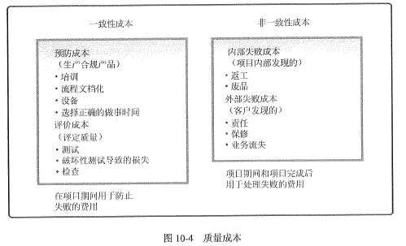
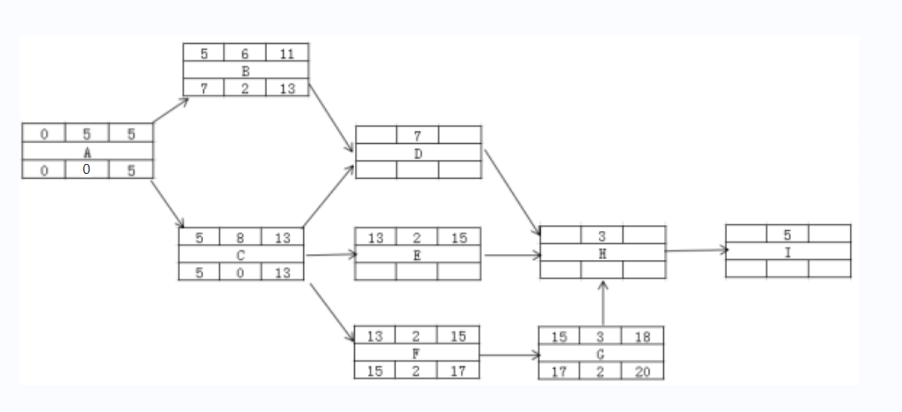
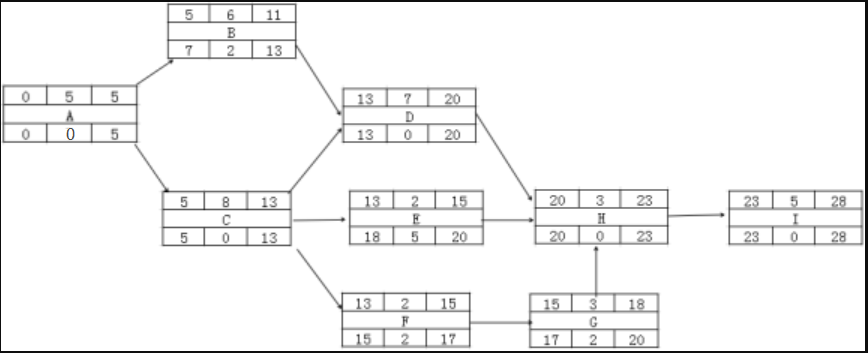

# 2019.5  

## 试题1  

某公司开发一个新闻客户端后台大数据平台，该平台可以实现基于用户行为、社交关系、内容、标准、热度，地理位置的内容推荐。公司指派张工负责项目的质量管理，由于刚开始从事质量管理工作，张工进行充分的学习、并梳理了如下内容  
1.质量规划的目的是确定项目应当采取哪些质量标准以及如何达到这些标准，进行制定质量管理规划；  
2.质量与等级类似，质量优于等级，项目中应重点关注质量。可以不必考虑等级问题；  
3.质量规划阶段需要考虑质量成本的因素，质量成本是项目总成本的一个组成部分，因此张工建立了如下表格，以区分一致性成本和非一致性成本。  
  

****问题1（5分）在本案例中，张工完成质量管理规划后，应该输出哪些内容？****  
>考核质量规划的输出，考核点清晰  
质量管理计划，过程改进计划，质量测量指标，质量核对单，项目文件更新  

****问题2（3分）结合案例，请指出张工对质量与等级的看法是否正确？请简述你对质量与等级的认识****  
>考核质量和等级的定义  
不正确。  
质量做为实现的性能或成果，是一系列特性满足要求和程度。  
等级做为设计用途，是对用途相同但技术特性不同的可交付成果的级别分类。  

**问题3（8分）请对张工设计的成本分类表格的内容进行判断（正确打√，错误打×）**  
【题干内容需补充】  
>考核一致性成本和非一致性成本的区别  
根据附图，判断结果如下  
对对错对对错对错  
  

**问题4（4分）**  
①______是将实际或计划的项目实践与可行项目实践进行对照，以便识别最佳实践，形成改进意见，并为绩效考核提供依据。  
A.实验设计  B.标杆对照 C.头脑风暴 D.统计抽样  
②提出了持续改进的观点，在休哈特之后系统样子提出用______的方法进行质量和生产力的持续改进。剥蒜头。  
A.零缺陷 B.六西格玛  C.精益  D.统计  
③实施质量保证的方法有很多。______属于实施质量保证的常用方法。  
A过程分析  B.实验设计  C.帕累托图  D.质量成本  
④七种工具包括因果图、流程图、检查表、帕累托图、直宁图、控制图和______  
运行图  B.统计图  C.散点图  D.鱼骨图  
>考核质量工具的定义  
参考答案BDAC  
解析  
1，标杆对照是将实际或计划的项目实践与可行项目实践进行对照，以便识别最佳实践，形成改进意见，并为绩效考核提供依据  
2，戴明提出了持续改进的观点，在休哈特之后系统和科学的提出用统计的方法进行质量和生产力的持续改进。  
3，实施质量保证的方法有很多。过程分析属于实施质量保证的常用方法。  
4，七种工具包括因果图、流程图、检查表、帕累托图、直宁图、控制图和散点图  

---
---
---

## 试题2  

项目经理根据甲方要求评估了项目的工期和成本。项目进行到20天的时候，项目经理对项目开展情况进行了评估。得到个活动实际花费成本（如下图），此时ABCDF已经完工，E仅完成了1/2，G仅完成了2/3。H尚未开工。  
  

**问题1（6分），基于以上案例，项目经理得到了代号网络图，请将以下图补充完整。**  
  
>考核网络图的最早开始、最早结束、最迟开始、最迟结束的算法。根据正推法和反推法，  
算出DEHI的最早开始，最早结束，最迟开始，最迟结束，填入空格  
根据正推取大原则，将13填入DE的最早开始，并分计算出DE的最早结束 13+7=2，13+2=15；  
将DE最早结束取大20，填入H的最早开始，并计算出H的最早结束20+3=23；  
将23填入I的最早开始，并计算出I的最早结束 23+5=28。  
逆推，将I的最早结束28做为工期，填入最迟结束，算出最迟开始，28-5=23；  
将23填入H的最迟结束，并算出最迟开始23-3=20；将20填入DE的最迟结束，并分别算出最迟开始20-7=13和20-2=18。  
  
备注A的总时差是0，不是5。  

**问题2（5分）**  
基于补充后的网络图  
（1）请推出项目的工期、关键路径和活动E的总时差  
（2）项目经理现在想通过赶工的方式提前一天完成项目，应该压缩哪个活动最合适？为什么？  
>考核关键路径的判断和总时差的算法以及工期压缩的选择  
（1）工期28天；  
关键路径ACDHI  
E的总时差=2-15=5天  
（2）压缩I，因为I是关键工作，且赶工成本最低。  

**问题3（6分）**  
请计算项目当前的PV、EV、AC、CV、SV为并评价项目进度和成本绩效。  
>考核挣值计算的能力  
按照网络图，到2天，ABCDEFG工作应该全部完成，所以  
PV=5+4+7+8+2+1+3=30万元  
EV=5+4+7+8+2X1/2+1+3X2/3=28万元  
AC=3+7+5+3+3+1+1=23万元  
SV=28-30=-2万元<0进度滞后  
CV=28-23=5万元>0成本节约  

---
---
---

## 试题3  

说明A公司中标工期为十个月的某政府（甲方）系统集成项目，需要采购一批液晶显示屏，考虑到项目，项目经理小张在竞标的几个供应商里选择了报价最低的B公司，并约定交货周期为五个月，B公司提出预付全部货款才能按时支付，小张同意了对方的要求。项目启动后，前期工作进展顺利，临近交货日期，B公司提出，因为最近公司订单太多，只能按时支付80%的货物，经过几次催促，B公司才答应按时全部交货，产品进入现场后，甲方反馈液晶显示屏有大量残次品，小张与B公司交涉多次，相关问题都没有得到解决，甲方很不满意。  

**问题1（4分）**  
按项目管理过程。请将下面（1）~（4）处的各答案填写在答题纸的对应框内。  
采购管理过程包括（1）、（2）、（3）和（4）  
>考核采购管理过程  
1，编制采购计划2，实施采购3，控制采购4，结束采购  

**问题2（8分）**  
结和案例简要说明小张在采购过程中存在的问题。  
>考核采购管理注意点  
1没有明确采购需求 2价格不应该是选择的供应商的唯一要素 3不能由项目经理决定预付全款 4不能按时交货时没有采取控制措施 5采购中没有进行验货 6没有执行有效的合同索赔方式  

**问题3（6分）**  
简要叙述供应商选择需要考虑的因素。  
>考核商选择的条件  
1成本 2服务 3质量 4业绩 5资质 6风险  

---
---
---

## 试题4  

**阅读下列说明，回到问题1至问题3，将解答填入答题纸的对应栏内。**  
A公司中标某客户业务系统的运行维护服务项目，服务期从2018年1月1日至2018 年12月31日。在服务合同中，A公司向客户承诺该系统全年的非计划中断时间不超 过20小时。  
1月初，项目经理小贾组织项目相关人员召开项目风险管理会议，从人员、资源、 技术、管理、客户、设备厂商等多方面对项目风险进行了识别，并制定了包含50多条 风险的《风险清单》。小贾按照风险造成的负面影响程度从高到低对这些风险进行了优先级排序。在讨论风险应对措施时，工程师小王建议针对来自项目团队内部的风险， 可以制定应对措施；针对来自外部（如客户、设备厂商）的风险，由于超出团队成员的控制范围，不用制定应对措施。小贾接受了建议，针对《风险清单》中的内部风险制定了应对措施，并将措施的实施责任落实到人，要求所有的应对措施在3月底前实 施完毕。  
3月底，小贾通过电话会议的方式了解风险应对措施的执行情况，相关负责人均表示应对措施都己实施完成。小贾对大家的工作表示感谢，将《风险清单》中的所有风险进行了关闭，并宣布风险管理工作结束。  
5月初，客户想用国外某厂商研发的新型网络设备替换原有的国产网络设备，并 征询小贾的建议。小贾认为新产品一般会采用最先进的技术，设备的稳定性和性能相 比原来设备应该会有.较大提升，强烈建议客户尽快替换。  
6月份，由于产品bug以及与主机、存储设备兼容性问题，新上线网络设备接连发生了 5次故障。每次发生故障时，小贾第一时间安排人员维修，但故障复杂，加上工程师对新设备操作不熟练，每次维修花费时间较长。5次维修造成的系统中断时间 超过了 20小时，客户对此非常不满意。  

**问题1（10分）**  
结合以上案例，请指出A公司在项目风险管理中存在的问题。  
>存在的问题  
1.在对风险进行排序时，没有考虑风险概率；  
小贾按照风险造成的负面影响程度从高到低对这些风险进行了优先级排序，没有考虑概率  
2.只针对部分风险制定了应对措施；  
针对来自外部（如客户、设备厂商）的风险，由于超出团队成员的控制范围，不用制定应对措施。小贾接受了建议，针对《风险清单》中的内部风险制定了应对措施。所以，他只对部分风险制定了应对措施  
3.没有对风险应对措施的执行结果进行验证；  
月底，小贾通过电话会议的方式了解风险应对措施的执行情况，相关负责人均表示应对措施都己实施完成。小贾对大家的工作表示感谢，将《风险清单》中的所有风险进行了关闭，并宣布风险管理工作结束。只电话了解，没有验证执行结果。  
4.没有对风险进行全项目过程持续监控；  
当更换新的网络设备时，没有重新进行风险识别。  
6月份，由于产品bug以及与主机、存储设备兼容性问题，新上线网络设备接连发生了 5次故障。每次发生故障时，小贾第一时间安排人员维修，但故障复杂，加上工程师对新设备操作不熟练，每次维修花费时间较长。5次维修造成的系统中断时间 超过了 2小时，客户对此非常不满意。他没有对整个过程进行监控，导致失控。  
5.当更换新的网络设备时，没有重新进行风险识别。  
5月初，客户想用国外某厂商研发的新型网络设备替换原有的国产网络设备，并 征询小贾的建议。小贾认为新产品一般会采用最先进的技术，设备的稳定性和性能相 比原来设备应该会有.较大提升，强烈建议客户尽快替换。没有重新进行风险识别。  
（每条2分，最多10分）  

**问题2（4分）**  
如果你是该项目的项目经理，针对新设备上线的风险，你有什么应对措施？  
>应对措施  
1.将新设备在实验环境进行测试，确保兼容性，确定性等没有问题。  
2.安排人员通过培训或自学等方式掌握该产品的维护技能。  
 （每条2分，最多4分）  

**问题3（6分）**  
结合本案例，判断下列选项的正误（填写在答题纸的对应栏内，正确的选项填写“√”，错误的选项填写“×”）  
（1）定量风险分析是评估并综合分析风险的概率和影响，对风险进行优先排序，从而为后续分析或行动提供基础的过程。（ ）  
（2）在没有足够的数据建立模型的时候，定量风险分析可能无法实施。（ ）  
（3）风险再评估指的是检查并记录风险应对措施在处理已识别风险及其根源方面的有效性，以及风险管理过程的有效性。（ ）  
（4）在股票市场上买卖股票属于纯粹风险。（ ）  
（5）如果风险管理所花费的成本超过所管理的风险事件的预期货币价值，则可以考虑任其发生不进行管理。（ ）  
（6）风险的后果会因时空变化而有所变化，这反映了风险的偶然性。（ ）  
>×√××√×  
(1) 该说法，是定性分析的定义，所以错误。  
(2) 没有足够的数据建议模型，确实无法做定量分析，定量分析，是建议在数据模型基础上的一种分析技术。  
(3) 在控制风险中，经常需要识别新风险，对现有风险进行再评估，以及删去已过时的 风险。应该定期进行项目风险再评估。反复进行再评估的次数和详细程度，应该根据 相对于项目目标的项目进展情况而定。所以，该说法错误  
(4) 买卖股票，就存在赚钱、赔钱、不赔不赚三种后果，因而属于投机风险，不是纯粹风险。该说法错误  
(5) 风险管理成本不应超过风险事件的预期货币价值，所以，说法正确  
(6) 风险后果会因时空各种因素变化而有所变化，这反映了风险的相对性，所以，该说法错误  
