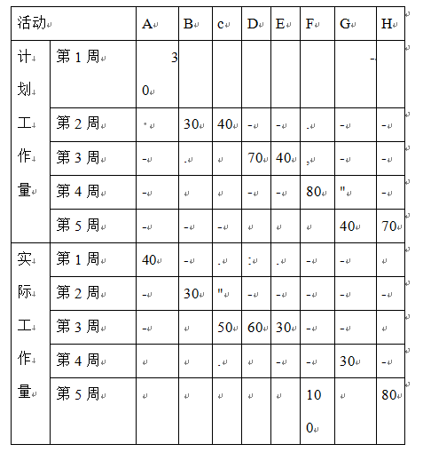
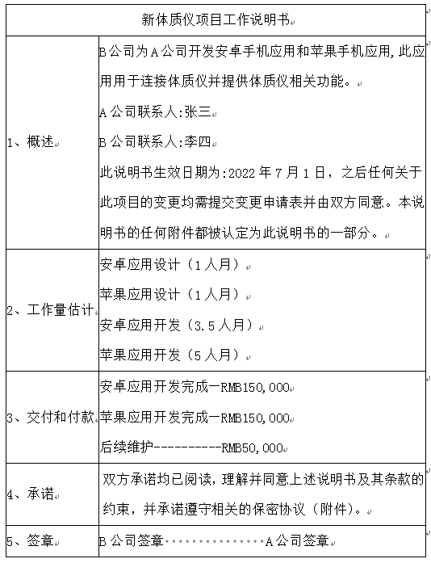
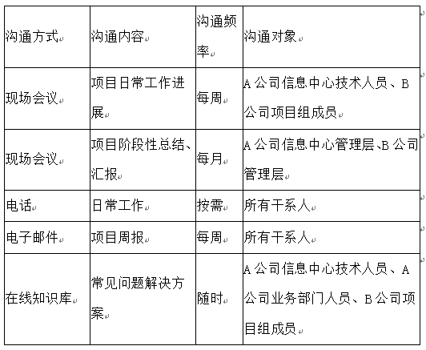

# 2022.11

## 试题1 （18分）

阅读下列说明，回答问题1至问题3，将解答填入答题纸的对应栏内
A公司承接了一个信息系统开发项目，任命小安为质量经理。由于前一个项目延期，小安在项目实施阶段才进入本项目。进入项目后，小安按照项目计划编制了质量管理计划，规划了质量审计、功能测试、集成测试、验收测试等活动，并为各测试活动安排了相应测试人员。结合需求，小安在以往类似项目的基础上，修改确定了本项目的测试用例，随后分发给了测试人员,要求严格按照测试用例执行。
在功能测试时，测试人员发现测试用例对应的某项功能缺失。经查阅，需求中没有此功能，于是测试人员关闭了该问题。灰度发布后，用户在试用过程中发现了一些问题，经检查，小安发现有个别集成测试问题未关闭。为了按期上线，小安决定将灰度发布后发现的问题作为遗留项后续再处理。

**【问题1】（9分）**
（1）结合案例,请指出小安在此项目中的工作是质量保证还是质量控制？
（2）指出本案例中质量管理方面存在的问题，并给出正确的做法。
>（1）
小安既进行了质量保证工作也进行质量控制工作
小安按照项目计划编制了质量管理计划，规划了质量审计、功能测试、集成测试、验收测试等活动，并为各测试活动安排了相应测试人员属于规划质量管理工作。
小安安排测试人员严格按照测试用例执行是质量保证工作。
在测试过程中发现有个别集成测试问题未关闭。为了按期上线，小安决定将灰度发布后发现的问题作为遗留项后续再处理，这个是质量控制工作。
（2）
1)小安欠缺项目管理经验和质量意识，需要给小安加强项目管理培训。
2)不能只按照项目计划编制质量管理计划，还应参考干系人登记册、风险登记册、需求文件等。
3)不应由小安独立编制质量管理计划，需要召集主要干系人共同编制计划并评审。
4)制订质量管理计划过程中只有质量管理计划，还应在计划中明确规定的质量测量指标、质量核对单等。
5)质量保证没有设置QA人员，应设立专门的QA人员做好质量保证工作。
6)质量保证执行不到位，发现问题没有及时反馈，应及时反馈问题并记录，做好实施质量保证工作。
7)质量控制环节缺失，对最后的结果没有进行检查。应做好质量控制工作。
8）质量检查发现问题后没有及时处理，检查发现问题后应及时查找原因进行处理。
9)对于测试用例的修改没有遵循正式的变更控制流程，对于任何的变更都需要遵循正式的变更控制流程。
10)没有建立有效的沟通机制，需要建立有效的沟通机制。

**【问题2】（6分）**
请分别指出实施质量保证和质量控制二者在工作内容上的区别。
>参考答案
实施质量保证是审计质量要求和质量控制测量结果，确保采用合理的质量标准和操作性定义的过程。本过程的主要作用是，促进质量过程改进。
质量控制是监督并记录质量活动执行结果，以便评估绩效’并推荐必要的变更的过 程。本过程的主要作用包括（1）识别过程低效或产品质量低劣的原因，建议并采取相应措施消除这些原因; （2）确认项目的可交付成果及工作满足主要干系人的既定需求，足以进行最终验收。
质量保证与质量控制的区别 质量保证是按计划开展具体的质量活动，即按计划做质量，提高干系人的质量信心，进行过程改进。强调的是过程改进和信心保证。质量控制是按质量标准检查质量，发现偏差和质量缺陷，对已完成的可交付成果进行质量合格性检查，对已批准的变更实施情况进行检查。强调的是具体可交互成果。

**【问题3】（3分）**
判断下列选项的正误（填写在答题纸的对应栏内，正确的选项填写"√"错误的选项填写"x"）
（1）可以使用其他工具（诸如亲和图、树形图或鱼骨图）产生的数据，来绘制关联图。（ ）
（2）质量通常是指产品的质量，广义上的质量还包括工作质量。产品质量是指产品的使用价值及其属性；而工作质量则是产品质量的保证，它反映了与产品质量直接有关的工作对产品质量的保证程度。（ ）
（3）存在问题未关闭，不能上线。（ ）
>（1）✔
关联图是关系图的变种’有助于在包含相互交叉逻辑关系（可有多达 50个相关项）的中等复杂情形中创新性地解决问题。可以使用其他工具（诸如亲和图、 树形图或鱼骨图）产生的数据’来绘制关联图。
（2）✔
质量通常是指产品的质量，广义上的质量还包括工作质量。产品质量是指产品的使 用价值及其属性；而工作质量则是产品质量的保证，它反映了与产品质量直接有关的工 作对产品质量的保证程度。
（3）✖
存在的问题未关闭，不是不能上线，我们只要处理好就可以。

---
---
---

## 试题2（21分）

阅读下列说明，回答问题1至问题4，将解答填入答题纸的对应栏内。
下表是一个软件项目在编码阶段各活动的计划和实际完成情况（工作量单位人天，假设工作量成本1万元/人天）。

**【问题1】（9分）**
为了实施项目的过程跟踪，项目经理制定了如下过程跟踪表，请补充表中的数据（PV、EV、AC值保留整数，SPI、CPI保留2位小数，单位万元）。

>

**【问题2】（4分）**
请说明第4周时项目的绩效情况，并说明理由。
>第四周时，CPI>1，SPI<1，所以成本节约，进度滞后。

**【问题3】（3分）**
第4周时，项目经理准备采取如下措施，请指出各措施可能会带来的负面风险。
（1）快速跟进。
（2）减小活动范围或减低活动要求。
（3）改进方法或技术。
>（1）可能会引起返工和风险增加。
（2）不一定能得到业主的同意，导致验收无法通过
（3）新技术不成熟或掌握不到位，也会带来相应的风险。

**【问题4】（5分）**
第4周时项目经理认为，照此情况，项目的这种偏差情况还会延续到项目的收尾阶段，项目总成本会发生变化，请计算项目总成本会超出预算多少？（结果保留整数）
>BAC=400，PV=290，EV=250，,AC=240
CPI=EV/AC=1.04
项目的这种偏差情况还会延续到项目的收尾阶段，所以属于典型偏差。
EAC=BAC/CPI=400/1.04=385
VAC=BAC-EAC=15
项目总成本比预算节约15万元。

---
---
---

## 试题3（17分）

阅读下列说明,回答问题1至问题3，将解答填入答题纸的对应栏内。
某智能体质仪生产商A，计划生产一款新的休质仪。由于缺乏软件开发人员、决定将应用程序的开发工作外包给B公司。A负责硬件及配套的固件开发,B负责对应安卓手机应用和苹果手机应用的开发。B作为A的合作伙伴，之前承担过其他产品的软件开发,且此次软件不需要重新开发，只需要基于已有应用增加新体质仪的功能。
此项目以工作说明书（Sow）约定双方工作内容如下:

**【问题1】（5分）**
请分析案例，指出案例中工作说明书缺少哪些主要内容。
>1、缺少具体的业务需求。
2、缺少战略计划。
3、缺少违约处理。
4、缺少签订日期。
5、缺少交付款的具体日期。
6、缺少具体的工作时间。
7、缺少具体的标准。
8、.缺少具体的工作内容。
9、缺少具体的完工日期。

**【问题2】（7分）**
如果A公司用招标的方式寻找合作方，请写出招投标程序。
>据《中华人民共和国招标投标法》，招投标程序如下。
（1）招标人采用公开招标方式的，应当发布招标公告；招标人采用邀请招标方式的，应当向三个以上具备承担招标项目能力的、资信良好的特定的法人或者其他组织发出投标邀请书。
（2）招标人根据招标项目的具体情况，可以组织潜在投标人踏勘项目现场。
（3）投标人投标。
（4）开标。
（5）评标。
（6）确定中标人。
（7）订立合同。

**【问题3】（5分）**
请将下面①～⑤处的答案填写在答题纸的对应栏内。
（1）按照采购管理过程，该项目处于①阶段。
（2）A公司招标过程涉及多种采购文件，②是用于征求潜在供应商建议的文件，③是用于征求潜在供应商报价的文件。
（3）依据《中华人民共和国政府采购法》，政府采购方式分为公开招标、邀请招标、竞争性谈判、④、⑤和国务院政府采购监督管理部门认定的其他方式。
>1、实施采购；2、方案邀请书；3、报价邀请书；4、单一来源采购；5、询价。

---
---
---

## 试题4（19分）

阅读下列说明，回答问题1至问题3，将解答填入答题纸的对应栏内。
A 集团公司信息中心负责集团及子公司的信息系统建设和运行维护管理工作。为了确保系统安全稳定运行，并为各业务部门（系统使用方）提供良好服务，信息中心将系统运行维护工作外包给了B公司,B公司高层非常重视该项目，任命张伟担任目经理。在项目初期，张伟编制了干系人清单，部分内容如下:
—类干系人（主要干系人）:A公司信息中心管理层。
二类干系人（次要干系人）:A公司信具中心技术人员、B公司管理层、B公司政部门（为项目提供备件、人员培训等支持）。
三类干系人（一船干系人）:A公司业务部门人员、B公司项目组成员、其他人员。
为确保项目沟通顺畅，张伟制定了顶日沟通计划.部分内容如下:

项目开展三个月后，B公司管理层收到了A公司信息中心管理层的投诉:
一是对项目的进展情况不了解；二是业务部门反馈服务热线总是占线。张伟解释:很难协调双方公司管理层同时到场，月度项目汇报现场会议一直未能召开；A公司部分BI人员不知道有在线知识库，遇到的大小问题都打服务热线造成了占线。

**【问题1】（10分）**
结合案例，请指出张伟在项目沟通管理与干系人管理中存在的问题。
>1、沟通管理问题
（1）沟通管理计划不全面，如缺少负责沟通人员、沟通信息的具体格等等
（2）管理沟通过程存在问题，收到投诉。
（3）控制沟通存在问题，很难协调双方同时到场等问题未解决。
（4）现场会议方式时，进行日常工作进展的沟通频率应该是“按需”，不是每周。
（5）进行日常工作沟通时，沟通方式不应是电话，还要包括“面对面沟通”。
（6）未能满足干系人的沟通需求，部分BI人员不知道有在线知识库
2、干系人管理问题
识别干系人只有张伟不妥，应有团队成员参与。
干系人识别不全面，如系统开发商没有作为项目干系人识别出来
（3）未制定干系人管理计划。
（4）管理干系人参与存在问题，未能按计划执行。
（5）控制干系人参与存在问题，未能有效提升干系人参与度。

**【问题2】（6分）**
结合案例，请采用权力/利益方格对A公司信息中心管理层、B公司行政部门、A公司业务部门人员，分别采用什么方式来管理，并给出理由。
>A公司管理层重点管理
理由是A公司信息中心管理层是管理权利高，利益高。
B公司行政部门领其满意
理由是B公司行政部门是权力高，利益低。
A公司业务部门人员:随时告知
理由是A公司业务部门人员是利益高，权力低。

**【问题3】（3分）**
请将下面①-③处的答案填写在答题纸的对应栏内。
案例中沟通的方式，会议属于①；电子邮件属于②；在线知识库属于③。
>1、交互式沟通。
2、推式沟通。
3、拉式沟通。
