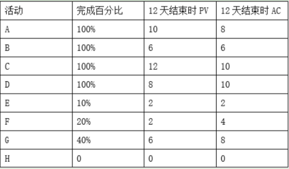
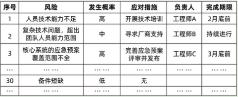

# 2022.5  

## 试题一  

某公司近期多次收到客户对系统集成项目的投诉，公司决定派一名质量经理直找具体原因并提出解决方案。  
质量经理进入集成项目团队后，对项目具体的质量管理活动经行了结构性的评审，识别出存在的问题,分享了公司其他类似项目的经验，并与项目团队一起讨论如何进行过程改进。  
质量经理离开后,项目团队计划用刚启动的A项目进行试点，推行质量经理的解决方案，由质量保证工程师(QA)协助监控项目执行情况。  
QA先收集了大量的项目信息,包括项目的进度目标，成本目标等，结合公司的质量政策制定了质量管理计划，并按照计划执行,定期输出质量控制成果。  
最终在整个项目组的努力下，项目质量有了很大改善。  

**【问题1】(分)**  
结合案例，请指出质量经理在查找质量问题时所采用的工具与技术,该工具与技术主要应用于哪个质量管理过程?  
>采用了质量审计，该工具用于质量保证过程。  

**【问题2】(分)**  
结合案例，请指出QA按照质量管理计划进行质量控制时可以采用的“新”工具。  
>新七工具包括：亲和图、过程决策程序图（PDPC）、关联图、树形图、优先矩阵、活动网络图和矩阵图。  

**【问题3】(分)**  
结合案例,请写出QA在执行质量控制过程中输出的质量控制成果。  
>1.质量控制测量结果  
2.确认的变更  
3.核实的可交付成果  
4.工作绩效信息  
5.变更请求  
6.项目管理计划更新  
7.项目文件更新  
8.组织过程资产更新  

**【问题4】(分)**  
请将下列表中质量管理技术简称所对应中文名称的选项编号填入答题纸对应栏内  
A、企业流程再造B、质量功能展开C、准时代生产  
D、统计过程控制E、全面质量管理  
  
>JIT（准时化生产）C；  
TQM（全面质量管理）E；  
SPC（统计过程控制）D，  
QFD（质量功能展开）B，  
BPR（企业流程再造）A  

---
---
---

## 试题二  

事件1:某项目的甘特图如图所示，项目经理预测了各活动工期缩短一天增加的费用(其中,A活动完成B,C，D活动才能开始,B,C，D活动均完成E,F才能开始，费用单位:万元，时间单位:天)  
  
事件2:项目到第12天结束时，项目经理统计了各活动完成情况，如表所示。  
  

**【问题1】(2分)**  
结合案例，确定项目的关键路径。  
>A-C-E-H  

**【问题2】(4分)**  
不考虑间接费用和人力资源，项目经理想通过赶工的方式提前一天并成本最低地完成项目，他应该压缩哪些活动的工期?请给出选择依据。  
>因A、C、E的压缩费用一样，所以压缩A、C、E其中一个就可以。  

**【问题3】(8分)**  
如果活动B拖延4天,项目工期会拖延几天?请说明理由。  
基于(①)，项目的关键路径是否发生变化?请说明理由。  
>项目工期会拖延1天,因为活动B的总工期变为7天,改变了关键路径,变为A-B-E-H,总工期为22天,较原来多出1天。  
会发生变化。因为在活动A之后有B、C、D三项活动,此时B活动工期最长，关键路径会选择A-B-E-H。  

**【问题4】(7分)**  
请根据案例中的项目的表格，计算项目第12天结束时的成本偏差和进度偏差,并判断项目的执行绩效。  
>PV=10+6+12+8+2+2+6=46  
AC=8+6+10+10+2+4+8=48  
EV=10+6+12+8+2*0.1+2*0.2+6*0.4=39  
CV=EV-AC=39-48=-9  
SV=EV-PV=39-46=-7  
因CV小于0，SV小于0，项目成本超支，进度滞后。  

---
---
---

## 试题三  

阅读下列说明，回答问题1至问题3，将解答填入答题纸的对应栏内。  
某公司承接了某大型企业数据中心的运行维护服务项目，任命经验丰富的李强为项目经理。  
1月初项目启动会后，李强整理出了项目风险单，对中级及以上风险制定了应对措施，在项目会议上，李强将应对措施的实施责任分配到个人，并确定了完成时限，要求项目全过程中按照此风险清单进行管理。  
风险及应对措施清单部分内容如下:  
  
3月，某系统服务器备机发生cpu故障，寻找外部供应商进行紧急采购，2天后,故障解决，虽然业务并未中断，但是客户表示不满。考虑到备件短缺的概率极小，李强并未采取措施。  
4月，某系统报错，无法确定故障原因，因此工程师B联系厂商寻求支持，经过与不同设备厂商的多轮沟通,逐个排查，耗时3天终于解决了问题。  
5月，数据中心及周边发生大面积停电，由于紧急预案未涉及停电场景，运维团队人员临时商量解决方案，在中断2小时后;核心系统业务恢复。  
8月，因机房温度过高导致部分设备停机，李强建议客户紧急扩容制冷设备。因年初未做该预算，客户责怪李强没有提前发现隐患。  

**【问题1】(10分)**  
结合案例，请指出项目风险管理中存在的问题。  
>没有制定风险管理计划  
风险识别是一个反复的过程，而且风险识别的风险不够全面  
没有实施定性分析，对风险进行高低排序  
没有实施定量分析，没有对风险进行量化处理  
没有制订好全面的应对计划，应对计划做的不是很好  
风险监控不全面，项目经理没有加强风险控制  
沟通做的不好  
团队成员没有加强风险培训，增强风险意识。  
应对措施做的不好，没有全面考虑  
风险管理应该全员参与，增加抵抗风险的风险  
制冷设备的问题，没有做好应对措施  

**【问题2】(4分)**  
请简述消极风险(威胁)和积极风险(机会)的应对策略。  
>消极或威胁应对策略（1）回避。（2）转移。（3）减轻。（4）接受。  
积极或机会应对策略（1）开拓。（2）分享。（3）提高。（4）接受  

**【问题3】(3分)**  
请将下面(1)~(3)处的答案填写在答题纸的对应栏内。  
>自然风险 、经济风险、技术风险  

---
---
---

## 试题四  

阅读下列说明,回答问题1至问题3,将解答填入答题纸的对应栏内。  
段1:A公司专门从事防真软件产品的研发,近期承接了一项目。公司任命老王担任项目经理,带领10人的开发团队完成该项目。老王兼任配置管理员，为方便工作,他给所有项自组成员开放了全部操作权限。  
段2:测试人员首先依据界面功能准备了集成测试用例,随后和开发人员在开发环境中交互进行集成测试并完成的缺陷修复工作。测试期间发现特定参数下防真图形显示出现较大变形的严重错误，开发人员认为彻底修复难度较大,可以在试运行阶段再处理,测试人员表示认可。  
段3:在回归测试结束后,测试人员向项目组提交了测试报告,老王认为开发工作已圆满结束。在客户的不断催促下，老王安排开发工程师将代码从开发库中提取出来，连带测试用的用户数据一起刻盘后快递给客户。  

**【问题1】(10分)**  
结合案例，请分别简述项目在配置管理和测试过程存在的问题。  
>没有做好配置管理计划  
项目经理小王不应该担任配置管理员，应该安排其他人  
权限开通不对，必须控制相关人员的权限  
对于问题没有及时进行处理  
没有做好配置标识  
没有做好变更控制，因严格按照配置控制的变更流程进行处理  
没有做好配置审计  
没有做好相关培训工作  
团队之间和干系人之间没有做好沟通管理  
测试做的不全面，不完整  
测试没有验证就交给了客户  
没有做好测试审计  

**【问题2】(3分)**  
请指出功能配置审计需要验证哪些方面的内容。  
>功能配置审计是进行审计以验证以下几个方面  
（1）配置项的开发已圆满完成  
（2）配置项已达到规定的性能和功能特定特性  
（3）配置项的运行和支持文档已完成并且是符合要求的  

**【问题3】(6分)**  
请将下面(1)-(3)处答案填写在答题纸的对应栏内。  
典型的配置库可以分为(1)种类型，(2)又称主库，包含当前基线和对基线的变更,(3)包含已发布使用的各种基线的存档，被置于完全的配置管理之下。  
>（1）三；（2）受控库；（3）产品库。  
