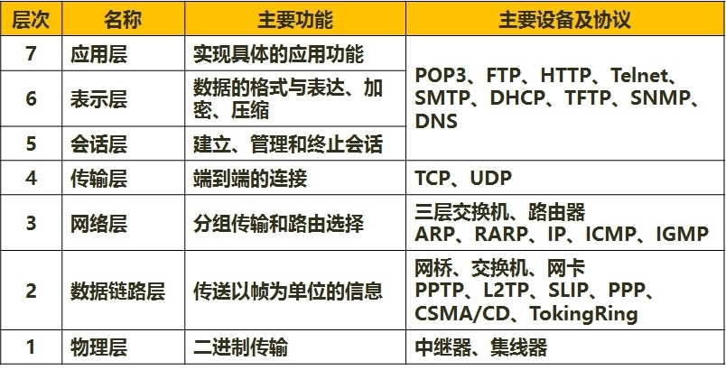
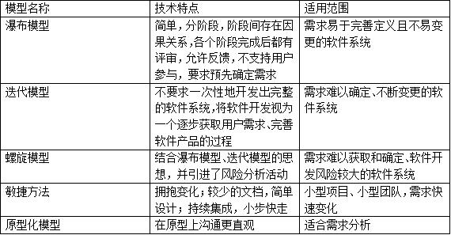
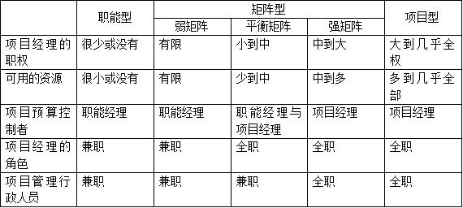
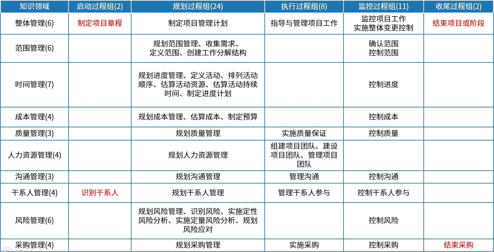
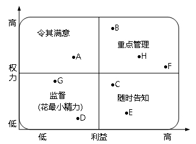

# 考前8页纸

## IT部分知识
1、信息化：信息化的主体是全体社会成员，包括政府、企业、事业、团体和个人；
它的空域是政治、经济、文化、军事和社会的一切领域；
它的手段是基于现代信息技术的先进社会生产工具；
它的途径是创建信息时代的社会生产力，推动社会生产关系及社会上层建筑的改革；
它的目标是使国家的综合实力、社会的文明素质和人民的生活质量全面提升。
信息化从小到大分为：产品信息化、企业信息化、产业信息化、国民经济信息化和社会生活信息化5个层次。

2、国家信息化体系包括信息技术应用、信息资源、信息网络、信息技术和产业、信息化人才、信息化法规政策和标准规范6个要素。
其中信息技术应用是信息化体系六要素中的龙头，是国家信息化建设的主阵地，集中体现了国家信息化建设的需求和效益；
信息资源的开发利用是国家信息化的核心任务，是国家信息化建设取得实效的关键；
信息网络是信息资源开发利用和信息技术应用的基础，是信息传输、交换和共享的必要手段；
信息技术和产业是我国进行信息化建设的基础，必须大力发展自主的信息产业；
信息化人才是国家信息化成功之本，对其他各要素的发展速度和质量有着决定性的影响，是信息化建设的关键；
信息化政策法规和标准规范用于规范和协调信息化体系各要素之间关系，是国家信息化快速、持续、有序、健康发展的根本保障。

3、系统特点：
(1)目的性。定义一个系统、组成一个系统或者抽象出一个系统，都有明确的目标或者目的，目标性决定了系统的功能。
(2)可嵌套性。系统可以包括若干子系统，系统之间也能够耦合成一个更大的系统。
(3)稳定性。系统的稳定性是指：受规则的约束，系统的内部结构和秩序应是可以预见的。
(4)开放性。系统的开放性是指系统的可访问性。
(5)脆弱性。系统可能存在着丧失结构、功能、秩序的特性。
(6)健壮性。系统具有的能够抵御出现非预期状态的特性称为健壮性。

4、信息是事物运动的状态及状态变化的方式，世间一切事物都会产生信息。
信息既不是物质，也不是能量。信息是系统有序程度的度量。
信息传输模型包括信源、编码、信道、噪声、解码、信宿，其中传输技术是信息技术的核心。
编码器包括：量化器、压缩编码器、调制器；译码器包括：调解器、译码器、数模转换器。

5、商业智能：通常被理解为将组织中现有的数据转化为知识，帮助组织做出明智决策的行为。
商业智能系统应具有的主要功能：数据仓库、数据ETL、数据统计输出（报表）、分析功能OLAP。
商业智能＝数据仓库+数据挖掘+联机分析处理+数据备份(恢复)。
商业智能的三个层次：数据报表、多维数据分析和数据挖掘。

6、电子商务：按照交易对象，电子商务模式包括：企业与企业之间的电子商务（B2B）、商业企业与消费
者之间的电子商务（B2C）、消费者与消费者之间的电子商务（C2C）。
电子商务与线下实体店有机结合向消费者提供商品和服务，称为O2O模式。

7、数据仓库：一个面向主题的、集成的、相对稳定的、反映历史变化的数据集合，用于支持管理决策。
括如下四个模块：数据源、数据的存储于管理、OLAP服务器、前端工具。

8、大数据所涉及的技术很多，主要包括数据采集、数据存储、数据管理、数据分析与挖掘四个环节。
在数据采集阶段主要使用的技术是数据抽取工具ETL。
谷歌文件系统（GFS）和Hadoop的分布式文件系统奠定了大数据存储技术的基础HBASE、MapReduce算法。
大数据5V特点：Volume（大量）、Velocity（高速）、Variety（多样）、Value（价值）、Veracity（真实性）。

9、物联网：概念的3个方面包括，
物：客观世界的物品，主要包括人、商品、地理环境等。
联：通过互联网、通信网、电视网以及传感网等实现网络互联。
网：首先，应和通讯介质无关，有线无线都可。其次，应和通信拓扑结构无关，总线、星型均可。最后，只要能达到数据传输的目的即可。
物联网从架构上面可以分为感知层、网络层和应用层。在物联网应用中有两项关键技术：
（1）传感器技术；
（2）嵌入式系统技术。

10、云计算（CloudComputing）：按照云计算服务提供的资源层次，可以分为laaS（基础设施即服务）、PaaS（平台即服务）和SaaS（软件即服务）等三种服务类型。

11、区块链：是分布式数据存储、点对点传输、共识机制、加密算法等计算机技术的新型应用模式。所谓共识机制是区块链系统中实现不同节点之间建立信任、获取权益的数学算法。
区块链是比特币的底层技术，像一个数据库账本，记载所有的交易记录。这项技术也因其安全、便捷的特性逐渐得到了银行与金融业的关注。
一般说来，区块链系统由数据层、网络层、共识层、激励层、合约层和应用层组成。
区块链的基本特点：去中心化；开放性；自治性；信息不可篡改；匿名性。

12、计算机网络基础

（1）物理层：该层包括物理连网媒介，如电缆连线连接器。该层的协议产生并检测电压以便发送和接收携带数据的信号。具体标准有RS232、V.35、RJ-45、FDDI。
（2）数据链路层：它控制网络层与物理层之间的通信。它的主要功能是将从网络层接收到的数据分割成特定的可被物理层传输的帧。常见的协议有IEEE802.3/.2、HDLC、PPP、ATM。
（3）网络层：其主要功能是将网络地址（例如IP地址）翻译成对应的物理地址（例如网卡地址），并决定如何将数据从发送方路由到接收方。在TCP/IP协议中，网络层具体协议有IP、ICMP、IGMP、IPX、ARP等。
（4）传输层：主要负责确保数据可靠、顺序、无错地从Ａ点到传输到Ｂ点。如提供建立、维护和拆除传送连接的功能；选择网络层提供最合适的服务；在系统之间提供可靠的透明的数据传送，提供端到端的错误恢复和流量控制。在TCP/IP协议中，具体协议有TCP、UDP、SPX。
（5）会话层：负责在网络中的两节点之间建立和维持通信，以及提供交互会话的管理功能，如三种数据流方向的控制，即一路交互、两路交替和两路同时会话模式。常见的协议有RPC、SQL、NFS。
（6）表示层：如同应用程序和网络之间的翻译官，在表示层，数据将按照网络能理解的方案进行格式化；这种格式化也因所使用网络的类型不同而不同。表示层管理数据的解密加密、数据转换、格式化和文本压缩。常见的协议有JPEG、ASCII、GIF、DES、MPEG。
（7）应用层：负责对软件提供接口以使程序能使用网络服务，如事务处理程序、文件传送协议和网络管理等。在TCP/IP协议中，常见的协议有HTTP、Telnet、FTP、SMTP。

13、信息系统的生命周期可以分为立项、开发、运维及消亡四个阶段。
（1）立项阶段：即概念阶段或需求阶段，这一阶段根据用户业务发展和经营管理的需要，提出建设信息系统的初步构想；然后对企业信息系统的需求进行深入调研和分析，形成《需求规格说明书》并确定立项。
（2）开发阶段：以立项阶段所做的需求分析为基础，进行总体规划之后，通过系统分析、系统设计、系统实施、系统验收等工作实现并交付系统。
（3）运维阶段：信息系统通过验收，正式移交给用户后，进入运维阶段。要保障系统正常运行，系统维护是一项必要的工作。系统的运行维护可分为更正性维护、适应性维护、完善性维护、预防性维护等类型。
（4）消亡阶段：信息系统不可避免地会遇到系统更新改造、功能扩展，甚至废弃重建等情况。对此，在信息系统建设的初期就应该注意系统消亡条件和时机，以及由此而花费的成本。

14、信息系统生命周期模型：

15、软件工程
1）系统总体设计：包括系统的总体架构方案设计、软件系统的总体架构设计、数据存储的总体设计、计算机和网络系统的方案设计等。
2）系统详细设计：包括代码设计、数据库设计、人/机界面设计、处理过程设计等。

16、软件维护有如下类型：
①更正性维护——更正交付后发现的错误；
②适应性维护——使软件产品能够在变化后或变化中的环境中继续使用；
③完善性维护——改进交付后产品的性能和可维护性；
④预防性维护——在软件产品中的潜在错误成为实际错误前，检测并更正它们。
IT运维管理，是指单位IT部门采用相关的方法、手段、技术、制度、流程和文档等，对IT如硬运行环境(软件环境、网络环境等)、IT业务系统和IT运维人员进行的综合管理。

17、典型的架构设计
1）管道/过滤式模式，其典型应用包括批处理系统；
2）面向对象模式，其典型应用是基于组件的软件开发；
3）事件驱动模式，其典型应用包括各种图形界面的应用；
4）分层模式，其典型应用是分层通用协议，如OSI的七层网络模型；
5）客户/服务器模式，C/S架构具有尽量利用后端处理而减少依赖客户端升级的特点。故后台系统开销是很大的。

18、面向对象的基本概念有对象、类、抽象、封装、继承、多态、接口、消息、组件、模式和复用等。
1)对象是由数据及其操作所构成的封装体，是系统中用来描述客观事物的一个模版，是构成系统的基本单位，用计算机语言描述，对象是由一组属性和对这组属性进行的操作构成的。对象包含三个基本要素，分别是对象标识、对象状态和对象行为。
2)类是现实世界中实体的形式化描述，类将该实体的数据和函数封装在一起。类的数据也叫属性、状态或特征，它表现类静态的一面。类的函数也叫功能、操作或服务，它表现类动态的一面。类和对象的关系可理解为：
对象是类的实例，类是对象的模版。现实世界中实体的形式化描述，类将该实体的属性（数据）和操作（函数）封装在一起。
3)抽象是通过特定的实例抽取共同特征以后形成概念的过程。它强调主要特征，忽略次要特征。
4)封装是将相关的概念组成一个单元，然后通过一个名称来引用它。
5)继承表示类之间的层次关系（父类和子类），这种关系使得某类对象可以继承另外一类对象的特征，继承又可分为单继承和多继承。
6）多态：同一操作作用于不同的对象，可以有不同的解释，产生不同的执行结果。

19、信息的质量属性：信息反映的是事物或者事件确定的转态，具有客观性、普遍性等特点，由于获取信息满足了人们消除不确定性的需求，因此信息具有价值，而价值的大小取决于信息的质量，这就要求信息满足一定的质量属性。
（1）精准性：对事物状态描述的精准程度。
（2）完整性：对事物状态描述的全面程度，完整信息应包括所有重要事实。
（3）可靠性：信息的来源、采集方法、传输过程是可以信任的、符合预期的。
（4）及时性：指获得信息的时刻与事件发生时刻的间隔长短。昨天的天气信息不论怎样精确、完整，对指导明天的穿衣并无帮助，从这个角度出发，这个信息的价值为零。
（5）经济性：指信息获取、传输带来的成本在可以接受的范围之内。
（6）可验证性：指信息的主要质量属性可以被证实或者证伪的程度。
（7）安全性：指在信息的生命周期中，信息可以被非授权访问的可能性，可能性越低，安全性越高。

20、信息安全的基本要素有：
（1）机密性：确保信息不暴露给未授权的实体或进程。
（2）完整性：只有得到允许的人才能修改数据，并且能够判别出数据是否已被篡改。
（3）可用性：得到授权的实体在需要时可访问数据，即攻击者不能占用所有的资源而阻碍授权者的工作。
（4）可控性：可以控制授权范围内的信息流向及行为方式。
（5）可审查性：对出现的网络安全问题提供调查的依据和手段。
系统运行安全和保密有4个层次：系统级安全、程序资源访问控制安全、功能性安全、数据域安全。

21、信息系统安全技术
（1）防火墙通常被比喻为网络安全的大门，用来鉴别什么样的数据包可以进出企业内部网。在应对黑客入侵方面，可以阻止基于IP报头的攻击和非信任地址的访问。但传统防火墙无法阻止和检测基于数据内容的黑客攻击和病毒入侵，同时也无法控制内部网络之间的违规行为。
（2）扫描器，可以说是入侵检测的一种，主要用来发现网络服务、网络设备和主机的漏洞，定期的检测与比较发现入侵或违规行为留下的痕迹。当然，扫描器无法发现正在的入侵行为，而且它还有可能成为攻击者的工具。
（3）防毒软件，是最为人熟悉的安全工具，可以检测、清除各种文件型病毒、宏病毒和邮件病毒等。
（4）安全审计系统，安全审计系统通过独立的、对网络行为和主机操作提供全面与忠实的记录，方便用户分析与审查事故原因，很像飞机上的黑匣子。由于数据量和分析量比较大，目前市场上鲜见特别成熟的产品，即使存在冠以审计名义的产品，也更多的是从事入侵检测的工作。

22、信息系统服务管理
（1）ITSS是Information Technology Service Standards的缩写，中文意思是信息技术服务标准，是在工业和信息化部、国家标准化委的领导和支持下，由ITSS工作组研制的一套IT服务领域的标准库和一套提供IT服务的方法论。
（2）ITSS（信息技术服务标准）组织要素：人员（People）、流程（Process）、技术（Technology）、资源（Resource），简称PPTR。
（3）IT服务生命周期5阶段：规划设计（Planning&Design）、部署实施（Implementing）、服务运营（Operation）、持续改进（Improvement）、监督管理（Supervision）。（PIOIS）

23、十四五规划和新印发文件
（1）《“十四五”数字经济发展规划》中明确提出数据要素是数字经济深化发展的核心引擎。
（2）《“十四五”国家信息化规划》重大任务和重点工程中，要统筹建设物联、数联、智联三位一体的新型城域物联专网，加快5G和物联网的协同部署，提高感知设施的资源共享和综合利用水平。
（3）在《国家标准化发展纲要》的发展目标中提到，到2025年实现标准供给由政府主导向政府与市场并重转变。
（4）《“十四五”国家信息化规划》指出，以推动高质量发展为题，以建设数字中国为总目标，以加快数字化发展为总抓手，发挥信息化对经济社会发展的驱动引领作用，推动新型工业化、信息化、城镇化、农业现代化同步发展，加快建设现代化经济体系。
（5）《“十四五”软件和信息技术服务业发展规划》中，聚力攻坚基础软件的主要任务是发展规划完善桌面、服务器、移动终端、车载等操作系统产品及配套工具集，推动操作系统与数据库、中间件、办公套件、安全软件及各类应用的集成、适配、优化。
（6）《“十四五”软件和信息技术服务业发展规划》中“加快突破”金融核心业务系统的建筑信息建模和建筑防火模拟智慧能源管理、智能交通管理、职能办公室等，属于协同攻关应用软件任务的工作内容。

## 项目管理知识域部分

### 项目管理基础知识

1、项目组织结构

2、十五至尊图

### 项目立项管理

1、项目可行性研究内容：投资必要性、技术可行性、财务可行性、组织可行性、经济可行性、社会可行性、风险因素及对策。
2、项目可行性研究阶段：1.机会可行性研究；2.初步可行性研究；3.详细可行性研究；4.项目可行性研究报告的编写、提交和获得批准；5.项目评估
3、系统集成供应商在进行项目内部立项时一般包括的内容有项目资源估算、项目资源分配、准备项目任务书和任命项目经理等。

### 项目整体管理

1、项目章程的作用：
（1）确定项目经理，规定项目经理的权力。
（2）正式确认项目的存在，给项目一个合法的地位。
（3）规定项目的总体目标，包括范围、时间、成本和质量等。
（4）通过叙述启动项目的理由，把项目与执行组织的日常经营运作及战略计划等联系起来。
2、项目变更的步骤（2种方式皆可）：
（1）①提出和接受变更申请②对变更的初审③变更方案论证④CCB审查发出变更通知并开始实施⑥变更实施的监控⑦变更效果的评估⑧判断发生变更后的项目是否已纳入正常轨道。
（2）①提出变更申请②变更影响分析③CCB审批④变更实施⑤监控变更实施⑥结束变更。
3、实施整体变更过程涉及的配置管理活动：
①配置项识别②配置状态记录③配置核实与审计。
4、变更请求的内容：
（1）纠正措施。为使项目工作绩效重新与项目管理计划一致而进行的有目的的活动。
（2）预防措施。为确保项目工作的未来绩效符合项目管理计划而进行的有目的的活动。
（3）缺陷补救。为了修正不一致的产品或产品组件而进行的有目的的活动。
（4）更新。对正式受控的项目文件或计划等进行的变更，以反映修改或增加的意见。

### 项目范围管理

1、项目范围管理可能存在的不足：
没有制定项目范围计划、没有进行范围定义（或没有形成范围说明书）、没有进行范围确认（或未与项目干系人统一意见就开始设计）、变更应遵循整体变更流程、范围管理中与干系人沟通存在问题（或范围变更未与干系人取得统一意见）。
2、WBS常见考点：
①一个工作单元只能从属某个上层单元，避免交叉从属；
②WBS应包括项目管理工作，包括分包出去的工作；
③WBS的编制需要所有项目干系人的参与，需要项目团队成员参与；
④8/80原则（工作包的大小应该至少需要8小时完成，总完成时间也不应大于80小时）
3、确认范围的工具包括检查、群体决策技术
4、范围说明书包括的内容：项目目标；产品范围说明；项目需求；项目边界；项目的可交付成果；项目的制约因素。
5、WBS分解步骤：
（1）识别和分析可交付成果及相关工作
（2）确定WBS的结构和编排方法
（3）自上而下逐层细化分解
（4）为WBS组件制定和分配标识编码
（5）核实可交付成果分解的程度是否恰当

### 项目进度管理

1、缩短工期的方法：
①赶工；②快速跟进；③使用高素质的资源或经验更丰富人员；④改进方法和技术；⑤缩减活动范围或降低活动要求；⑥加强质量管理。
2、资源平衡，资源平衡往往导致关键路径改变，通常是延长。
3、资源平滑，相对于资源平衡而言，资源平滑不会改变项目关键路径，完工日期也不会延迟。
4、三点估算公式为：tE=（to+4tM+tP）/6；tE期望时间、to乐观时间、tM最可能时间、tP悲观时间。
5、标准差公式为：σ=（tP-to）/6

### 项目成本管理

1、成本类型：
（1）直接成本：直接可以归属于项目工作的成本为直接成本。如项目团队差旅费、工资、项目使用的物料及设备使用费等。
（2）间接成本：来自一般管理费用科目或几个项目共同担负的项目成本所分摊给本项目的费用，就形成了项目的间接成本，如税金、额外福利和保卫费用等。
2、挣值分析：PV计划价值；EV挣值；AC实践成本；ETC完工尚需估算；BAC完工预算；EAC完工估算。
成本偏差CV=EV-AC；进度偏差SV=EV-PV；
成本绩效指数CPI=EV/AC；进度绩效指数SPI=EV/PV；
非典型偏差：完工尚需估算ETC=(BAC-EV)，后续不会再发生类似偏差；
典型偏差：完工尚需估算ETC=(BAC-EV)/CPI，EAC=BAC/CPI，按当前绩效继续；
完工估算EAC=AC+ETC；
完工偏差VAC=BAC-EAC；
为了按计划（BAC）完成，必须维持的效率：完工尚需绩效指数TCPI=（BAC-EV）/（BAC-AC）；
为了按当前完工估算（EAC）完成，必须维持的效率：TCPI=（BAC-EV）/（EAC-AC）。

### 项目质量管理

1、质量控制过程的输入：①项目管理计划②质量测量指标③质量核对单④工作绩效数据3批准的变更请求⑥可交付成果⑦项目文件⑧组织过程资产。
2、规划质量管理的输出：质量管理计划、过程改进计划、质量测量指标、质量核对单、项目文件更新。
3、老七质量工具：因果图、流程图、核查表、帕累托图、直方图、控制图、散点图；新七质量工具亲和图、关联图、过程决策程序图、树形图、优先矩阵、活动网络图、矩阵图。

### 项目人力资源管理

1、项目人力资源管理计划的内容：
①角色和职责的分配②项目的组织结构图③人员配备管理计划
2、项目团队管理的工具与技术：
①观察和交谈②项目绩效评估③冲突管理④人际关系技能。
3、冲突管理的6种方法：①解决问题②合作③强制④妥协⑤求同存异⑥撤退
4、成功的项目团队的特点：团队的目标明确，成员清楚自己的工作对目标的贡献；团队组织结构清晰，岗
位明确；有成文或习惯的工作流程和方法，而且流程简明有效；项目经理对团队成员有明确的考核和评价标准，工作结果公正公开、赏罚分明；共同制定并遵守的组织纪律
5、团队建设的5个阶段：形成阶段---震荡阶段---规范阶段---发挥阶段---结束阶段
6、激励理论：马斯洛需求层次理论（生理需要-安全需要-社会交往的需要-自尊的需要-自我实现的需要）；
赫兹伯格双因素理论（保健因素—激励因素）；X理论和Y理论；期望理论。

### 项目沟通管理与干系人管理

1、沟通渠道数M=n*（n-1）/2。
2、沟通方式包括参与讨论---征询方式—推销（说明）--叙述方式，参与程度由强到弱，控制程度有弱到强；沟通方法：交互式沟通---推式沟通---拉式沟通。
3、权力/利益方格：

### 项目采购管理

采购管理的主要过程：①规划采购管理；②实施采购；③控制采购；④结束采购。
合同分类：按支付方式可以划分：总结合同、成本补偿合同、工料合同。
合同管理：合同签订、合同履行、合同变更、合同档案。

项目风险管理
1、识别风险的原则：由粗及细，由细及粗；严格界定风险内涵并考虑风险因素之间的相关性；先怀疑，后排除；排除与确认并重；必要时可作实验论证
2、识别风险的工具：文档审查、信息收集技术（头脑风暴、德尔菲技术、访谈）、核对单分析、假设分析、图解技术、SWOT分析、专家判断
3、实施定性风险分析的工具与技术：风险概率和影响评估、概率和影响矩阵、风险数据质量评估、风险分类、风险紧迫性评估、专家判断
4、消极风险应对策略：规避、转移、减轻、接受；积极风险应对策略：积极风险应对策略：开拓、提高、分享、接受。
5、控制风险的工具与技术：风险再评估、风险审计、偏差和趋势分析、技术绩效测量。

### 配置管理

1、软件开发项目涉及的四个主要配置管理活动：
(1)配置项标识(2)配置项控制(3)配置状态报告(4)配置审计
2、配置管理的主要工作并作简要解释
（1）制定配置管理计划。确定方针，分配资源，明确责任，计划培训，确定干系人，制定配置识别准则，制定基线计划，制定配置库备份计划，制定变更控制规程，制定审批计划。
（2）配置项识别。识别配置项，分配唯一标识，确定配置项特征，记录配置项进入时间，确定配置项拥有者职责，进行配置项登记管理。
（3）建立配置管理系统。建立分级配置管理机制，存储和检索配置项，共享和转换配置项进行归档、记录、保护和权限设置。
（4）基线化。获得授权，建立或发布基线，形成文件，使基线可用。
（5）建立配置库。建立动态库、受控库和静态库。
（6）变更控制。包括变更的记录、分析、批准、实施、验证、沟通和存档。
（7）配置状态统计。统计配置项的各种状态。
（8）配置审计。包括功能配置审计和物理配置审计，分别用以验证当前配置项的一致性和完整性。
3、配置项状态，可分为“草稿”“正式”和“修改”三种，分别对应的版本号0.YZ、X.Y、X.YZ。当配置项修改完毕并重新通过评审时，其状态又变为“正式”。

### 案例分析解题技巧

第一步，找五大过程组。首先需要知道每一个管理过程的所有过程组。比如材料是范围管理，需要判断材料中有没有做规划范围管理、收集需求、定义范围、制定WBS、有没有做好监控等。
第二步，找主要ITTO。五大过程组的问题找完之后，判断有没有生成主要的文件。比如范围管理题目，有没有生成范围管理计划和需求管理计划、有没有范围说明书、有没有WBS等。比如质量管理题目，有没有生成质量管理计划、过程改进计划、质量测量指标、质量核对单等。
第三步，找每个过程组的特点。以上问题找完后，找各个管理过程组的特点问题。
（1）如范围管理中，创建范围管理计划有没有全员参与？（常见考法：项目经理凭经验制定了范围管理计划）
收集需求有没有向所有关键干系人收集需求？创建WBS有没有全员参与？（常见考法：项目经理凭经验制定了WBS或项目经理组织主要干系人完成了WBS的制定）
控制范围中发生变更有没有走变更流程？（常见考法：人员认为变更影响较小，擅自完成变更）有没有创建CCB？监控过程有没有贯穿项目全过程？
（2）如质量管理中，
质量管理计划是否有经过审核？（常见考法：QA制定质量管理计划后直接交付团队成员按计划实施工作）
是否有聘请专业质量保证人员？（常见考法：项目经理请测试人员兼职QA）
质量控制是否贯穿项目全过程？（常见考法：项目进行到3/4/5个月的时候，才组织开始质量检查）
第四步，若经过上述三步，还不能发现较多问题，可以考虑增加万金油句式：团队成员没有范围/质量管理意识、团队成员没有培训、项目经理范围/质量管理经验不足等。
第五步，案例分析作答以前三步为准，若经过此三步写完的答案条数还不到问题分值的一半（如第一问分值12分，则至少回答6条以上），则还需按照第四步增补至分值一半以上的回答数。原则上上不封顶，答错/多答不扣分。
